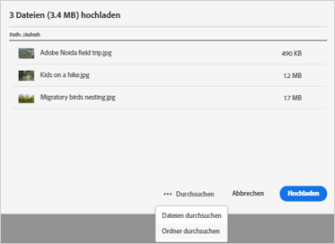
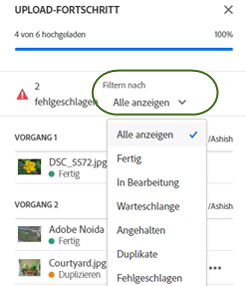
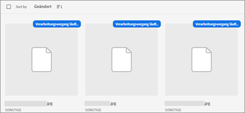
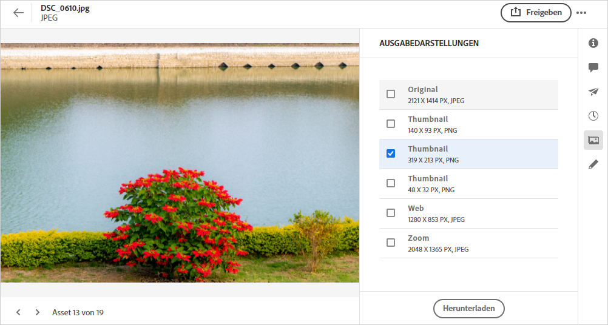
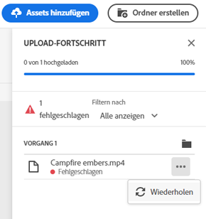
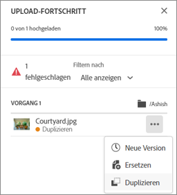
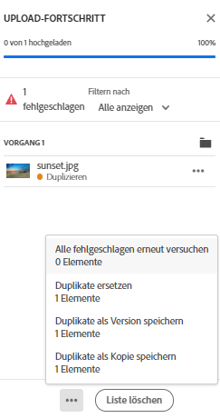
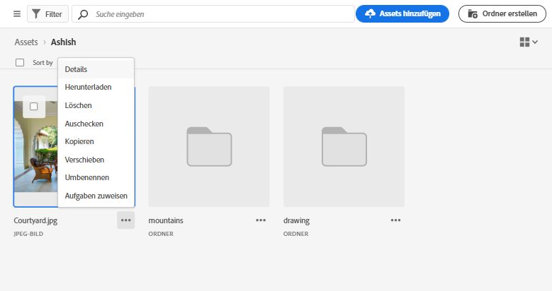

# Hochladen von Assets {#add-assets}

Um neue Assets für die Verwendung hinzuzufügen, laden Sie einige Assets aus Ihrem lokalen Dateisystem hoch. <!-- TBD: Many of the [common file formats are supported](/help/supported-file-formats.md). -->

Sie können die folgenden Methoden verwenden, um ein oder mehrere Assets oder einen Ordner mit Assets hochzuladen:

* Ziehen Sie Assets oder Ordner auf die Benutzeroberfläche und befolgen Sie die Anweisungen auf dem Bildschirm.
* Klicken Sie in der Symbolleiste auf die Option **[!UICONTROL Assets hinzufügen]** und fügen Sie einige Dateien zum Upload-Dialogfeld hinzu.

<!-- TBD: Update this GIF
 -->

Sie können eine dieser Methoden verwenden, um Assets hochzuladen, nachdem Sie einen Ordner erstellt haben. Um einen leeren Ordner zu erstellen, klicken Sie in der Symbolleiste auf **[!UICONTROL Ordner erstellen]** . Während [!DNL Assets Essentials] eine leistungsstarke Volltextsuche-Funktion bietet, können Sie Ordner auch verwenden, um Ihre Assets besser zu organisieren.

Nachdem Sie die Dateien ausgewählt haben, erhalten Sie ein Bestätigungsdialogfeld, um weitere Dateien hinzuzufügen oder bereits ausgewählte Dateien zu entfernen. Um einer Auswahl weitere Dateien hinzuzufügen, klicken Sie auf **[!UICONTROL Durchsuchen]** und wählen Sie **[!UICONTROL Dateien durchsuchen]** oder **[!UICONTROL Ordner durchsuchen]** aus. Fügen Sie weitere Dateien oder Ordner aus demselben oder einem anderen Ordner hinzu.

Sobald alle Dateien in die Warteschlange gestellt sind, klicken Sie auf **[!UICONTROL Upload]**.

*Abbildung: Vor dem Hochladen der ausgewählten Assets können Sie Assets zur Warteschlange hinzufügen oder daraus entfernen.*

>[!CAUTION]
>
>Verwenden Sie Assets ohne Leerzeichen in den Dateinamen. Die Antworten auf Kommentare funktionieren nicht für solche Assets.

## Upload-Fortschritt und -Status anzeigen {#upload-progress}

Wenn Sie viele Assets oder verschachtelte Ordner in [!DNL Assets Essentials] hochladen, können einige Assets aus verschiedenen Gründen (z. B. doppelte Asset- und Netzwerkprobleme) nicht hochgeladen werden.

Um den Upload-Fortschritt zu verfolgen, klicken Sie in der Symbolleiste auf die Option **[!UICONTROL Upload-Fortschritt]** . In einem Bereich wird der Upload-Fortschritt aller Assets angezeigt.

Um eine Teilmenge von Assets basierend auf dem Upload-Fortschritt oder -Status anzuzeigen, verwenden Sie den Filter in der Seitenleiste **[!UICONTROL Upload-Fortschritt]** . Die verschiedenen Filter umfassen die Anzeige aller Assets, abgeschlossenen Uploads, laufenden Uploads, in der Warteschlange zu ladenden Assets, angehaltene Uploads, doppelte Assets und Assets, die nicht hochgeladen werden konnten.

*Abbildung: Filtern Sie die Assets, die Sie hochzuladen versucht haben, nach ihrem Upload-Status oder Upload-Fortschritt.*

Unmittelbar nach dem Hochladen der Assets verarbeitet [!DNL Assets Essentials] die Assets, um Miniaturansichten zu generieren und Metadaten zu verarbeiten. Bei vielen Assets dauert die Verarbeitung einige Zeit. Wenn keine Miniaturansicht angezeigt wird und eine Verarbeitungsmeldung auf der Miniaturansicht des Platzhalters angezeigt wird, überprüfen Sie den Ordner nach einigen Minuten erneut. Während der Verarbeitung generiert [!DNL Assets Essentials] u. a. die Ausgabedarstellungen, fügt Smart-Tags hinzu und indiziert die Asset-Details für die Suche.

*Abbildung: Hochgeladene Assets zeigen die Verarbeitung der Kachel an, die verarbeitet wird.*

## Asset-Ausgabedarstellungen {#renditions}

[!DNL Assets Essentials] verarbeitet die hochgeladenen Assets nahezu in Echtzeit und generiert für viele unterstützte Dateitypen Ausgabedarstellungen. Erstellt für Bilder, sind die Ausgabeformate Größenversionen des hochgeladenen Bildes. Sie können nicht nur das Asset, sondern auch die Ausgabeformate herunterladen, um eine geeignete Version zu verwenden. Sie können alle Ausgabeformate eines Assets anzeigen, wenn Sie [ein Asset in der Vorschau anzeigen](/help/navigate-view.md#preview-assets).

*Abbildung: Zeigen Sie die Ausgabedarstellungen an und laden Sie sie herunter.*

## Fehlgeschlagene Uploads verwalten {#resolve-upload-fails}

Wenn das Hochladen eines unterstützten Assets aus irgendeinem Grund fehlschlägt, klicken Sie im Bereich [!UICONTROL Upload Progress] auf ]**erneut versuchen.**[!UICONTROL 

*Abbildung: Wiederholen Sie diesen Vorgang, wenn eine unterstützte Datei aus irgendeinem Grund nicht hochgeladen werden kann.*

Wenn Sie versuchen, doppelte Assets hochzuladen, werden die Assets erst hochgeladen, nachdem Sie den Upload ausdrücklich bestätigt haben. Zunächst werden die doppelten Assets als fehlgeschlagene Uploads markiert. Um dieses Problem zu beheben, können Sie einfach eine Version erstellen, die vorhandenen Assets löschen und ersetzen oder eine doppelte Kopie erstellen, indem Sie das Asset umbenennen. Sie können solche Fehler jeweils für ein Asset beheben oder für alle fehlgeschlagenen Duplikate in einem Schritt stapelweise durchführen.

*Abbildung: Beheben Sie das Problem bei doppelten Assets, die standardmäßig nicht hochgeladen werden können, einzeln.*

*Abbildung: Beheben Sie bei doppelten Assets, die standardmäßig nicht hochgeladen werden können, Probleme mit allen Assets gleichzeitig.*

>[!TIP]
>
>Sie können Assets direkt aus Ihren [!DNL Creative Cloud] -Desktop-Applikationen in das DAM-Repository hochladen. Erfahren Sie, wie [[!DNL Assets Essentials] mit [!DNL Adobe Asset Link]](/help/integration.md) integriert wird.

## Löschen von Assets oder Ordnern {#delete-assets}

Benutzer können nicht mehr benötigte einzelne Assets oder Ordner löschen. Führen Sie einen der folgenden Schritte aus, um ein Asset oder einen Ordner zu löschen:

* Verwenden Sie die Option, die auf der Miniaturansicht eines Assets oder Ordners verfügbar ist.

   

   *Abbildung: Aktionen für Dateien und Ordner sind auf der Asset- oder Ordnerkachel verfügbar.*

* Wählen Sie ein Asset oder einen Ordner aus und klicken Sie in der Symbolleiste auf **[!UICONTROL Löschen]**  .
