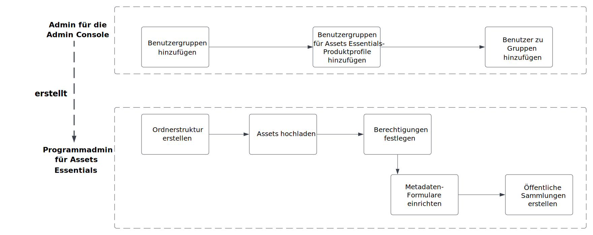
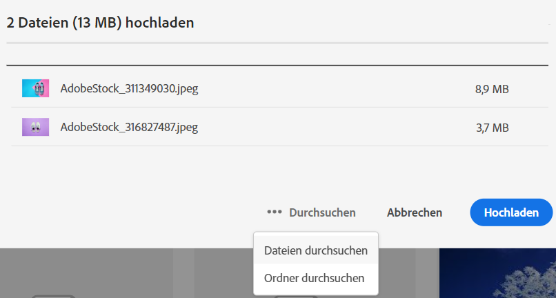
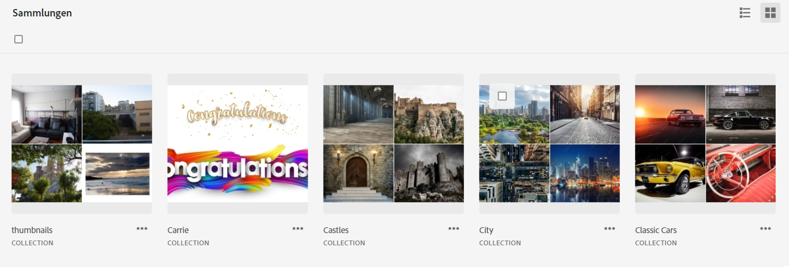

# Verwalten von [!DNL Assets Essentials] und Hinzufügen von Benutzern {#administer}

[!DNL Adobe Experience Manager Assets Essentials] wird von Adobe für seine Kunden bereitgestellt. Im Rahmen der Implementierung wird [!DNL Assets Essentials] in der [!DNL Adobe Admin Console] zur Organisation eines Kunden hinzugefügt. Administratoren verwenden die [!DNL Admin Console], um Benutzerberechtigungen für [!DNL Assets Essentials] zu verwalten, und ernennen Programmadministratoren, um Berechtigungen und Metadatenformulare in [!DNL Assets Essentials] einzurichten.

Das folgende Datenflussdiagramm zeigt die Aufgabensequenz, die ein Administrator zur Konfiguration und Verwaltung von Assets Essentials durchführen muss:

## Zugang zur Admin Console {#access-admin-console}

Nachdem die Assets Essentials-Lösung bereitgestellt wurde, erhält der Administrator eine E-Mail von Adobe. Die E-Mail enthält eine Willkommensnachricht und einen Link zu den ersten Schritten. Darüber hinaus startet Adobe den Prozess zur automatischen Implementierung von Assets Essentials. Der Implementierungsprozess dauert eine Stunde.

Greifen Sie über den Link in der E-Mail auf die [Admin Console](https://adminconsole.adobe.com) zu und melden Sie sich an. Wenn Sie Administratorzugriff auf mehr als ein Konto einer Organisation haben, wählen Sie die entsprechende Organisation aus oder wechseln Sie mithilfe des [Organisationsselektors](https://helpx.adobe.com/de/enterprise/using/admin-console.html) zu ihr. Sobald der automatische Implementierungsprozess abgeschlossen ist, wird die Produktkarte für [!DNL AEM Assets Essentials] in [!DNL Admin Console] angezeigt.

Führen Sie mithilfe von Admin Console die folgenden Benutzerberechtigungsaufgaben aus:

* [Assets Essentials-Anwendungsadministrator erstellen](#create-assets-essentials-administrator)

* [Hinzufügen von Benutzergruppen](#add-user-groups)

* [Hinzufügen von Benutzergruppen zu Produktprofilen](#add-users-to-product-profiles)

### Assets Essentials-Anwendungsadministrator erstellen {#create-assets-essentials-administrator}

Ein Admin Console-Administrator muss einen Assets Essentials-Anwendungsadministrator hinzufügen, um Aufgaben wie das Erstellen einer Ordnerstruktur, das Hochladen von Assets, das Einrichten von Berechtigungen, das Einrichten von Metadatenformularen und das Erstellen öffentlicher Sammlungen zu verwalten. Informationen zum Zuweisen eines Benutzers oder einer Benutzergruppe zu einem Administrator-Profil der Assets Essentials-Anwendung finden Sie unter [Benutzer zu Produktprofilen hinzufügen](#add-users-to-product-profiles).

### Hinzufügen von Benutzergruppen {#add-user-groups}

Erstellen Sie Benutzergruppen und weisen Sie dann Ihre Benutzer den Benutzergruppen zu. Diese Benutzergruppen stehen in Assets Essentials zum Festlegen von Berechtigungen für Ordner zur Verfügung.

Informationen zum Verwalten von Benutzergruppen finden Sie unter `Create user groups` und `Edit user groups`, verfügbar unter [Verwalten von Benutzergruppen](https://helpx.adobe.com/de/enterprise/using/user-groups.html).

>[!NOTE]
>
>Wenn Ihre Admin Console so eingerichtet ist, dass sie ein externes System zur Verwaltung von Benutzer-/Gruppenzuweisungen wie Azure- oder Google-Connectoren, ein Benutzersynchronisierungs-Tool oder die User Management-Rest-API nutzt, werden Ihre Gruppen und Benutzerzuweisungen automatisch konfiguriert. Weitere Informationen finden Sie unter [Adobe Admin Console-Benutzer](https://helpx.adobe.com/de/enterprise/using/users.html).

Informationen zum Verwalten hinzugefügter Benutzer zu Benutzergruppen finden Sie unter `Add users to groups`, verfügbar unter [Verwalten von Benutzergruppen](https://helpx.adobe.com/de/enterprise/using/user-groups.html#add-users-to-groups).

### Hinzufügen von Benutzergruppen zu Produktprofilen {#add-users-to-product-profiles}

Fügen Sie Produktprofilen Benutzergruppen hinzu, damit sie Zugriff auf die Assets Essentials-Anwendung haben.

So fügen Sie Produktprofilen Benutzergruppen hinzu:

1. Rufen Sie die [Admin Console](https://adminconsole.adobe.com) für Ihre Organisation auf, klicken Sie in der oberen Leiste auf **[!UICONTROL Produkte]**, dann auf **[!UICONTROL AEM Assets Essentials]** und anschließend auf die Instanz für [!DNL Assets Essentials]. Der Name der Instanz kann sich von dem im folgenden Screenshot unterscheiden.
   >[!NOTE]
   >
   >Die [!DNL Cloud Manager]-Instanz ist nur für spezielle Admin-Zwecke wie die Überprüfung des Service-Status und den Zugriff auf Service-Protokolle vorgesehen und kann nicht zum Hinzufügen von Benutzern zum Produkt verwendet werden. 

   

   [!DNL Assets Essentials] verfügt über drei Produktprofile, die den Zugriff für Administratoren, Standardbenutzer und Privatkunden darstellen.

   * **[!DNL Assets Essentials]-Administratoren** verfügen über administrativen Zugriff auf das Programm. Zusätzlich zu allen Endbenutzer-Funktionen können Programmadministratoren in dieser Gruppe auch die Berechtigungen aller Ordner und Gruppen/Benutzer im gesamten Programm-Repository verwalten.

   * Benutzer von **[!DNL Assets Essentials]** haben Zugriff auf die gesamte Benutzeroberfläche. Diese Benutzer können digitale Assets hochladen, organisieren, taggen und suchen.

   * Endverbraucher-Benutzer von **[!DNL Assets Essentials]** haben Zugriff auf das eingebettete Asset-Auswahlerlebnis im E-Mail-Vorlageneditor von [!DNL Adobe Journey Optimizer]. Weitere Informationen finden Sie unter [Verwenden von  [!DNL Assets Essentials]  in  [!DNL Journey Optimizer]](https://experienceleague.adobe.com/docs/journey-optimizer/using/create-messages/assets-essentials.html?lang=de).

   

1. Um eine Benutzergruppe zum Produkt hinzuzufügen, klicken Sie auf eines der drei Assets Essentials-Produktprofile und wählen Sie **[!UICONTROL Benutzer hinzufügen]**, geben Sie die Details der Benutzergruppe an und klicken Sie auf **[!UICONTROL Speichern]**.

   

   Wenn Sie einen Benutzer hinzufügen, erhält der Benutzer eine Einladung per E-Mail. Sie können die E-Mail-Einladungen in den Produktprofileinstellungen in der [!DNL Admin Console] deaktivieren.

   >[!NOTE]
   >
   >Sie müssen einen Benutzer zum Produktprofil eines Assets Essentials-Administrators in der Admin Console hinzufügen, damit er in Assets Essentials Verwaltungsaufgaben ausführen kann. Diese Aufgaben umfassen das [Erstellen einer Ordnerstruktur](#create-folder-structure), [Verwalten von Berechtigungen für Ordner](#manage-permissions-for-folders) und [Einrichten von Metadatenformularen](#metadata-forms).

## Zugriff auf Assets Essentials-Anwendungen {#access-assets-essentials-application}

Nachdem Sie Benutzerberechtigungen in Admin Console ausgeführt haben, können Sie auf die Assets Essentials-Anwendung zugreifen, um die folgenden Aufgaben auszuführen:

* [Erstellen einer Ordnerstruktur](#create-folder-structure)

* [Hochladen von Assets](#upload-assets)

* [Verwaltung von Zugriffsberechtigungen für Ordner](#manage-permissions-for-folders)

* [Einrichten von Metadatenformularen](#metadata-forms)

* [Öffentliche Sammlungen erstellen](#create-public-collections)

### Erstellen einer Ordnerstruktur {#create-folder-structure}

Sie können die folgenden Methoden verwenden, um eine Ordnerstruktur im Assets Essentials-Repository zu erstellen:

* Klicken Sie auf die Option **[!UICONTROL Ordner erstellen]** in der Symbolleiste, um einen leeren Ordner zu erstellen.

* Klicken Sie auf die Option **[!UICONTROL Assets hinzufügen]** in der Symbolleiste, um [eine auf Ihrem lokalen Computer vorhandene Ordnerstruktur hochzuladen](add-delete.md).

Erstellen Sie eine Ordnerstruktur entsprechend Ihren betrieblichen Anforderungen. Wenn Sie eine vorhandene Ordnerstruktur in das Assets Essentials-Repository hochladen, sollten Sie die Struktur überprüfen. Weitere Informationen finden Sie unter [Best Practices für die Ordnerstruktur zur effektiven Berechtigungsverwaltung](permission-management-best-practices.md##folder-structure-assets-essentials).

Es gibt verschiedene mögliche Ordnerstrukturtypen, die Sie für Ihr Unternehmen verwenden können. Im Folgenden finden Sie einige Beispiele für typische Ordnerstrukturen:

>[!NOTE]
>
>Um diese Aufgaben, insbesondere die Verwaltung von Berechtigungen, durchführen zu können, muss Ihr Benutzer über Administratorrechte für Programme verfügen und dazu dem [Produktprofil eines Assets Essentials-Administrators](#add-users-to-product-profiles) hinzugefügt werden.

### Hochladen von Assets {#upload-assets}

Um neue Assets hinzuzufügen, mit denen Sie arbeiten können, laden Sie einige Assets aus Ihrem lokalen Dateisystem hoch. Sie können entweder Assets oder Ordner auf die Benutzeroberfläche ziehen und den Anweisungen auf dem Bildschirm folgen oder auf **[!UICONTROL Hinzufügen von Assets]** in der Symbolleiste und fügen Sie einige Dateien zum Upload-Dialogfeld hinzu. [!DNL Assets Essentials] bietet eine leistungsstarke Volltext-Suchfunktion, Sie können aber auch Ordner verwenden, um Ihre Assets besser zu organisieren. Weitere Informationen finden Sie unter [Hochladen von Assets](add-delete.md).

### Verwaltung von Zugriffsberechtigungen für Ordner {#manage-permissions-for-folders}

Mit Assets Essentials können Administratoren die Zugriffsebenen für Ordner verwalten, die im Repository verfügbar sind. Als Administrator können Sie Benutzergruppen erstellen und diesen Gruppen Berechtigungen zum Verwalten von Zugriffsebenen zuweisen. Sie können Benutzergruppen die Berechtigung zur Zugriffsberechtigungsverwaltung auch auf Ordnerebene zuweisen.

>[!VIDEO](https://video.tv.adobe.com/v/341104)

Weitere Informationen finden Sie unter [Verwalten von Berechtigungen für Ordner](manage-permissions.md).

### Einrichten von Metadatenformularen (Optional) {#metadata-forms}

Assets Essentials bietet standardmäßig viele Standard-Metadatenfelder. Unternehmen haben zusätzliche Metadatenanforderungen und benötigen mehr Metadatenfelder, um geschäftsspezifische Metadaten hinzuzufügen. Mit Metadatenformularen können Unternehmen benutzerdefinierte Metadatenfelder zur Seite [!UICONTROL Details] eines Assets hinzufügen. Die geschäftsspezifischen Metadaten verbessern die Verwaltung und Erkennung der Assets. Sie können Formulare von Grund auf neu erstellen oder ein vorhandenes Formular wiederverwenden.

Sie können Metadatenformulare für verschiedene Asset-Typen (verschiedene MIME-Typen) konfigurieren. Verwenden Sie denselben Formularnamen wie den MIME-Typ der Datei. Essentials passt den MIME-Typ der hochgeladenen Assets automatisch an den Namen des Formulars an und aktualisiert die Metadaten für die hochgeladenen Assets basierend auf den Formularfeldern.

Wenn beispielsweise ein Metadatenformular mit dem Namen `PDF` oder `pdf` vorhanden ist, enthalten die hochgeladenen PDF-Dokumente Metadatenfelder, wie sie im Formular definiert wurden.

Weitere Informationen finden Sie unter [Metadatenformulare](metadata.md#metadata-forms).

>[!VIDEO](https://video.tv.adobe.com/v/341275)

Weitere Informationen zu Metadatenformularen finden Sie unter [Metadatenformulare in Assets Essentials](metadata.md#metadata-forms).

### Erstellen öffentlicher Sammlungen (optional) {#create-public-collections}

Eine Sammlung ist ein Satz von Assets innerhalb von Experience Manager Assets Essentials. Anhand von Sammlungen können Assets von mehreren Benutzern gemeinsam verwendet werden.

Im Gegensatz zu Ordnern kann eine Sammlung Assets von verschiedenen Speicherorten enthalten. Sie können mehrere Sammlungen für einen Benutzer freigeben. Jede Sammlung enthält Referenzen zu Assets. Die referenzielle Integrität von Assets wird sammlungsübergreifend aufrechterhalten. Weitere Informationen finden Sie unter [Verwalten von Sammlungen](manage-collections.md).

## Nächste Schritte {#next-steps}

* [Video zur Bereitstellung von Assets Essentials ansehen](https://experienceleague.adobe.com/docs/experience-manager-learn/assets-essentials/provisioning.html?lang=de)

* Geben Sie Produkt-Feedback über die Option [!UICONTROL Feedback] in der Benutzeroberfläche von Assets Essentials

* Geben Sie Feedback zur Dokumentation durch  über die Option [!UICONTROL Diese Seite bearbeiten] oder durch  über die Option [!UICONTROL Problem protokollieren] in der rechten Seitenleiste

* Kontaktieren Sie die [Kundenunterstützung](https://experienceleague.adobe.com/?support-solution=General&amp;lang=de#support)

>[!MORELIKETHIS]
>
>* [[!DNL Admin Console] -Hilfe](https://helpx.adobe.com/enterprise/using/admin-console.html)
>* [[!DNL Cloud Manager] -Hilfe](https://experienceleague.adobe.com/docs/experience-manager-cloud-manager/using/introduction-to-cloud-manager.html?lang=de)
>* [Dokumentation zu Adobe Journey Optimizer](https://experienceleague.adobe.com/docs/journey-optimizer/using/ajo-home.html?lang=de)
>* [Versionshinweise](release-notes.md)
>* [Erste Schritte mit  [!DNL Assets Essentials]](get-started.md)

