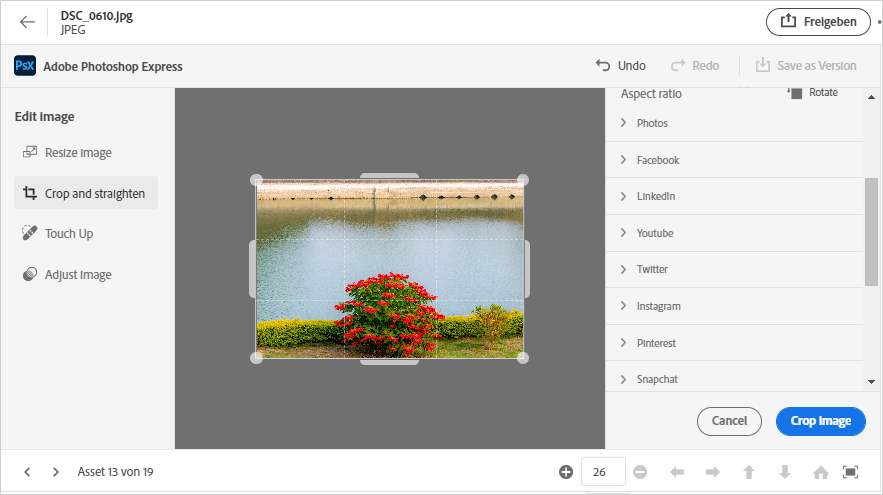
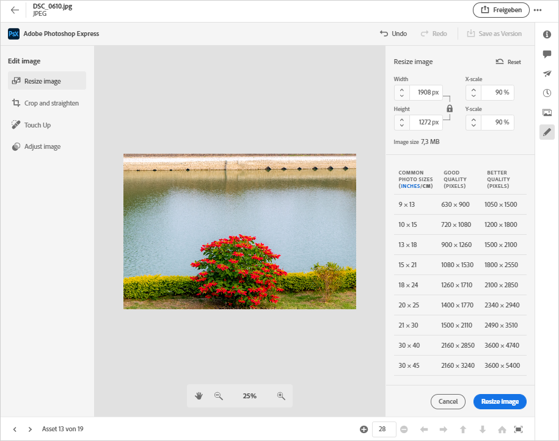
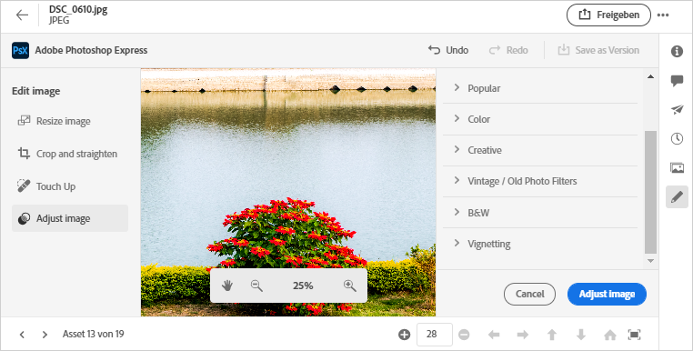

# Bilder bearbeiten in [!DNL Assets Essentials] {#edit-images}

[!DNL Assets Essentials] bietet benutzerfreundliche Bearbeitungsoptionen, die von unterstützt  [!DNL Adobe Photoshop Express]werden. Die verfügbaren Bearbeitungsaktionen sind Bereichsreparatur, Zuschneiden und gerade ausrichten, Bildgröße ändern und Bild anpassen.

Nachdem Sie ein Bild bearbeitet haben, können Sie das neue Bild als neue Version speichern. Mit der Versionierung können Sie bei Bedarf später zum Original-Asset zurückkehren. Um ein Bild zu bearbeiten, öffnen Sie [seine Vorschau](/help/navigate-view.md#preview-assets) und klicken Sie in der Leiste rechts auf **[!UICONTROL Bild bearbeiten]**  .

*Abbildung: Die Optionen zum Bearbeiten von Bildern werden von  [!DNL Adobe Photoshop Express]unterstützt.*

## Bereichsreparaturbilder {#spot-heal-images}

Wenn ein Bild kleine Flecken oder Objekte aufweist, können Sie die Flecken mithilfe der von Adobe Photoshop bereitgestellten Funktion zur Fleckheilung bearbeiten und entfernen.

Der Pinsel nimmt den retuschierten Bereich ab und lässt die reparierten Pixel nahtlos in den Rest des Bildes einfließen. Verwenden Sie eine Pinselgröße, die nur geringfügig größer ist als die Stelle, die Sie reparieren möchten.

<!-- TBD: See if we should give backlinks to PS docs for these concepts.
For more information about how Spot Healing works in Photoshop, see [retouching and repairing photos](https://helpx.adobe.com/photoshop/using/retouching-repairing-images.html). -->

## Bilder beschneiden und gerade ausrichten {#crop-straighten-images}

Mit der Option &quot;Zuschneiden und gerade ausrichten&quot;können Sie das Bild einfach zuschneiden, drehen, horizontal oder vertikal drehen und es auf für beliebte Social-Media-Websites geeignete Abmessungen zuschneiden.

Um Ihre Änderungen zu speichern, klicken Sie auf **[!UICONTROL Bild zuschneiden]**. Nach der Bearbeitung können Sie das neue Bild als Version speichern.

Mit vielen Standardoptionen können Sie Ihr Bild auf die besten Proportionen zuschneiden, die für verschiedene Social-Media-Profile und -Beiträge geeignet sind.

## Bildgröße ändern {#resize-image}

Die Größenanpassung eines Bildes auf eine bestimmte Größe ist ein beliebtes Anwendungsbeispiel. [!DNL Assets Essentials] ermöglicht Ihnen, die Größe des Bildes schnell an die gängigen Bildgrößen anzupassen, indem Sie vorab berechnete neue Auflösungen für bestimmte Bildgrößen bereitstellen. Sie können die gebräuchlichen Bildgrößen in Zentimetern oder Zoll anzeigen, um die Abmessungen zu ermitteln. Standardmäßig behält die Methode zur Größenanpassung das Seitenverhältnis bei. Um das Seitenverhältnis manuell zu überschreiben, klicken Sie auf .

Geben Sie die Dimensionen ein und klicken Sie auf **[!UICONTROL Bildgröße ändern]**, um die Bildgröße zu ändern. Bevor Sie die Änderungen als Version speichern, können Sie entweder alle vor dem Speichern vorgenommenen Änderungen rückgängig machen, indem Sie auf [!UICONTROL Rückgängig] klicken, oder Sie können den spezifischen Schritt im Bearbeitungsvorgang ändern, indem Sie auf [!UICONTROL Wiederherstellen] klicken.

## Bild anpassen {#adjust-image}

[!DNL Assets Essentials] Mit können Sie die Farbe, den Ton, den Kontrast und mehr mit nur wenigen Klicks anpassen. Klicken Sie im Bearbeitungsfenster auf **[!UICONTROL Bild]** anpassen. Die folgenden Optionen sind in der rechten Seitenleiste verfügbar:

* **Beliebt**:  [!UICONTROL Hoher Kontrast und Detail],  [!UICONTROL entsortierter Kontrast],  [!UICONTROL gealtertes Foto],  [!UICONTROL B&amp;W Soft] und  [!UICONTROL B&amp;W Sepia Tone].
* **Farbe**:  [!UICONTROL Natur],  [!UICONTROL Hell],  [!UICONTROL Hoher Kontrast],  [!UICONTROL Hoher Kontrast und Detail],  [!UICONTROL Vivid] und  [!UICONTROL Matte].
* **Kreativ**:  [!UICONTROL entatmetes Kontrast],  [!UICONTROL kühles Licht],  [!UICONTROL Türkis und Rot],  [!UICONTROL Softnebel],  [!UICONTROL Vintage Instant],  [!UICONTROL Warmer Kontrast],  [!UICONTROL Flach und Grün],  [!UICONTROL Rote Lift Matte],  [!UICONTROL Warme Schatten] und  [!UICONTROL Alter Foto].
* **B&amp;W**:  [!UICONTROL B&amp;W Landscape],  [!UICONTROL B&amp;W High Contrast],  [!UICONTROL B&amp;W Punch],  [!UICONTROL B&amp;W Low Contrast],  [!UICONTROL B&amp;W Flat],  [!UICONTROL B&amp;W Soft],  [!UICONTROL B&amp;W Infrared],  [!UICONTROL B&amp;W Selenium Tone],  [!UICONTROL B&amp;W Sepia Tone] und  [!UICONTROL  B&amp;W-Teilung].
* **Vignettierung**:  [!UICONTROL Keine],  [!UICONTROL Licht],  [!UICONTROL Mittel] und  [!UICONTROL Schwerwiegend].

<!--
TBD: Insert a video of the available social media options.
-->

>[!MORELIKETHIS]
>
>* [Versionsverlauf eines Assets anzeigen](/help/navigate-view.md)

