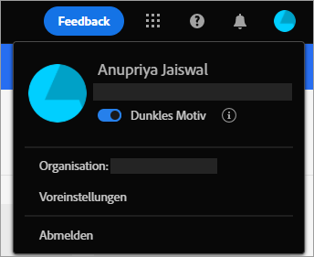
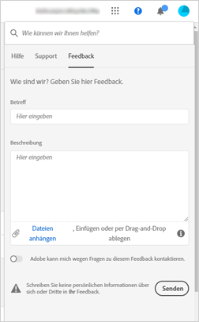

# Erste Schritte mit [!DNL Experience Manager Assets Essentials] {#assets-essentials-get-started}

<!-- TBD: Make links for these steps. -->

Die Verwaltung digitaler Assets mit [!DNL Assets Essentials] erfordert nur drei einfache Schritte:

* **Schritt 1**:   Hochladen und   Anzeigen von Assets.
* **Schritt 2**:   Assets durchsuchen und   herunterladen.
* **Schritt 3**:  [Verwalten und ](/help/manage-organize.md) Organisieren von Assets.

Um [!DNL Assets Essentials] zu verwenden, melden Sie sich unter [https://experience.adobe.com/#/assets](https://experience.adobe.com/#/assets) an. Wenden Sie sich an den Administrator Ihres Unternehmens, um Zugriff zu erhalten.

Weitere Referenzinformationen, die hilfreich sein können, sind [Verständnis der Benutzeroberfläche](/help/navigate-view.md), [Liste der Anwendungsfälle](#use-cases), <!-- TBD: [supported file types](/help/supported-file-formats.md), --> und [bekannte Probleme](/help/release-notes.md#known-issues).

## Zugriff auf [!DNL Assets Essentials] erhalten {#get-access}

Adobe stellt die Lösung bereit und fügt die von Ihrem Unternehmen benannte Person als Administrator hinzu. Die Administratoren können mithilfe von [[!DNL Admin Console]](https://helpx.adobe.com/enterprise/admin-guide.html/enterprise/using/welcome.ug.html) Zugriff auf verschiedene Benutzer aus der Organisation gewähren. Wenden Sie sich bei Anfragen bezüglich Ihres Zugriffs an den Administrator Ihres Unternehmens.

## Konfigurieren [!DNL Assets Essentials] {#configuration}

Um die Voreinstellungen zu öffnen, klicken Sie auf den Avatar in der oberen rechten Ecke der Benutzeroberfläche. Sie können in den Lösungsvoreinstellungen zwischen den hellen und den dunklen Themen wechseln.

Wenn Sie Mitglied verschiedener Organisationen sind, können Sie auch die Organisation ändern und unternehmensübergreifend auf Ihre Konten zugreifen.

Um Ihre [!UICONTROL Experience Cloud-Voreinstellungen] zu ändern, klicken Sie auf [!UICONTROL Voreinstellungen].

<!-- TBD: What can admins configure? What more can users configure? Any doc that describes Exp Cloud preferences? 
Metadata forms is out of the scope of 6/17 GA. When the functionality is added, link to it from here. It is about configuring metadata UI. -->

<!-- TBD: This section contains beta-specific video that will be updated post-GA.

## Login experience {#login-experience}

When logging in, after providing the credentials, you can be prompted to select an account. In this case, select `Company or School Account` to proceed.

-->

## [!DNL Assets Essentials] Anwendungsfälle {#use-cases}

Nachfolgend finden Sie die verschiedenen DAM-Aufgaben (Digital Asset Management), die Sie mit [!DNL Assets Essentials] ausführen können.

| Benutzeraufgaben | Funktionalität und Anleitungsinformationen |
|-----|------|
| Wie füge ich ein Asset hinzu? | <ul> <li> [Hochladen von Assets](/help/add-delete.md) </li> <li> [Ausgabeformate](/help/add-delete.md#renditions) </li> </ul> |
| Wie aktualisiert ich Assets oder zugehörige Informationen? | <ul> <li>Vorhandenes Asset ändern</li> <li>[Erstellen von ](/help/manage-organize.md#create-versions) Versionen und  [Anzeigen von Versionen](/help/navigate-view.md#view-versions)</li> <li>[Bearbeiten von Bildern](/help/edit-images.md)</li> </ul> |
| Wie finde ich Assets? | <ul> <li>[Repository durchsuchen](/help/navigate-view.md#view-assets-and-details) </li> <li> [Asset-Vorschau ](/help/navigate-view.md#preview-assets) anzeigen und Assets  [herunterladen](/help/manage-organize.md) </li> <li>[Anzeigen detaillierter Metadaten](/help/metadata.md) </li> <li>[Suchen von Assets](/help/search.md)</li></ul> |
| Wie kann ich Assets im Repository bearbeiten? | <ul> <li>[Bearbeitung im Browser mit Adobe Photoshop Express](/help/edit-images.md)</li> <li>[Zuschneiden für ein Social-Media-Profil](/help/edit-images.md#crop-straighten-images)</li> <li>[Anzeigen und Verwalten von Versionen](/help/manage-organize.md#create-versions)</li> <li>Verwenden Sie [Adobe Asset Link](/help/integration.md#integrations)</ul></ul> |
| Wie suche ich im Repository nach Assets? | <ul> <li>[Suchen in einem bestimmten Ordner](/help/search.md)</li> <li>[Gespeicherte Suchvorgänge](/help/search.md)</li> <li>[Suchen nach kürzlich angezeigten Assets](/help/search.md)</li> <li>[Volltextsuche](/help/search.md) |
| Wie füge ich neue Assets hinzu? | <ul> <li>[Hochladen neuer Assets und Ordner](/help/add-delete.md#add-assets)</li> <li>[Überwachen des Upload-Fortschritts und Verwalten von Uploads](/help/add-delete.md)</li> <li>[Duplikate auflösen](/help/add-delete.md#resolve-upload-fails)</li> </ul> |
| Kann [!DNL Assets Essentials] in andere Lösungen integriert werden? | <ul> <li>[Verwenden der Asset-Auswahl in [!DNL Adobe Journey Optimizer]](/help/integration.md)</li> <li>[[!DNL Adobe Asset Link] für [!DNL Creative Cloud]](/help/integration.md)</li> <li>Integration mit [!DNL Creative Cloud Team]-Bibliotheken</li> </ul> |

<!--TBD: Merge in above table when these use cases are documented/available.
| How do I delete assets? | <ul> <li>[Delete assets](/help/manage-organize.md)</li> <li>Recover deleted assets</li> <li>Permanently delete assets</li> </ul> |
| How do I share assets or find shared assets? | <ul> <li>Shared by me</li> <li>Shared with me</li> <li>Share for comments and review</li> <li>Unshare assets</li> </ul> |
| How do I collaborate with others and get my assets reviewed | <ul> <li>Share for review</li> <li>Provide comments. Resolve and filter comments</li> <li>Annotations on images</li> <li>Assign tasks to specific users and prioritize</li> </ul> |
-->

##  SymbolBereitstellen von Produktfeedback {#provide-feedback}

Adobe begrüßt Feedback zur Lösung. Verwenden Sie die Option [!UICONTROL Feedback] in der Benutzeroberfläche, um Feedback zu geben, ohne die Arbeitsoberfläche zu wechseln. Es ermöglicht auch das Anhängen von Dateien wie Screenshots oder Videoaufzeichnungen eines Problems.

Um Feedback zur Dokumentation zu geben, klicken Sie auf [!UICONTROL Diese Seite bearbeiten]  oder [!UICONTROL Melden Sie ein Problem]  in der rechten Seitenleiste. Sie können einen der folgenden Schritte ausführen:

* Nehmen Sie die Inhaltsaktualisierungen vor und senden Sie eine GitHub-Pull-Anfrage.
* Erstellen Sie ein Problem oder Ticket in GitHub. Behalten Sie beim Erstellen eines Problems den automatisch ausgefüllten Artikelnamen bei.

>[!MORELIKETHIS]
>
>* [Machen Sie sich mit der Benutzeroberfläche](/help/navigate-view.md) vertraut.
>* [Versionshinweise und bekannte Probleme](/help/release-notes.md).

<!-- TBD: 
>* [Supported file types](/help/supported-file-formats.md).
-->
