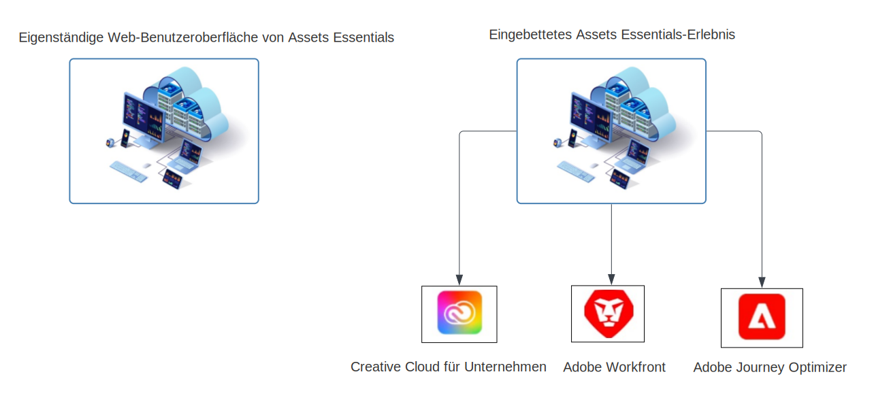

# Überblick über [!DNL Adobe Experience Manager Assets Essentials] {#assets-essentials}

<!-- TBD: Update this banner to remove Beta label. 

-->

Adobe bietet robuste DAM-Lösungen (Digital Asset Management), mit denen Sie Ihre digitalen Assets optimal nutzen können. Adobe Experience Manager Assets Essentials ist die einfache Asset-Management-Lösung von Adobe zum Speichern, Verwalten, Entdecken und Verwenden digitaler Assets.

## Was ist Assets Essentials? {#assets-essemtials-overview}

Experience Manager Assets Essentials ist eine einfache Edition von Adobe Experience Manager Assets Cloud Service. Assets Essentials bietet eine einheitliche Asset-Verwaltung und Zusammenarbeit mit einer vereinfachten, modernen Benutzeroberfläche. Die benutzerfreundliche Lösung ermöglicht es kreativen und Marketing-Teams, digitale Assets zu speichern, zu entdecken und zu verteilen.

Mit Assets Essentials können Sie:

* Verwalten, Organisieren und Verwalten von Assets an einem zentralen Speicherort

* Zusammenarbeit bei der Entwicklung von Inhalten in allen Teams.

* Rufen Sie genehmigte Assets auf, suchen Sie sie und suchen Sie sie.

* Freigeben und Herunterladen von Assets für die nachgelagerte Bereitstellung.

## Wie greife ich auf Assets Essentials zu? {#access-options}

Assets Essentials bietet eine eigenständige Web-Benutzeroberfläche für Endbenutzer und Administratoren, über die sie auf alle Funktionen der Lösung zugreifen können. Anwender anderer Adobe-Lösungen können über ein eingebettetes Erlebnis, das in Creative Cloud für Enterprise-, Adobe Journey Optimizer- und Adobe Workfront- verfügbar ist, auch auf Assets aus Assets Essentials zugreifen und mit ihnen arbeiten.

## Warum Assets Essentials? {#assets-essentials-features}

Assets Essentials bietet wichtige Vorteile:

* **Erste Schritte schnell** mit nativen Tools für die Asset-Verwaltung.

* Erweitern des Zugriffs auf Assets auf mehr Teams, um konsistente Kundenerlebnisse mit **vereinfachtes Asset-Management**.

* Vereinheitlichen des Inhaltslebenszyklus mit nativen Inhalten **Integrationen in andere Adobe-Lösungen**.

* Nutzen Sie eine **Cloud-basierte Plattform**, sicher und skalierbar jederzeit und überall.

* Beginnen Sie mit den grundlegenden DAM-Funktionen und **wachsen** auf Unternehmens-DAM.

**Erste Schritte schnell**

Die Assets Essentials-Lösung wird den Kunden nach Adobe bereitgestellt und steht nach Abschluss des Bereitstellungsprozesses zur Verfügung. Administratoren erhalten Zugriff auf das Produkt in Adobe Admin Console und können sofort mit der Systemkonfiguration und dem Onboarding von Benutzern beginnen.

Weitere Informationen zur Assets Essentials [Administration und Onboarding von Benutzern](deploy-administer.md).

**Vereinfachtes Asset-Management**

Die vereinfachte Benutzeroberfläche von Assets Essentials erleichtert die Verwaltung, Erkennung und Verteilung digitaler Assets. Ein breites Spektrum von Benutzern aus verschiedenen Funktionen, einschließlich Kreativ-, Marketing- und Branchenteams, kann an Assets zusammenarbeiten und auf die richtigen, genehmigten Assets zugreifen, wann und wo sie benötigt werden.

Weitere Informationen finden Sie unter [Erste Schritte mit Ihren Asset-Management-Anforderungen mit Assets Essentials](get-started.md).

**Integration mit anderen Adobe Apps**

Assets Essentials ist mit den unterstützten Adobe-Lösungen integriert und bietet ein eingebettetes Erlebnis über die Benutzeroberflächen dieser Anwendungen. Damit können Benutzer problemlos auf Assets zugreifen, die sie direkt in ihrer Anwendung benötigen. Alle Benutzer können mit denselben zentral verwalteten Assets in ihren vertrauten Tools und Anwendungen arbeiten.

Das eingebettete Assets Essentials-Erlebnis steht für Creative Cloud für Enterprise-, Adobe Journey Optimizer- und Adobe Workfront-Anwendungen zur Verfügung.

Weitere Informationen finden Sie unter [Integration mit anderen Adobe-Lösungen](integration.md).

**Cloud-basierte Plattform**

Basierend auf der Cloud-Infrastruktur von Adobe ermöglicht Assets Essentials Unternehmen, sich auf ihre Geschäftsanforderungen zum Erstellen, Verwalten und Verteilen digitaler Assets zu konzentrieren. Darüber hinaus stellt Adobe sicher, dass die Lösung verfügbar, sicher, skalierbar und stets auf dem neuesten Stand ist, mit Produktinnovationen, die Benutzern nahtlos über häufige Updates bereitgestellt werden.

**Leistungsstarke Funktionen**

Profitieren Sie von den zentralen Digital Asset Management-Funktionen verschiedener Teams, um Assets Essentials schnell zu nutzen.

Wenn Ihr Geschäftsbedarf wächst und Sie Unterstützung für erweiterte Digital Asset Management-Anforderungen wie Anpassungen, Erweiterbarkeit und Integrationen, Automatisierung, Dynamic Media und Brand Portal benötigen, bietet Adobe auch [Adobe Experience Manager Assets as a Cloud Service](https://experienceleague.adobe.com/docs/experience-manager-cloud-service/content/assets/home.html?lang=en).

## Nächste Schritte {#next-steps}

* Geben Sie Produkt-Feedback über die Option [!UICONTROL Feedback] in der Benutzeroberfläche von Assets Essentials

* Geben Sie Feedback zur Dokumentation durch  über die Option [!UICONTROL Diese Seite bearbeiten] oder durch  über die Option [!UICONTROL Problem protokollieren] in der rechten Seitenleiste

* Kontaktieren Sie die [Kundenunterstützung](https://experienceleague.adobe.com/?support-solution=General&amp;lang=de#support)

>[!MORELIKETHIS]
>
>* [[!DNL Assets Essentials] Tutorials-Seite](https://experienceleague.adobe.com/docs/experience-manager-learn/assets-essentials/overview.html?lang=en)

