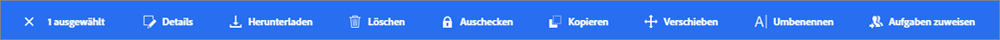
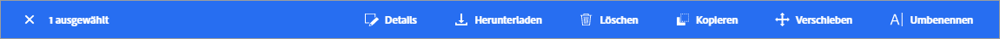
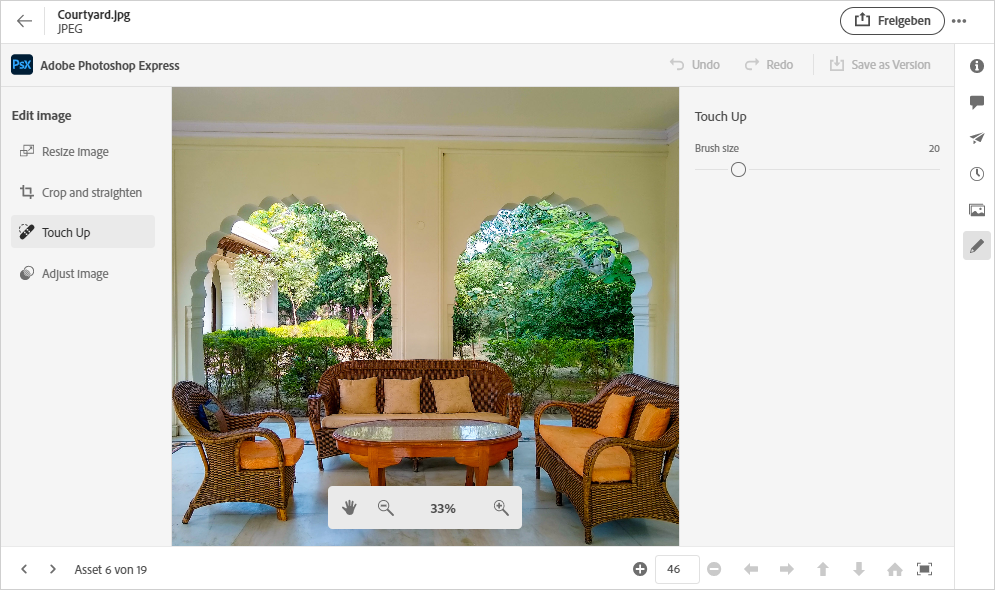
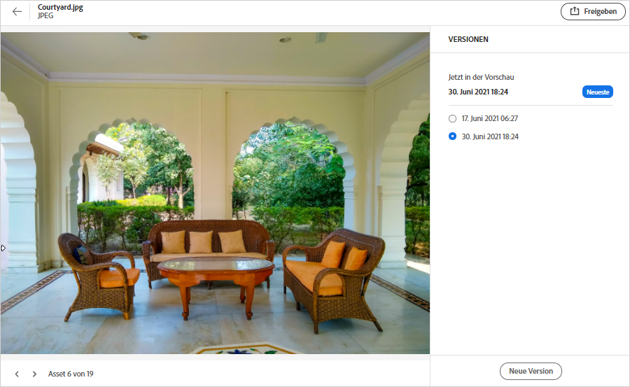
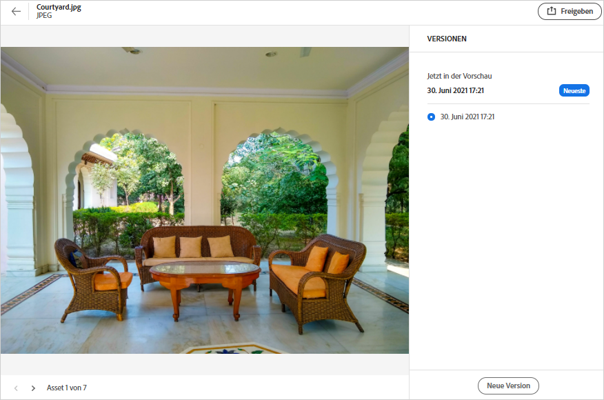

# Verwalten von Assets {#manage-assets}

Mithilfe der benutzerfreundlichen Oberfläche von [!DNL Assets Essentials] können Sie mühelos verschiedene Aufgaben des Digital Asset Management (DAM) ausführen. Nachdem Sie die Assets hinzugefügt haben, können Sie sie suchen, herunterladen, verschieben, kopieren, umbenennen, löschen, aktualisieren und bearbeiten.

Verwenden Sie [!DNL Assets Essentials], um die folgenden Asset-Management-Aufgaben auszuführen. Wenn Sie ein Asset auswählen, werden die folgenden Optionen in der Symbolleiste oben angezeigt.

*Abbildung: In der Symbolleiste verfügbare Optionen für ein ausgewähltes Bild.*

*  Deaktivieren der Auswahl.
*  Anklicken, um ein Asset in der Vorschau anzuzeigen und die detaillierten Metadaten anzuzeigen. Aus der Vorschau heraus können Sie die Versionen anzeigen und ein Bild bearbeiten.
*  Lädt das ausgewählte Asset in Ihr lokales Dateisystem herunter.
*  Löscht das ausgewählte Asset oder den ausgewählten Ordner.
*  SymbolCheckout für das ausgewählte Asset.
*  Kopiert die ausgewählte Datei oder den ausgewählten Ordner.
*  Verschiebt das ausgewählte Asset oder den ausgewählten Ordner an einen anderen Speicherort in der Repository-Hierarchie.
*  Benennt das ausgewählte Asset oder den ausgewählten Ordner um. Verwenden Sie einen eindeutigen Namen, sonst schlägt die Umbenennung mit einer Warnung fehl. Sie können es mit einem anderen Namen erneut versuchen.
*  Weisen Sie anderen Benutzern Aufgaben zu, um an einem Asset zusammenzuarbeiten.

Sie können die gleichen Optionen bei den Miniaturansichten der Assets anzeigen.

[!DNL Assets Essentials] zeigt nur die relevanten Optionen in der Symbolleiste an, die vom Typ des ausgewählten Assets abhängen.

*Abbildung: In der Symbolleiste verfügbare Optionen für einen ausgewählten Ordner.*

*Abbildung: In der Symbolleiste verfügbare Optionen für eine ausgewählte PDF-Datei.*

## Herunterladen und Verteilen von Assets {#download}

Sie können ein oder mehrere Assets oder Ordner oder eine Kombination aus beiden auswählen und die Auswahl in Ihr lokales Dateisystem herunterladen. Sie können die Assets bearbeiten und erneut hochladen oder die Assets außerhalb von [!DNL Assets Essentials] verteilen. Außerdem können Sie [die Ausgabeformate](/help/add-delete.md#renditions) eines Assets herunterladen.

## Asset-Versionierung {#versions-of-assets}

<!-- 
TBD: query for engineering: How many versions are maintained. What happens when we reach that limit? Are old versions automatically removed? -->

[!DNL Assets Essentials] versioniert die Assets, wenn die Assets, die aktualisiert oder bearbeitet werden, erneut hochgeladen werden. Sie können den Versionsverlauf und frühere Versionen anzeigen und eine frühere Version von Assets als neueste Version wiederherstellen, die bei Bedarf auf eine frühere Version zurückgesetzt wird. Asset-Versionen werden in den folgenden Szenarien erstellt:

* Ein neues Asset wird mit demselben Dateinamen wie ein vorhandenes Asset und in denselben Ordner wie das vorhandene Asset hochgeladen. [!DNL Assets Essentials] fordert dazu auf, entweder das vorherige Asset zu überschreiben oder das neue Asset als Version zu speichern. Siehe [Hochladen von Asset-Duplikaten](/help/add-delete.md#resolve-upload-fails).

   

   *Abbildung: Beim Hochladen eines Assets mit dem Namen eines vorhandenen Assets können Sie eine Version des Assets erstellen.*

* Bearbeiten Sie ein Bild und klicken Sie auf **[!UICONTROL Als Version speichern]**. Siehe [Bearbeiten von Bildern](/help/edit-images.md).

   

   *Abbildung: Speichern Sie das bearbeitete Bild als Version.*

* Öffnen Sie die Versionen eines vorhandenen Assets. Klicken Sie auf **[!UICONTROL Neue Version]** und laden Sie eine neuere Version des Assets in das Repository hoch.

   

### Anzeigen von Versionen eines Assets {#view-versions}

Beim Hochladen eines Duplikats oder einer geänderten Kopie eines Assets können Sie dessen Versionen erstellen. Mit der Versionierung können Sie historische Assets überprüfen und bei Bedarf zu einer früheren Version zurückkehren.

Um Versionen anzuzeigen, öffnen Sie die Vorschau eines Assets und klicken Sie in der rechten Seitenleiste auf **[!UICONTROL Versionen]** . Um eine bestimmte Version in der Vorschau anzuzeigen, wählen Sie sie aus. Um zu ihr zurückzukehren, klicken Sie auf **[!UICONTROL Neueste erstellen]**.

Sie können Versionen auch aus der Versions-Zeitleiste erstellen. Wählen Sie die neueste Version aus, klicken Sie auf **[!UICONTROL Neue Version]** und laden Sie eine neue Kopie des Assets aus Ihrem lokalen Dateisystem hoch.

*Abbildung: Zeigen Sie Versionen eines Assets an, kehren Sie zu einer früheren Version zurück oder laden Sie eine andere neue Version hoch.*
