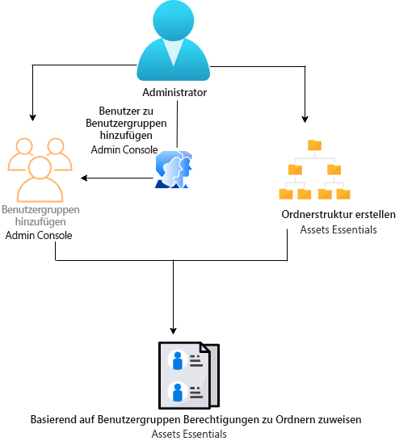
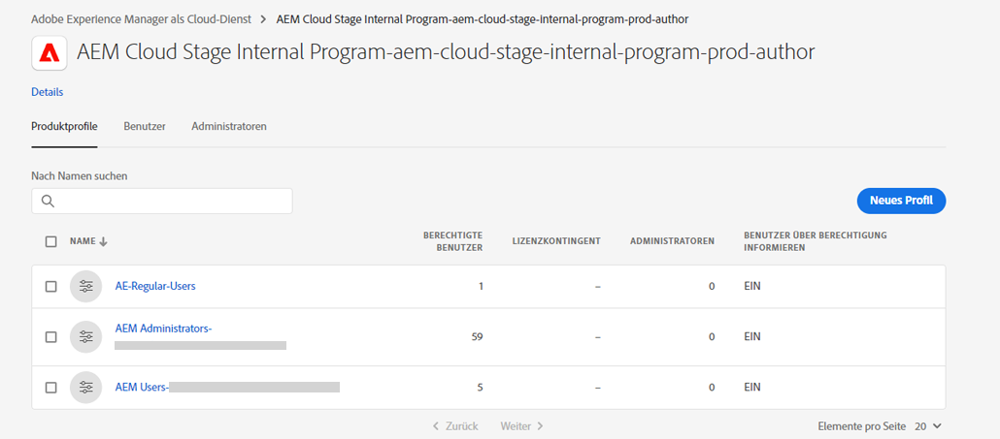
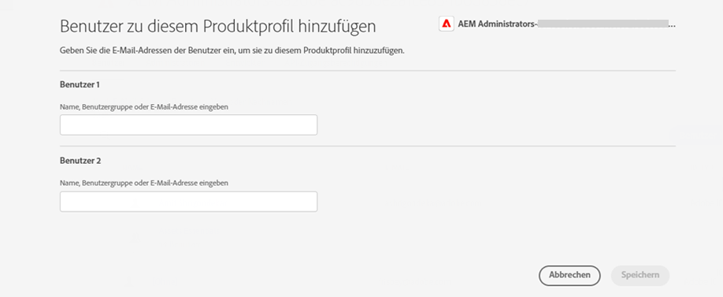
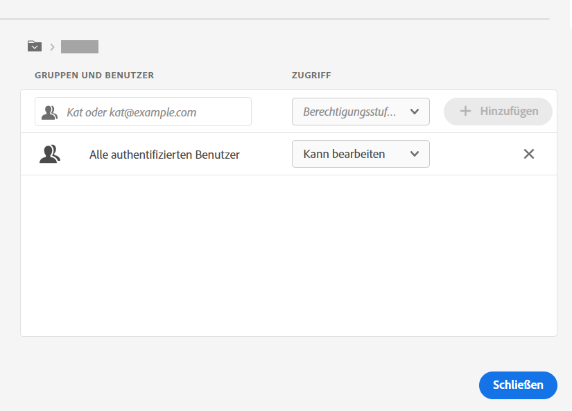
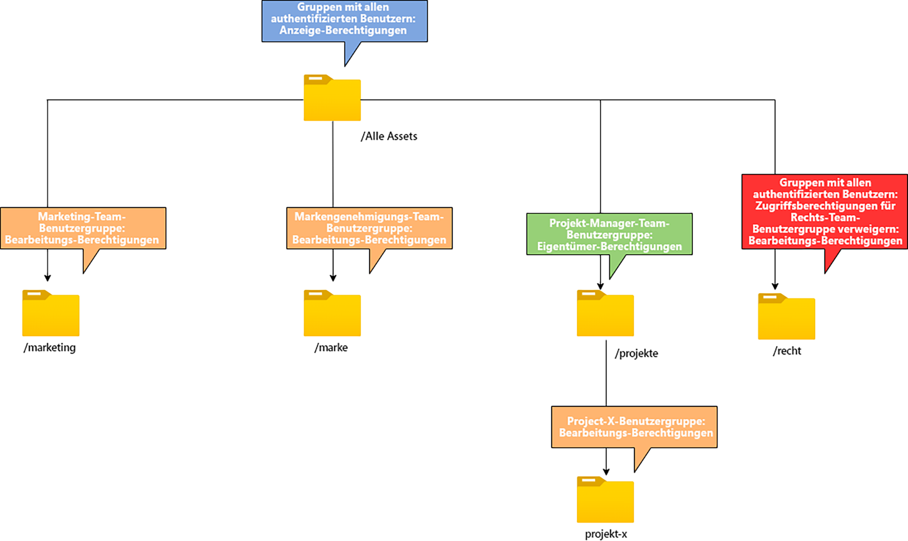

# Berechtigungen für Ordner verwalten

Mit Assets Essentials können Administratoren die Zugriffsebenen für Ordner verwalten, die im Repository verfügbar sind. Als Administrator können Sie Benutzergruppen erstellen und diesen Gruppen Berechtigungen zum Verwalten von Zugriffsebenen zuweisen. Sie können die Berechtigungsverwaltungsberechtigungen auch auf Ordnerebene Benutzergruppen zuweisen.

Das folgende Datenflussdiagramm zeigt die Abfolge von Aufgaben, die Sie zum Konfigurieren und Verwalten von Berechtigungen für Ordner ausführen, die im Assets Essentials-Repository verfügbar sind:

## Vor dem Verwalten von Berechtigungen für Ordner {#before-managing-permissions}

Bevor Sie mit der Verwaltung von Ordnerberechtigungen in Ihrem Assets Essentials-Repository beginnen, müssen Sie bestimmte Aufgaben ausführen, z. B. das Hinzufügen von Administratoren, die eine logische Ordnerstruktur erstellen, Benutzergruppen erstellen und Ordnerberechtigungen für verschiedene Benutzergruppen verwalten.

### Administratoren hinzufügen {#add-admin-users}

Fügen Sie Administratoren für die Assets Essentials-Anwendung hinzu, damit sie Ordnerberechtigungen für andere Benutzergruppen verwalten können.

Hinzufügen von Administratoren:

1. Zugriff [Admin Console](https://adminconsole.adobe.com) Klicken Sie für Ihre Organisation auf **[!UICONTROL Produkte]** Klicken Sie in der oberen Leiste auf **[!UICONTROL AEM Assets Essentials]** und klicken Sie anschließend auf [!DNL Assets Essentials] Umgebung. [!DNL Assets Essentials] verfügt über drei Produktprofile, die den Zugriff für Administratoren, normale Benutzer und Verbraucher darstellen.

   

1. Um einen Benutzer zu einer Gruppe hinzuzufügen, klicken Sie auf die Gruppe Assets Essentials-Administratoren und wählen Sie **[!UICONTROL Benutzer hinzufügen]**, geben Sie die Benutzerdetails an und klicken Sie auf **[!UICONTROL Speichern]**.

   

   Wenn Sie einen Benutzer hinzufügen, erhält der Benutzer eine Einladung per E-Mail. Sie können die E-Mail-Einladungen in den Produktprofileinstellungen in der [!DNL Admin Console] deaktivieren.

1. Um einen Benutzer aus einer Gruppe zu entfernen, klicken Sie auf die Gruppe, wählen Sie einen vorhandenen Benutzer aus und wählen Sie **[!UICONTROL Benutzer entfernen]** aus.

### Benutzergruppen hinzufügen {#add-user-groups}

Erstellen Sie Benutzergruppen und weisen Sie diesen Gruppen Berechtigungen zu, um Ordnerzugriffsstufen im Assets Essentials-Repository zu verwalten. Anschließend können Sie Ihre Benutzer den Benutzergruppen zuweisen.

Sie können Benutzer zu Benutzergruppen (1) hinzufügen und [Anwender für Assets Essentials-Produktprofile (2)](#add-admin-users). Es ist jedoch nicht möglich, Benutzergruppen direkt zu Assets Essentials-Produktprofilen (3) hinzuzufügen.

Informationen zum Verwalten von Benutzergruppen finden Sie unter `Create user groups` und `Edit user groups` verfügbar unter [Benutzergruppen verwalten](https://helpx.adobe.com/enterprise/using/user-groups.html).

>[!NOTE]
>
>Wenn Ihre Admin Console so eingerichtet ist, dass sie ein externes System zur Verwaltung von Benutzer-/Gruppenzuweisungen wie Azure- oder Google-Connectoren, Benutzersynchronisierungs-Tool oder User Management Rest-API nutzt, werden Ihre Gruppen und Benutzerzuweisungen automatisch konfiguriert. Weitere Informationen finden Sie unter [Adobe Admin Console-Benutzer](https://helpx.adobe.com/enterprise/using/users.html).

### Hinzufügen von Benutzern zu Gruppen {#add-users-to-uesr-groups}

Nachdem Sie Benutzergruppen erstellt haben, können Sie damit beginnen, Benutzer zu Benutzergruppen hinzuzufügen.

Informationen zum Verwalten des Hinzufügens von Benutzern zu Benutzergruppen finden Sie unter `Add users to groups` verfügbar unter [Benutzergruppen verwalten](https://helpx.adobe.com/in/enterprise/using/user-groups.html#add-users-to-groups).

### Ordnerstruktur erstellen {#create-folder-structure}

Sie können die folgenden Methoden verwenden, um eine Ordnerstruktur im Assets Essentials-Repository zu erstellen:

* Klicken Sie auf **[!UICONTROL Ordner erstellen]** in der Symbolleiste verfügbar, um einen leeren Ordner zu erstellen.

* Klicken **[!UICONTROL Hinzufügen von Assets]** -Option in der Symbolleiste verfügbar, um [Laden Sie eine Ordnerstruktur hoch, die auf Ihrem lokalen Computer verfügbar ist.](add-delete.md).

Erstellen Sie eine Ordnerstruktur, die den Geschäftszielen der Organisation entspricht. Wenn Sie eine vorhandene Ordnerstruktur in das Assets Essentials-Repository hochladen, sollten Sie die Struktur überprüfen. Weitere Informationen finden Sie unter [Best Practices für die effektive Berechtigungsverwaltung](permission-management-best-practices.md).

## Berechtigungen für Ordner verwalten {#manage-permissions-folders}

Sie können die folgenden Berechtigungen den Benutzergruppen oder Benutzern zuweisen. Adobe rät davon ab, Benutzern Berechtigungen zuzuweisen.

| Berechtigungsname | Beschreibung |
|-----|------|
| Kann anzeigen | <ul><li>Lesezugriff zum Anzeigen und Navigieren in Ordnern </li><li>Anzeigen einer Vorschau für Assets</li><li>Herunterladen von Assets</li><li>Kopieren von Assets</li><li>Freigeben von Links zu Assets</li><ul> |
| Kann bearbeiten | <ul><li>Alle Berechtigungen, die für Kann-Ansicht-Berechtigungen verfügbar sind </li><li>Erstellen von Ordnern</li><li>Entfernen von Ordnern</li><li>Ordner umbenennen</li><li>Erstellen von Assets</li><li>Aktualisieren von Assets</li><li>Entfernen von Assets</li><li>Verschieben von Assets</li><li>Umbenennen von Assets</li><ul> |
| Inhaber | <ul><li>Alle Berechtigungen, die für die Berechtigungen &quot;Kann bearbeiten&quot;verfügbar sind</li><li>Berechtigungen für Ordner und deren Unterordner verwalten</li>Diese Berechtigung ermöglicht es den Administratoren, die Administratorberechtigungen für einen Ordner und dessen Unterordner an andere zu delegieren.<ul> |
| Zugriff verweigern | Entfernen Sie die Berechtigungen &quot;Kann anzeigen&quot;, &quot;Kann bearbeiten&quot;und &quot;Inhaber&quot;für einen Ordner und dessen Unterordner. |

**Standardberechtigungen**

Alle Benutzer, die authentifiziert sind und sich bei der Assets Essentials-Anwendung anmelden können, haben `Can Edit` zunächst Berechtigungen für das Assets Essentials-Repository. Der Administrator kann die Standardberechtigungen ändern, indem er [Bearbeitungsberechtigungen für das gesamte Assets Essentials-Repository](#edit-permissions-entire-repository).

**Sequenz zum Zuweisen von Ordnerberechtigungen zu Benutzergruppen**

Erstellen Sie Regeln, um Benutzergruppen Ordnerberechtigungen zuzuweisen. Die Reihenfolge, in der Sie einem Ordner Berechtigungen zuweisen, ist wichtig und entscheidet über den Zugriff, der den Benutzergruppen und schließlich Benutzern zur Verfügung steht.

Wenn Sie beispielsweise die `Can View` Berechtigungen für einen Ordner zu einer Supergruppe und dann zuweisen `Can Edit` Berechtigungen für die Untergruppe zuweisen, haben nur die Mitglieder der Untergruppe Bearbeitungsberechtigungen für den Ordner. Die Supergruppenbenutzer haben Zugriff auf den Ordner.

Wenn Sie der `Marketing` Ordner nur der Marketing-Abteilung Ihres Unternehmens zuweisen und Berechtigungen für andere anzeigen, `Can View` Berechtigungen für die Supergruppe `All Authenticated Users` und `Can Edit` Berechtigungen für seine Untergruppe `Marketing`.

**Berechtigungsvererbung**

Assets Essentials verwendet die Berechtigungsvererbung, mit der Sie die für den übergeordneten Ordner im untergeordneten Ordner festgelegten Berechtigungen erben können. Wenn der übergeordnete Ordner beispielsweise `Can View` Berechtigungen für `All Authenticated Users` und der untergeordnete Ordner `Can Edit` Berechtigungen für `Marketing` Benutzergruppe, ermöglicht es allen authentifizierten Benutzern, Anzeigeberechtigungen für den untergeordneten Ordner und die `Marketing` Benutzergruppe, um Bearbeitungsberechtigungen für den untergeordneten Ordner zu erhalten. Die `Marketing` Benutzergruppe hat Bearbeitungsberechtigungen für weitere Ordnerebenen unter dem untergeordneten Ordner (Marketing).

>[!NOTE]
>
> Festlegen einer `Deny Access` Berechtigungen für eine Gruppe in einem Ordner mit höherer Ebene und Wiederherstellung des Zugriffs (`Can view`, `Can edit` oder `Owner`) für diese Gruppe oder ihr Mitglied wird nicht unterstützt. Verwendung `Deny Access` sparsam.

### Berechtigungen zu Benutzergruppen hinzufügen {#add-permissions}

So weisen Sie Gruppenberechtigungen für Ordner zu:

1. Wählen Sie den Ordner aus und klicken Sie auf **[!UICONTROL Berechtigungen verwalten]**.

1. Im **[!UICONTROL Berechtigungen verwalten]** Geben Sie den Namen der Gruppe oder eines Benutzers im **[!UICONTROL Gruppen und Benutzer]** -Feld.

1. Wählen Sie die [Zugangsstufe](#manage-permissions-folders) von **[!UICONTROL Zugriff]** Dropdown-Liste.

1. Klicken **[!UICONTROL Hinzufügen]** , um eine sofortige Änderung an den Berechtigungen für den Benutzer oder die Benutzergruppe vorzunehmen.

1. Wiederholen Sie die Schritte 1 bis 3, um dem **[!UICONTROL Berechtigungen verwalten]** angezeigt.

   

   >[!NOTE]
   >
   > Die Reihenfolge, in der Sie einem Ordner Berechtigungen zuweisen, ist wichtig und entscheidet über den Zugriff, der den Benutzergruppen und schließlich den zu den Gruppen hinzugefügten Benutzern zur Verfügung steht.

   Wenn Sie Berechtigungen für mehrere Ordner verwalten, können Sie auch einen anderen Ordner im linken Bereich auswählen und mit der Verwaltung der Berechtigungen für diesen Ordner beginnen.

1. Klicken Sie auf **[!UICONTROL Schließen]**.

>[!CAUTION]
>
> Es wird empfohlen, Berechtigungen für Benutzergruppen und nicht für einzelne Benutzer zu verwalten. Festlegen der `Deny access` -Berechtigung wird nur für Benutzergruppen, aber nicht für einzelne Benutzer unterstützt.

### Berechtigungen bearbeiten, die Benutzergruppen zugewiesen sind {#edit-permissions}

So bearbeiten Sie Berechtigungen, die Benutzergruppen für Ordner zugewiesen sind:

1. Wählen Sie den Ordner aus und klicken Sie auf **[!UICONTROL Berechtigungen verwalten]**.

1. Im **[!UICONTROL Berechtigungen verwalten]** Dialogfeld, bearbeiten Sie die [Zugangsstufe](#manage-permissions-folders) von **[!UICONTROL Zugriff]** Dropdown-Liste.

1. [Hinzufügen weiterer Benutzergruppen oder Benutzer](#add-permissions) ggf. den bestehenden Genehmigungsregeln.

1. Klicken Sie auf X , um die einer Benutzergruppe zugewiesenen Berechtigungen zu entfernen.

### Berechtigungen für das gesamte Assets Essentials-Repository bearbeiten {#edit-permissions-entire-repository}

Ein Anwendungsadministrator kann die Berechtigungen für das gesamte Assets Essentials-Repository von einem standardmäßigen `Can Edit` auf jede andere Zugriffsebene.

So bearbeiten Sie Berechtigungen für das gesamte Assets Essentials-Repository:

1. Wählen Sie einen beliebigen Ordner aus und klicken Sie auf **[!UICONTROL Berechtigungen verwalten]**.

1. Im **[!UICONTROL Berechtigungen verwalten]** dialog, klicken Sie **[!UICONTROL Alle Assets]** in der linken Leiste.

1. [Berechtigungen bearbeiten](#edit-permissions) und schließen Sie das Dialogfeld.

>[!NOTE]
>
>Administratoren können die `Deny Access` Berechtigungsstufe für das gesamte Assets Essentials-Repository, um sicherzustellen, dass Benutzer mindestens Lesezugriff auf die Anwendung haben. Ebenso `All Authenticated Users` mindestens Leserechte für das Repository haben, auch wenn der Administrator die `Can Edit` Berechtigungen für [!UICONTROL Berechtigungen verwalten] angezeigt.

## Beispiele für effektive Berechtigungsverwaltung {#example-permission-management}

**Nutzungsszenario**

* Alle authentifizierten Benutzer-Gruppen haben Zugriff auf das Repository.
* Team-spezifische Benutzergruppen haben Bearbeitungsberechtigungen für ihren eigenen funktionsspezifischen Ordner.
* Der Ordner &quot;Legal&quot;steht nur dem Team Legal zur Ansicht für authentifizierte Benutzer zur Verfügung.

Erstellen Sie die folgenden Benutzergruppen in Admin Console:

* Marketing-Team

* Team der Markenvalidierer

* Team der Projektmanager

* Projekt X Team

* Rechtspersonal

Die folgende Abbildung zeigt die Ordnerhierarchie und die den einzelnen Benutzergruppen zugewiesenen Berechtigungen:

Im Folgenden finden Sie die Zugriffsebenen für alle Benutzergruppen in der Ordnerhierarchie:

* /Alle Assets: Der Administrator ändert die Berechtigungen auf der Stammebene von der Standardeinstellung `Can Edit` nach `Can View`. Alle Benutzer können Ordner und Assets anzeigen, sie jedoch nicht bearbeiten.

* /marketing: Alle Benutzer können die Ordner und die Unterordner basierend auf der Vererbung von Berechtigungen anzeigen. Die Marketing Team-Benutzergruppe hat jedoch Bearbeitungsberechtigungen für den Ordner.

* /brand: Alle Benutzer können die Ordner und die Unterordner basierend auf der Vererbung von Berechtigungen anzeigen. Die Benutzergruppe &quot;Brand Approvers Team&quot;hat jedoch Bearbeitungsberechtigungen für den Ordner.

* /projects: Alle Benutzer können die Ordner und Unterordner auf der Grundlage der Vererbung von Berechtigungen anzeigen. Die Team Manager-Benutzergruppe verfügt über:

   * Berechtigungen bearbeiten

   * Inhaber-Berechtigungen: Verwalten Sie Berechtigungen für einen Ordner und dessen Unterordner.

* /projects/project-x: Alle Benutzer können die Ordner und die Unterordner anzeigen. Die Benutzergruppe Projektmanager Team hat Bearbeitungsberechtigungen und kann Berechtigungen für einen Ordner und dessen Unterordner verwalten (Berechtigungen des Eigentümers). Die Benutzergruppe Projekt X Team verfügt über Bearbeitungsberechtigungen.

* /legal: Keiner der Benutzer kann auf den Ordner zugreifen, der auf der Variablen `Deny Access` Berechtigungen für `All Authenticated Users` hinzugefügt. Die Benutzergruppe Rechtsabteilung verfügt über Bearbeitungsberechtigungen.
