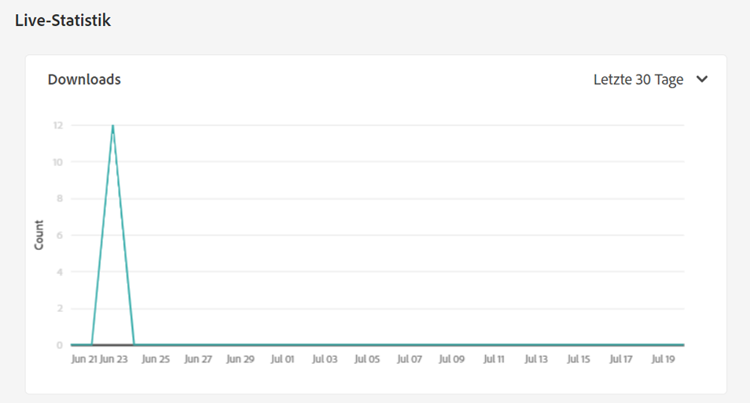
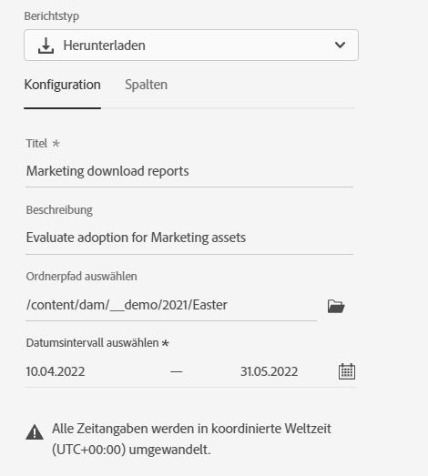
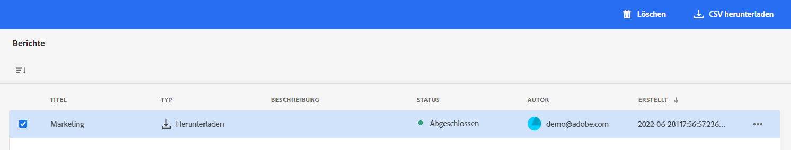

# Berichte verwalten {#manage-reports}

Mit Asset-Berichten können Administratoren die Nützlichkeit der Adobe Experience Manager Assets Essentials-Implementierung bewerten. Die Berichte enthalten nützliche Informationen dazu, wie Benutzer mit in Ihrer Bereitstellung verfügbaren Assets interagieren.

Verwenden Sie die Informationen aus den Berichten, um wesentliche Erfolgsmetriken abzuleiten, um festzustellen, wie gut  Assets innerhalb Ihrer Organisation und von Ihren Kunden angenommen wird.

## Auf Berichte zugreifen {#access-reports}

Alle Benutzer, die dem [Produktprofil &quot;Assets Essentials-Administratoren&quot;](deploy-administer.md) kann auf Live-Statistiken und -Berichte in Assets Essentials zugreifen.

## Anzeigen von Live-Statistiken {#view-live-statistics}

Mit Assets Essentials können Sie automatisch generierte Download-Daten für Ihre Assets Essentials-Bereitstellung anzeigen. Sie können auswählen, um die Anzahl der Asset-Downloads anzuzeigen, die in den letzten 30 Tagen oder in den letzten 12 Monaten durchgeführt wurden.

Navigieren Sie zu **[!UICONTROL Einstellungen]** > **[!UICONTROL Live Statistics]** um die automatisch generierten Download-Daten anzuzeigen.

## Bericht erstellen {#create-report}

So erstellen Sie einen Bericht:

1. Navigieren Sie zu **[!UICONTROL Einstellungen]** > **[!UICONTROL Berichte]** und klicken Sie auf **[!UICONTROL Bericht erstellen]**.

1. Im [!UICONTROL Konfiguration] einen Titel und eine optionale Beschreibung für den Bericht angeben.

1. Wählen Sie den Ordnerpfad aus, der die Assets enthält, für die der Bericht ausgeführt werden soll, mithilfe der **[!UICONTROL Ordnerpfad auswählen]** -Feld.

1. Wählen Sie das Datumsintervall für den Bericht aus.

1. Im [!UICONTROL Spalten] wählen Sie die Spaltennamen aus, die im Bericht angezeigt werden sollen.

1. Klicken Sie auf **[!UICONTROL Erstellen]**.

   

In der folgenden Tabelle wird die Verwendung aller Spalten erläutert, die Sie zum Bericht hinzufügen können:

<table>
    <tbody>
     <tr>
      <th><strong>Spaltenname</strong></th>
      <th><strong>Beschreibung</strong></th>
     </tr>
     <tr>
      <td>Titel</td>
      <td>Der Titel des Assets.</td>
     </tr>
     <tr>
      <td>Pfad </td>
      <td>Der Ordnerpfad, unter dem das Asset in Assets Essentials verfügbar ist.</td>
     </tr>
     <tr>
      <td>Typ</td>
      <td>Der MIME-Typ für das Asset.</td>
     </tr>
     <tr>
      <td>Größe</td>
      <td>Die Größe des Assets.</td>
     </tr>
     <tr>
      <td>Heruntergeladen von</td>
      <td>Die E-Mail-ID des Benutzers, der das Asset heruntergeladen hat.</td>
     </tr>
     <tr>
      <td>Download-Datum</td>
      <td>Das Datum, an dem die Asset-Download-Aktion ausgeführt wird.</td>
     </tr>
     <tr>
      <td>Autor</td>
      <td>Der Autor für das Asset.</td>
     </tr>
     <tr>
      <td>Erstellungsdatum</td>
      <td>Das Datum, an dem das Asset in Assets Essentials hochgeladen wurde.</td>
     </tr>
     <tr>
      <td>Änderungsdatum</td>
      <td>Das Datum, an dem das Asset zuletzt geändert wurde.</td>
     </tr>
     <tr>
      <td>Abgelaufen</td>
      <td>Der Ablaufstatus des Assets.</td>
     </tr>
     <tr>
      <td>Heruntergeladen nach Benutzername</td>
      <td>Der Name des Benutzers, der das Asset heruntergeladen hat.</td>
     </tr>           
    </tbody>
   </table>

## Berichtliste anzeigen {#view-report-list}

Nachher [Berichterstellung](#create-report)können Sie die Liste der Berichte anzeigen und auswählen, ob Sie sie im CSV-Format herunterladen oder löschen möchten.

Um die Liste der Berichte anzuzeigen, navigieren Sie zu **[!UICONTROL Einstellungen]** > **[!UICONTROL Berichte]**.

Für jeden Bericht können Sie den Berichtstitel, den Berichtstyp, die bei der Berichterstellung angegebene Beschreibung, den Status des Berichts, die E-Mail-Adresse des Autors, der den Bericht erstellt hat, und das Erstellungsdatum des Berichts anzeigen.

`Completed ` -Status bedeutet, dass der Bericht heruntergeladen werden kann.

## CSV-Bericht herunterladen {#download-csv-report}

So laden Sie einen Bericht im CSV-Format herunter:

1. Navigieren Sie zu **[!UICONTROL Einstellungen]** > **[!UICONTROL Berichte]**.

1. Wählen Sie einen Bericht aus und klicken Sie auf **[!UICONTROL CSV herunterladen]**.

Der ausgewählte Bericht wird im CSV-Format heruntergeladen. Die im CSV-Bericht angezeigten Spalten hängen von den Spalten ab, die Sie während der [Berichterstellung](#create-report).

## Löschen eines Berichts {#delete-report}

So löschen Sie einen Bericht:

1. Navigieren Sie zu **[!UICONTROL Einstellungen]** > **[!UICONTROL Berichte]**.

1. Wählen Sie einen Bericht aus und klicken Sie auf **[!UICONTROL Löschen]**.
