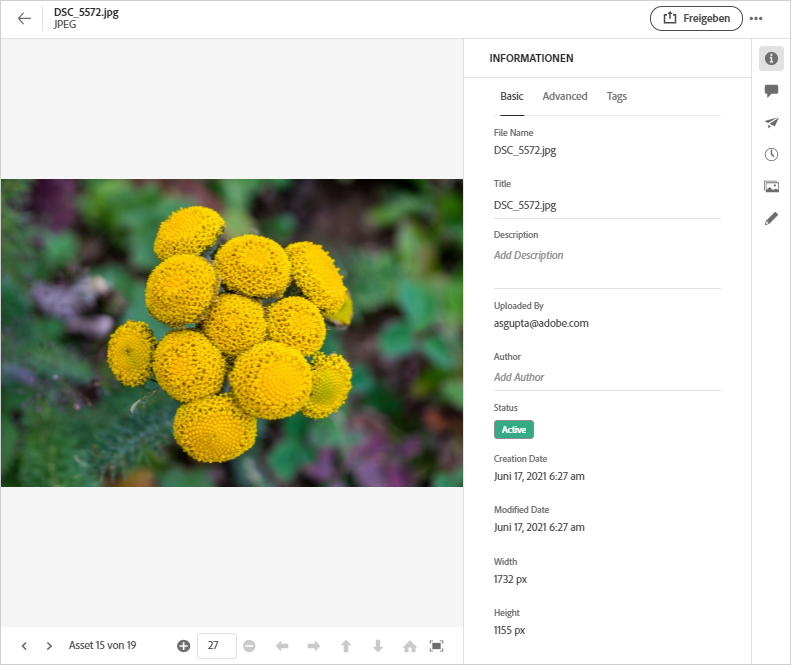
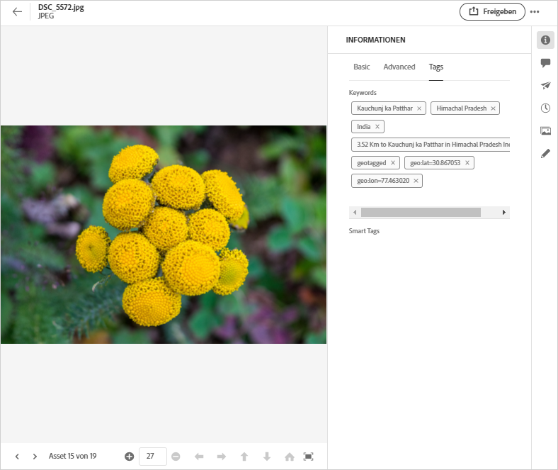

# Metadaten in [!DNL Assets Essentials] {#metadata}

Metadaten sind Daten oder Beschreibungen zu den Daten. Beispielsweise können Ihre Bilder als Asset Informationen über die Kamera, mit der sie aufgenommen wurden, oder Copyright-Informationen enthalten. Diese Informationen sind Metadaten des Bildes. Metadaten sind für ein effizientes Asset-Management von entscheidender Bedeutung. Metadaten stellen die Sammlung aller für ein Asset verfügbaren Daten dar, sind aber nicht unbedingt im Bild selbst enthalten.

Mit Metadaten können Sie Assets genauer einteilen. Außerdem erweisen sie sich als nützlich, wenn die Menge digitaler Daten ansteigt. Es ist möglich, einige Hundert Dateien zu verwalten, die nur auf den Dateinamen, den Miniaturbildern und dem Speicherbedarf basieren. Dieser Ansatz ist jedoch nicht skalierbar. Er reicht nicht aus, wenn die Zahl der beteiligten Personen und die Zahl der verwalteten Assets steigt.

Durch das Hinzufügen von Metadaten steigt der Wert eines digitalen Assets, da das Asset folgende Eigenschaften aufweist:

* besser zugänglich – Systeme und Benutzer können es leicht finden.
* einfacher zu verwalten – Sie können Assets mit denselben Eigenschaften einfacher finden und Änderungen auf sie anwenden.
* vollständig – Asset enthält mehr Informationen und Kontext mit mehr Metadaten.

Aus diesen Gründen erhalten Sie mit Assets die richtigen Mittel, um Metadaten für digitale Assets zu erstellen, zu verwalten und auszutauschen.

## Anzeigen der Metadaten {#view-metadata}

Um die Metadaten eines Assets anzuzeigen, navigieren Sie zum Asset oder suchen Sie das Asset, wählen Sie das Asset aus und klicken Sie in der Symbolleiste auf **[!UICONTROL Details]**.

*Abbildung: Um ein Asset und seine Metadaten anzuzeigen, klicken Sie in der Symbolleiste auf **[!UICONTROL Details]** oder doppelklicken Sie auf das Asset.*

Die grundlegenden Metadaten wie Titel, Beschreibung und Upload-Datum sind auf der Registerkarte [!UICONTROL Standard] verfügbar. Die Registerkarte [!UICONTROL Erweitert] enthält erweiterte Metadaten wie Kameramodell, Informationen zum Objektiv und Geotags. Die Registerkarte [!UICONTROL Tags] enthält automatisch vergebene Tags, die auf dem Inhalt des Bildes basieren.

## Metadaten aktualisieren {#update-metadata}

Einige Metadatenfelder können Sie manuell aktualisieren. Diese Felder sind unter anderem [!UICONTROL Titel], [!UICONTROL Beschreibung], [!UICONTROL Autor] und [!UICONTROL Schlüsselwörter].

## Tags {#tags}

[!DNL Assets Essentials] verwendet künstliche Intelligenz, die von [Adobe Sensei](https://www.adobe.com/de/sensei.html) bereitgestellt wird, um automatisch relevante Tags zu allen hochgeladenen Assets hinzuzufügen. Diese Tags, auch Smart-Tags genannt, erhöhen die Geschwindigkeit der Inhaltserstellung Ihrer Projekte, da Sie relevante Assets schnell finden können. Die Smart-Tags sind ein Beispiel für Metadaten, die nicht im Bild enthalten sind.

Die Smart-Tags werden nahezu in Echtzeit hinzugefügt und basierend auf dem Inhalt des Bildes generiert. Wenn Sie ein Asset hochladen, zeigt die Benutzeroberfläche für einige Zeit [!UICONTROL Wird verarbeitet] auf der Asset-Miniaturansicht an. Sobald die Verarbeitung abgeschlossen ist, können Sie [die Metadaten und die Smart-Tags anzeigen](#view-metadata).

*Abbildung: Um die Smart-Tags eines Assets anzuzeigen, klicken Sie in der Symbolleiste auf **[!UICONTROL Details]** oder doppelklicken Sie auf das Asset.*

Smart-Tags enthalten auch einen Konfidenzwert in Prozent. Er zeigt die Konfidenz an, die mit dem angebrachten Tag verbunden ist. Sie können die automatisch angebrachten Smart-Tags moderieren.

## Hinzufügen oder Aktualisieren von Tags {#manually-tag}

Zusätzlich zu den Smart-Tags, die automatisch mit dem intelligenten Service [!DNL Adobe Sensei] hinzugefügt werden, können Sie Ihren Assets weitere Tags hinzufügen. Öffnen Sie ein Asset für die Vorschau, klicken Sie auf [!UICONTROL Tags] und geben Sie die gewünschten Keywords in das Feld [!UICONTROL Keywords] ein. Um das Tag hinzuzufügen, drücken Sie die Eingabetaste. [!DNL Assets Essentials] indiziert das Keyword nahezu in Echtzeit und Ihr Team kann die aktualisierten Assets bald mit den neuen Keywords durchsuchen.

Sie können Tags auch aus dem Abschnitt [!UICONTROL Smart-Tags] entfernen, die automatisch von [!DNL Assets Essentials] zu allen hochgeladenen Assets hinzugefügt werden.

<!-- TBD: Queries for PM and engg.

Can we edit the existing metadata in any form?

How to moderate smart tags?

Allow or deny list for smart tags?

What about Tags displayed just above Smart Tags in the UI?

Is there a detailed metadata tab. Where do the other details of an asset go?

How can one search based strictly on the metadata. Similar to AEM Assets GQL queries.
-->

<!-- TBD: Link to related articles if any.

>[!MORELIKETHIS]
>
>* [Search assets](search.md).
-->
