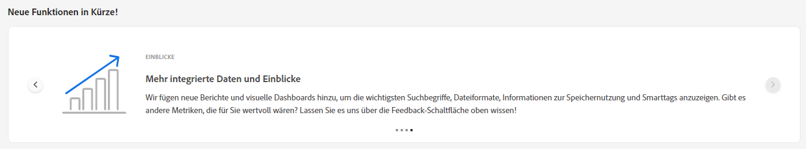
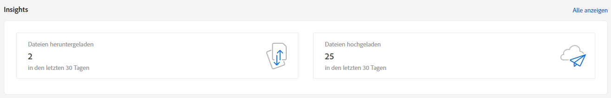
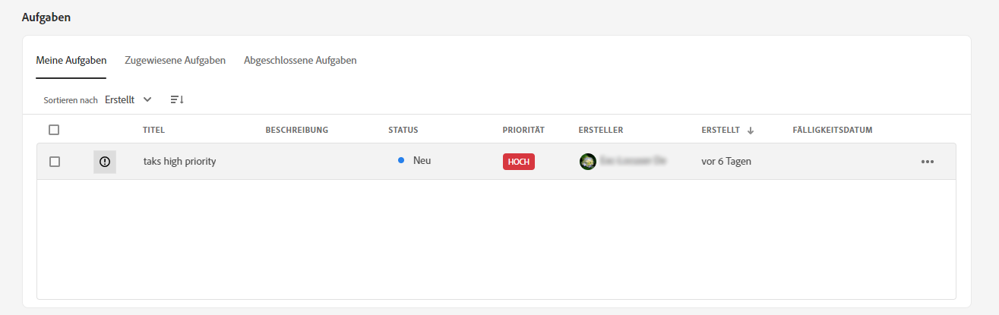
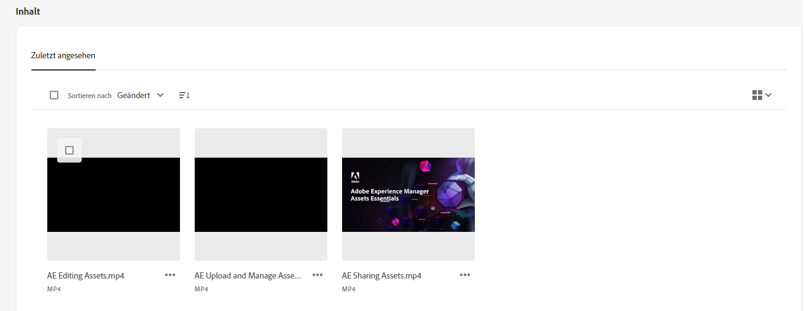
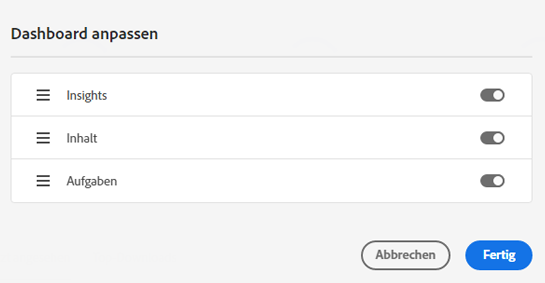

# Mein Arbeitsbereich für Assets {#my-workspace}

Assets enthält jetzt einen anpassbaren Arbeitsbereich, der Widgets für den bequemen Zugriff auf wichtige Bereiche der Assets-Benutzeroberfläche und Informationen bereitstellt, die für Sie am relevantesten sind. Diese Seite dient als zentrale Anlaufstelle, um einen Überblick über Ihre Arbeitselemente zu erhalten und schnellen Zugriff auf wichtige Workflows zu ermöglichen. Ein bequemerer Zugriff auf diese Optionen erhöht Ihre Effizienz und Content Velocity.

Sie können auf den Arbeitsbereich zugreifen, indem Sie auf **[!UICONTROL Mein Arbeitsbereich]** aus den im linken Navigationsbereich verfügbaren Elementen. Mein Arbeitsbereich umfasst eine Vielzahl von Widgets, die neue Funktionen zeigen, Einblicke, Aufgaben und Content-Widgets. Sie können je nach Ihren Voreinstellungen konfigurieren, wie diese Widgets in Ihrem Arbeitsbereich angezeigt werden.

>[!NOTE]
>
>Das Insights-Widget ist nur für Administratoren sichtbar.

**Neue Funktionen in Kürze**

Hervorhebung bevorstehender Funktionen für Assets.

**Insights**

Administratoren können eine Zusammenfassung der Anzahl der Downloads und Uploads anzeigen, die in den letzten 30 Tagen in der Assets-Umgebung durchgeführt wurden. Sie können auf **[!UICONTROL Alle anzeigen]** um schnell zur Seite Insights zu navigieren, um detailliertere Dashboards zu erhalten.

**Aufgaben**

Zeigt die Liste der Aufgaben an, die Ihnen derzeit im **[!UICONTROL Meine Aufgaben]** von Ihnen im **[!UICONTROL Zugewiesene Aufgaben]** und die Aufgaben, die Sie bereits im **[!UICONTROL Abgeschlossen]** Registerkarte. Sie können eine Aufgabe auswählen und auf **[!UICONTROL Aufgabe abschließen]** , um eine Aufgabe zu genehmigen oder abzulehnen. Sie können auch eine Aufgabe auswählen und auf **[!UICONTROL Aufgabendetails öffnen]** , um die Aufgabe anzuzeigen und zu genehmigen, abzulehnen, zu bearbeiten oder zu löschen.

>[!NOTE]
>
> Die **[!UICONTROL Aufgaben zuweisen]** Die Option zum Zuweisen einer Aufgabe für ein Asset zu einem anderen Benutzer ist verfügbar, wenn Sie ein Asset auswählen oder die Ansicht mit den Asset-Informationen öffnen.

**Inhalt**

Zeigt Asset-Ansichten an, einschließlich der Liste der Assets, die Sie kürzlich angezeigt haben. Sie können auswählen, ob Assets im Widget in einer Listenansicht, Rasteransicht, Galerie- oder Wasserfallansicht angezeigt werden sollen, und die Assets nach Name, Größe und Änderungsdatum sortieren. Sie können auch ein Asset auswählen, um die Asset-Details anzuzeigen oder es aus der Liste der zuletzt angezeigten Assets zu entfernen.

## Arbeitsbereich anpassen {#configure-widgets}

Alle Widgets werden standardmäßig angezeigt, Sie können jedoch die in My Workspace angezeigten Widgets aktivieren oder deaktivieren. Die Voreinstellungen sind für jeden Benutzer spezifisch.

1. Klicken **[!UICONTROL Mein Arbeitsbereich]** im linken Navigationsbereich verfügbar und klicken Sie auf **[!UICONTROL Anpassen]**.

1. Deaktivieren Sie den Umschalter für das Widget, das nicht in Workspace angezeigt werden muss. Sie können ein Widget auch an die gewünschte Position ziehen, um seine Anzeigereihenfolge in Workspace zu aktualisieren.

1. Klicken Sie auf **[!UICONTROL Fertig]**, um die Änderungen zu speichern.

   
