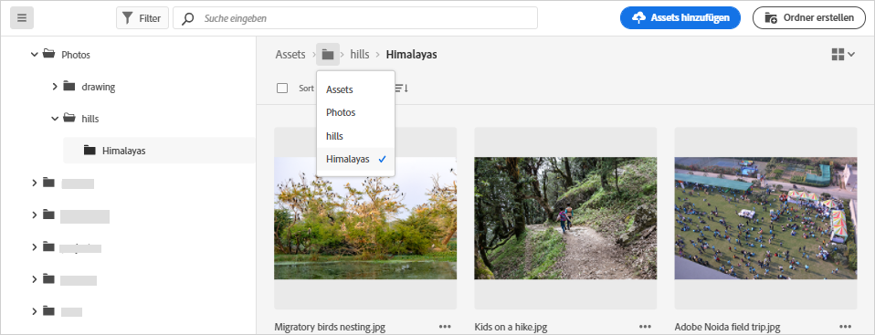
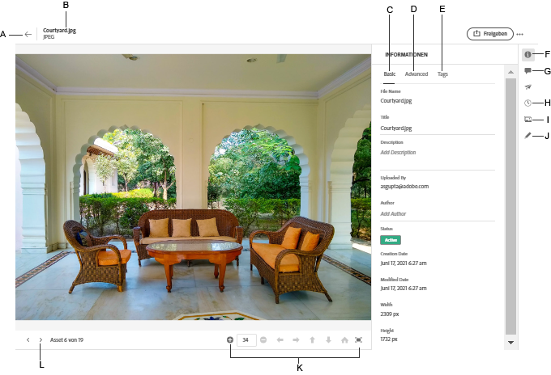

# Navigieren zu Dateien und Ordnern und Anzeigen von Assets {#view-assets-and-details}

<!-- TBD: Give screenshots of all views with many assets. Zoom out to showcase how the thumbnails/tiles flow on the UI in different views. -->

<!-- TBD: The options in left sidebar may change. Shared with me and Shared by me are missing for now. Update this section as UI is updated. -->

## Grundlegendes zur Benutzeroberfläche von [!DNL Assets Essentials]  {#understand-interface-navigation}

[!DNL Assets Essentials] bietet eine intuitive und benutzerfreundliche Benutzeroberfläche. Die klare Benutzeroberfläche erleichtert das Auffinden und Speichern von Assets und zugehörigen Informationen.

Wenn Sie sich bei [!DNL Assets Essentials] anmelden, sehen Sie die folgende Oberfläche.

<!-- TBD: Update this screenshot. Remove top bar. Remove 2 labels from top bar. -->

Benutzeroberfläche von ![[!DNL Assets Essentials] ](assets/essentials-interface1.png)

*Abbildung: Erster Anmeldebildschirm und wo Sie die wichtigsten Funktionen finden.*
    *A: Linke Seitenleiste zum Durchsuchen des Repositorys. Bietet Zugriff auf einige andere Optionen.*
    *B: Linke Seitenleiste minimieren oder erweitern, um den Asset-Ansichtsbereich zu vergrößern.*
    *C: Suchergebnisse filtern.*
    *D: Suchfeld.*
    *E: Optionen zum Sortieren von Assets.*
    *F: Produkt-Feedback geben.*
    *G: Bearbeiten Ihrer Benutzereinstellungen oder Abmelden.*
    *H: Wechseln zwischen verschiedenen Ansichten.*

<!-- TBD: Need an embedded video here with narration. It has to be hosted on MPC to be embeddable. -->

## Durchsuchen und Anzeigen von Assets und Ordnern {#browse-repository}

Sie können die Ordner über die Hauptbenutzeroberfläche oder die linke Seitenleiste durchsuchen. Um das gewünschte Asset schnell zu finden, können Sie zum visuellen Durchsuchen des Repositorys die Benutzeroberfläche verwenden, um Asset-Miniaturansichten anzuzeigen oder um Asset-Details anzuzeigen. Die in der linken Seitenleiste verfügbaren Optionen sind:

* **Assets**: Liste aller Ordner in einer Baumstrukturansicht, auf die Sie Zugriff haben.
* **Kürzlich angesehen**: Liste der Assets, die Sie kürzlich in der Vorschau betrachtet haben. [!DNL Assets Essentials] zeigt nur die Assets an, die Sie in der Vorschau anzeigen. Hier werden die Assets, an denen Sie beim Durchsuchen der Repository-Dateien oder -Ordner vorbeiscrollen, nicht angezeigt.
* **Papierkorb**:

<!-- TBD: Not sure if we want to publish these right now. CC Libs are beta as per Greg.
* **Libraries**: Access to [!DNL Adobe Creative Cloud Team] (CCT) Libraries view. This view is visible only if the user is entitled to CCT Libraries.
-->

<!-- TBD: My Work Space shows task inbox and it is not visible on AEM Cloud Demos as of now. It is the source of truth server hence not documenting My Work Space option for now.
-->

Sie können die linke Seitenleiste erweitern oder minimieren, um den verfügbaren Asset-Anzeigebereich zu vergrößern.

In [!DNL Assets Essentials] können Sie Assets, Ordner und Suchergebnisse in vier verschiedenen Layout-Typen anzeigen.

*  [!UICONTROL Listenansicht]
*  [!UICONTROL Rasteransicht]
*  [!UICONTROL Galerieansicht]
*  [!UICONTROL Wasserfallanasicht]

Um ein Asset zu finden, können Sie die Assets in auf- oder absteigender Reihenfolge von `Name`, `Relevancy`, `Size`, `Modified` und `Created` sortieren.

Um in einen Ordner zu gelangen, doppelklicken Sie auf die Miniaturansichten des Ordners oder wählen Sie den Ordner in der linken Seitenleiste aus. Um Details zu einem Ordner anzuzeigen, wählen Sie ihn aus und klicken Sie oben in der Symbolleiste auf „Details“. Um in der Hierarchie nach oben und unten zu navigieren, verwenden Sie entweder die linke Seitenleiste oder die Breadcrumbs oben.

*Abbildung: Verwenden Sie die Breadcrumbs oben oder links in der Seitenleiste, um die Hierarchie zu durchsuchen.*

## Anzeigen einer Vorschau für Assets {#preview-assets}

Bevor Sie ein Asset verwenden, freigeben oder herunterladen, können Sie es sich genauer ansehen. Mit der Vorschaufunktion können Sie nicht nur die Bilder, sondern auch einige andere unterstützte Asset-Typen anzeigen.

Um ein Asset in der Vorschau anzuzeigen, wählen Sie es aus und klicken Sie oben in der Symbolleiste auf [!UICONTROL Details] . Sie können nicht nur das Asset, sondern auch seine detaillierten Metadaten anzeigen und andere Aktionen durchführen.

*A: Zurück zum aktuellen Ordner oder zum aktuellen Suchergebnis im Repository.*
*B: Name und Format der Datei, die Sie in der Vorschau anzeigen.*
*C: Grundlegende Metadaten.*
*D: Erweiterte Metadaten.*
*E: Keywords und Smart-Tags.*
*F: Vorschau des Assets und Anzeige der Metadaten-Informationen.*
*G: Kommentare und Anmerkungen.*
*H: Anzeigen und Verwalten von Versionen.*
*I: Anzeigen von Ausgabedarstellungen des Bildes.*
*J: Bild bearbeiten.*
*K: Genauere Vorschau anzeigen. Zoom, Vollbild und andere Optionen.*
*L: Fortfahren mit dem vorherigen oder nächsten Asset im aktuellen Ordner, ohne zum Ordner zurückzugehen.*

Sie können auch eine Vorschau der Videos anzeigen.

Wenn Sie ein Asset explizit in der Vorschau anzeigen, dann [!DNL Assets Essentials] zeigt es als kürzlich angezeigtes Asset an.

<!-- TBD: Describe the options.

Explicitly previewed assets are displayed as recently viewed assets. Give screenshot of this.
Other use cases after previewing.
-->

>[!MORELIKETHIS]
>
>* [Anzeigen von Versionen eines Assets](/help/manage-organize.md#view-versions).

