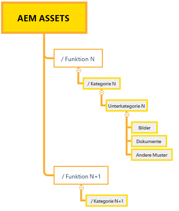
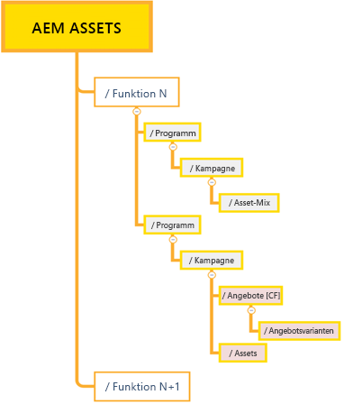
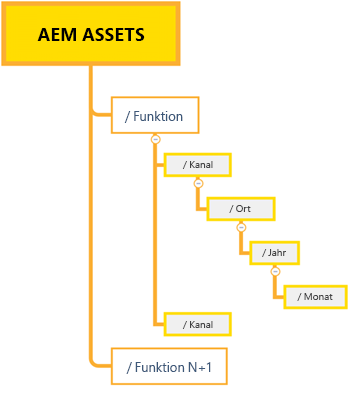

# Best Practices für die effektive Berechtigungsverwaltung {#best-practices-permissions-management}

Bevor Sie als Administrator mit der Verwaltung der Ordnerberechtigungen für das Assets Essentials-Repository beginnen, gibt es verschiedene Best Practices, die Sie implementieren können, um die Infrastruktur für Administratoren und Endbenutzer während der Verwaltung von Vorgängen intuitiv zu gestalten.

Sie können diese Best Practices bei Folgendem einbinden:

* [Erstellen von Benutzergruppen in Admin Console](#admin-console-best-practices)

* [Erstellen der Ordnerstruktur im Assets Essentials-Repository](#folder-structure-assets-essentials)

* [Berechtigungen im Assets Essentials-Repository verwalten](#folder-permissions)

## Admin Console {#admin-console-best-practices}

Identifizieren Sie die Zugriffsanforderungen anhand von Benutzergruppen in Ihrer Organisation. Planen und erstellen Sie Benutzergruppen für Ihre Organisation und fügen Sie diesen Benutzergruppen Benutzer hinzu. Es ist einfacher, Ordnerberechtigungen auf der Basis von Benutzergruppen und nicht einzelnen Benutzern zu verwalten.

## Ordnerstruktur für Assets Essentials-Repository {#folder-structure-assets-essentials}

Beachten Sie die folgenden Punkte, wenn Sie mit der Erstellung einer Ordnerstruktur im Assets Essentials-Repository beginnen:

* Zukünftige Governance: Die Ordner, die von Administratoren verwaltet werden, und die Ordner, die [wurde für Berechtigungen an andere Benutzer als Eigentümer delegiert](manage-permissions.md##manage-permissions-folders).

* Skalierbar: Die Ordnerstruktur sollte den künftigen Anforderungen Ihres Unternehmens entsprechen und leicht skalierbar sein.

* Größe: Ein Ordner darf nicht zu viele Assets enthalten. Dies kann zu Benutzerfreundlichkeits-Problemen führen und schwierig zu handhaben sein.

* Intuitiv: Die Ordnerstruktur sollte für die Endbenutzer einfach zu durchsuchen und intuitiv zu gestalten sein. Benutzer sollten leicht erkennen können, wo ein neues Asset in die Ordnerstruktur hochgeladen werden soll.

Es gibt verschiedene mögliche Ordnerstrukturtypen, die Sie für Ihr Unternehmen verwenden können. Im Folgenden finden Sie einige Beispiele für typische Ordnerstrukturen:

* Funktion und Kategorisierung basierend

   

* Kampagnenbasiert

   

* Angebotsposition (oder -kanal) basierend

   

## Ordnerberechtigungen {#folder-permissions}

Nachdem Sie Benutzergruppen für Ihr Unternehmen erstellt, Benutzer zu diesen Benutzergruppen hinzugefügt und eine Ordnerstruktur im Assets Essentials-Repository ausgewählt und erstellt haben, die den Anforderungen Ihres Unternehmens entspricht, können Sie mit der Verwaltung von Ordnerberechtigungen für Ihr Unternehmen beginnen. Beachten Sie beim Verwalten von Ordnerberechtigungen die folgenden Punkte:

* Wenden Sie Berechtigungen für Benutzergruppen an, nicht für einzelne Benutzer. Dies führt zu einer einfacheren, effizienteren Berechtigungsstruktur.

* Halten Sie die Berechtigungsstruktur so einfach wie möglich, um betriebliche Effizienz zu erzielen.

* Verwenden Sie sorgfältig Zugriffsberechtigungen verweigern und bevorzugen Sie es, positive Berechtigungen (Kann bearbeiten, Kann anzeigen, Inhaber) auf die Ordnerstruktur anzuwenden.

Beispiele für das Erzielen einer effizienten und einfachen Ordnerstruktur finden Sie unter [Berechtigungen für Ordner verwalten](manage-permissions.md##manage-permissions-folders).

