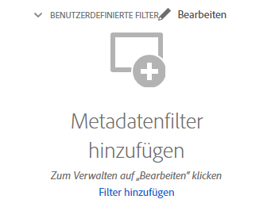

# Suchen nach Assets in [!DNL Assets Essentials] {#search-assets}

[!DNL Assets Essentials] bietet eine effektive Suche, die einfach standardmäßig funktioniert. Die Suche ist umfassend, da es sich um eine Volltextsuche handelt. Mit der leistungsstarken Suchfunktion können Sie schnell das passende Asset ermitteln und die Geschwindigkeit Ihrer Inhaltserstellung steigern. [!DNL Assets Essentials] bietet Volltextsuche und Suchvorgänge durch die Metadaten wie Smart-Tags, Titel, Erstellungsdatum und Copyright.

Um nach Assets zu suchen,

* klicken Sie oben auf der Seite in das Suchfeld. Standardmäßig wird innerhalb des Ordners gesucht, den Sie gerade durchsuchen. Führen Sie einen der folgenden Schritte aus:

   

   * Suchen Sie mithilfe eines Keywords und ändern Sie optional den Ordner. Drücken Sie die Eingabetaste.

   * Beginnen Sie die Arbeit mit einem kürzlich angezeigten Asset, indem Sie direkt danach suchen. Klicken Sie in das Suchfeld und wählen Sie aus den Vorschlägen ein kürzlich angezeigtes Asset aus.

## Filtern von Suchergebnissen {#refine-search-results}

Sie können die Suchergebnisse anhand der folgenden Parameter filtern.

*Abbildung: Filtern gesuchter Assets basierend auf verschiedenen Parametern.*

* Asset-Status: Filtern Sie die Suchergebnisse mithilfe einer `Approved`, `Rejected`oder `No Status` Asset-Status.

* Asset-Typ: Filtern von Suchergebnissen nach den unterstützten Dateitypen: `Images`, `Documents` und `Videos`.
* MIME-Typ: Filtern nach einem oder mehreren der unterstützten Dateiformate. <!-- TBD:  [supported file formats](/help/supported-file-formats.md). -->
* Bildgrösse: Geben Sie eine oder mehrere der minimalen und maximalen Abmessungen zum Filtern von Bildern an. Die Größe wird in Pixeln angegeben und ist nicht die Dateigröße der Bilder.
* Erstellungsdatum: Das Erstellungsdatum des Assets, wie in den Metadaten angegeben. Das verwendete Standarddatumsformat ist `yyyy-mm-dd`.
* Änderungsdatum: Das Datum der letzten Änderung der Assets. Das verwendete Standarddatumsformat ist `yyyy-mm-dd`.

Sie können die gesuchten Assets in aufsteigender oder absteigender Reihenfolge von `Name`, `Relevancy`, `Size`, `Modified` und `Created` sortieren.

## Verwalten von benutzerdefinierten Filtern {#custom-filters}

**Erforderliche Berechtigungen:**  `Can Edit`, `Owner` oder Administrator.

Mit Assets Essentials können Sie auch benutzerdefinierte Filter zur Benutzeroberfläche hinzufügen. Sie können diese benutzerdefinierten Filter dann zusätzlich zu den [Standardfiltern](#refine-search-results) anwenden, um Ihre Suchergebnisse zu verfeinern.

Assets Essentials bietet die folgenden benutzerdefinierten Filter:

<table>
    <tbody>
     <tr>
      <th><strong>Benutzerspezifischer Filtername</strong></th>
      <th><strong>Beschreibung</strong></th>
     </tr>
     <tr>
      <td>Titel</td>
      <td>Filtern Sie Assets unter Verwendung des Asset-Titels. Der Titel, den Sie in den Suchkriterien, die die Groß- und Kleinschreibung berücksichtigen, angeben, muss genau mit dem Titel des Assets übereinstimmen, damit es in den Ergebnissen angezeigt wird.</td>
     </tr>
     <tr>
      <td>Name</td>
      <td>Filtern Sie Assets unter Verwendung des Asset-Dateinamens. Der Name, den Sie in den Suchkriterien, die die Groß- und Kleinschreibung berücksichtigen, angeben, muss genau mit dem Namen des Assets übereinstimmen, damit es in den Ergebnissen angezeigt wird.</td>
     </tr>
     <tr>
      <td>Asset-Größe</td>
      <td>Filtern Sie Assets, indem Sie in den Suchkriterien für ein Asset, das in den Ergebnissen angezeigt werden soll, einen Größenbereich in Byte festlegen.</td>
     </tr>
     <tr>
      <td>Prognostizierte Tags</td>
      <td>Filtern Sie Assets unter Verwendung des Asset-Smart-Tags. Der Smart-Tag-Name, den Sie in den Suchkriterien, die die Groß- und Kleinschreibung berücksichtigen, angeben, muss genau mit dem Smart-Tag-Namen des Assets übereinstimmen, damit es in den Ergebnissen angezeigt wird. Sie können nicht mehrere Smart-Tags in den Suchkriterien angeben.</td>
     </tr>    
    </tbody>
   </table>

### Hinzufügen benutzerdefinierter Filter {#add-custom-filters}

Hinzufügen benutzerdefinierter Filter

1. Klicken Sie auf **[!UICONTROL Filter]**.

1. Klicken Sie im Abschnitt **[!UICONTROL Benutzerdefinierte Filter]** auf **[!UICONTROL Bearbeiten]** oder auf **[!UICONTROL Filter hinzufügen]**.

   

1. Wählen Sie im Dialogfeld **[!UICONTROL Verwaltung benutzerdefinierter Filter]** die Filter aus, die Sie der vorhandenen Filterliste hinzufügen möchten. Wählen Sie **[!UICONTROL Benutzerdefinierte Filter]** aus, um alle Filter auszuwählen.

1. Klicken Sie auf **[!UICONTROL Bestätigen]**, um die Filter zur Benutzeroberfläche hinzuzufügen.

### Entfernen benutzerdefinierter Filter {#remove-custom-filters}

Entfernen benutzerdefinierter Filter

1. Klicken Sie auf **[!UICONTROL Filter]**.

1. Klicken Sie im Abschnitt **[!UICONTROL Benutzerdefinierte Filter]** auf **[!UICONTROL Bearbeiten]**.

1. Heben Sie im Dialogfeld **[!UICONTROL Verwaltung benutzerdefinierter Filter]** die Auswahl der Filter auf, die Sie aus der Liste der vorhandenen Filter entfernen möchten.

1. Klicken Sie auf **[!UICONTROL Bestätigen]**, um die Filter aus der Benutzeroberfläche zu entfernen.

## Gespeicherte Suchvorgänge {#saved-search}

In [!DNL Assets Essentials] ist die Suchfunktion recht einfach zu verwenden. Über das Suchfeld können Sie nicht nur ein Keyword eingeben und die Eingabetaste drücken, um die Ergebnisse zu sehen, sondern auch schnell mit einem einzigen Klick erneut nach Ihren kürzlich gesuchten Keywords suchen.

Sie können die Suchergebnisse auch nach bestimmten Kriterien rund um Metadaten und Art der Assets filtern. Mit [!DNL Assets Essentials] können Sie bei häufig verwendeten Filtern die Suchparameter speichern, um das Sucherlebnis zu verbessern. Um zu suchen und den Filter mit nur einem Klick anzuwenden, können Sie auch die gespeicherte Suche auswählen.

Um eine gespeicherte Suche zu erstellen, suchen Sie nach einem Asset, wenden Sie einen oder mehrere Filter an und klicken Sie im Bereich [!UICONTROL Filter] auf [!UICONTROL Suche speichern].

<!-- TBD: Search behavior. Full-text search. Ranking and rank boosts. Hidden assets.
Report poor UX that users can only save a filtered search and not a simple search.
.
Are other supported files fully indexed and support full-text search? Eg. audio/videos files can at best have metadata indexed.
Anything about ranking of assets displayed in search results?

What about temporarily hiding an asset (suspending search on it) from the search results? If an asset is undergoing review collaboration, should it be used by others? Should it be hidden in search?

When userA is searching and userB add an asset that matches search results, will the asset display in search as soon as userA refreshes the page? Assuming indexing is near real-time. May not be so for bulk uploads.
-->

## Nächste Schritte {#next-steps}

* [Video ansehen, um Assets in Assets Essentials zu suchen](https://experienceleague.adobe.com/docs/experience-manager-learn/assets-essentials/basics/using.html)

* Stellen Sie Produkt-Feedback mit der [!UICONTROL Feedback] Option in der Benutzeroberfläche von Assets Essentials verfügbar

* Feedback zur Dokumentation mit [!UICONTROL Diese Seite bearbeiten]  oder [!UICONTROL Problem protokollieren]  in der rechten Seitenleiste verfügbar

* Kontakt [Kundenunterstützung](https://experienceleague.adobe.com/?support-solution=General&amp;lang=de#support)
