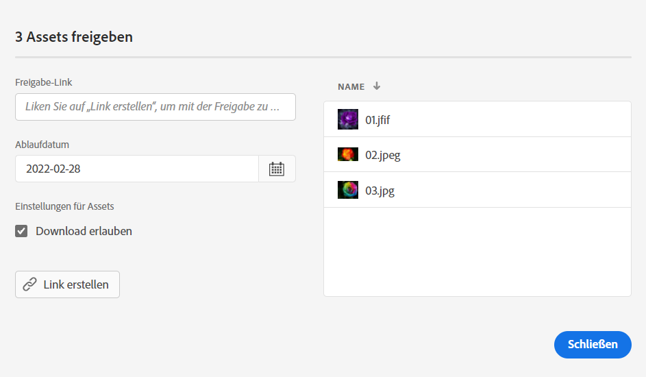
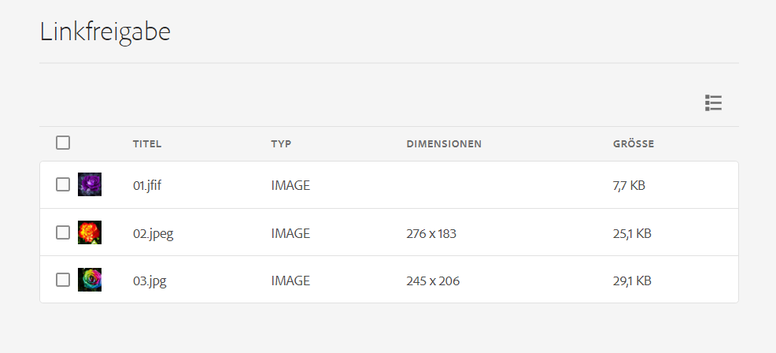

# Freigeben von Links zu Medienelementen {#share-links-assets}

[!DNL Assets Essentials] ermöglicht Ihnen, einen Link zu erstellen und Medienelemente für externe Stakeholder freizugeben, die keinen Zugriff auf das Programm [!DNL Assets Essentials] haben. Sie können ein Ablaufdatum für den Link definieren und ihn dann mithilfe Ihrer bevorzugten Kommunikationsmethode wie E-Mail oder Messaging-Services für andere freigeben. Empfänger des Links können eine Vorschau der Medienelemente anzeigen und sie herunterladen.

## Generieren eines Links für Medienelemente {#generate-link-for-assets}

So generieren Sie einen Link für ein Medienelement oder einen Ordner mit Medienelementen:

1. Wählen Sie die Medienelemente und/oder Ordner mit den Medienelementen aus und klicken Sie auf **[!UICONTROL Freigabe-Link]**.

1. Sie können den Link anpassen, indem Sie auf das Kalendersymbol klicken, um im Feld **[!UICONTROL Ablaufdatum]** ein Ablaufdatum für den Link festzulegen. Sie können auch ein Datum direkt im `yyyy-mm-dd`-Format angeben. Standardmäßig ist das Ablaufdatum für einen Link auf 2 Wochen ab dem Datum der Freigabe festgelegt.

1. Klicken Sie auf **[!UICONTROL Link erstellen]**.

1. Klicken sie auf **[!UICONTROL Link kopieren]**, um den Link zu kopieren. Sie können den Link auch aus dem Feld **[!UICONTROL Freigabe-Link]** kopieren.

   

1. Klicken Sie auf **[!UICONTROL Schließen]** und teilen Sie den Link mithilfe von E-Mail oder anderen Collaboration-Tools.

## Zugreifen auf die freigegebenen Medienelemente {#access-shared-assets}

Nach der Freigabe des öffentlichen Links für Medienelemente können die Empfänger auf den Link klicken, um die freigegebenen Medienelemente in einem Webbrowser als Vorschau anzuzeigen oder herunterzuladen, ohne sich bei [!DNL Assets Essentials] anmelden zu müssen.

Klicken Sie auf den Link und dann auf den Ordner, um zum Medienelement zu navigieren, und klicken Sie dann auf das Medienelement, um eine Vorschau anzuzeigen. Sie können auswählen, ob die freigegebenen Medienelemente in einer Listen- oder Kartenansicht angezeigt werden sollen.

Sie können den Mauszeiger über das freigegebene Medienelement oder den Ordner mit den freigegebenen Medienelementen bewegen, um das Medienelement auszuwählen oder herunterzuladen.

Sie können auch mehrere Medienelemente auswählen und auf **[!UICONTROL Herunterladen]** klicken. [!DNL Assets Essentials] lädt die ausgewählten Medienelemente als ZIP-Datei herunter. [!DNL Assets Essentials] erstellt für jedes Medienelement, das Sie herunterladen möchten, einen Unterordner in der übergeordneten ZIP-Datei mit dem Namen des Medienelements.

Um alle Medienelemente auf einmal herunterzuladen, wechseln Sie zur **[!UICONTROL Listenansicht]**, klicken Sie auf **[!UICONTROL Alle auswählen]** und dann auf **[!UICONTROL Herunterladen]**.

