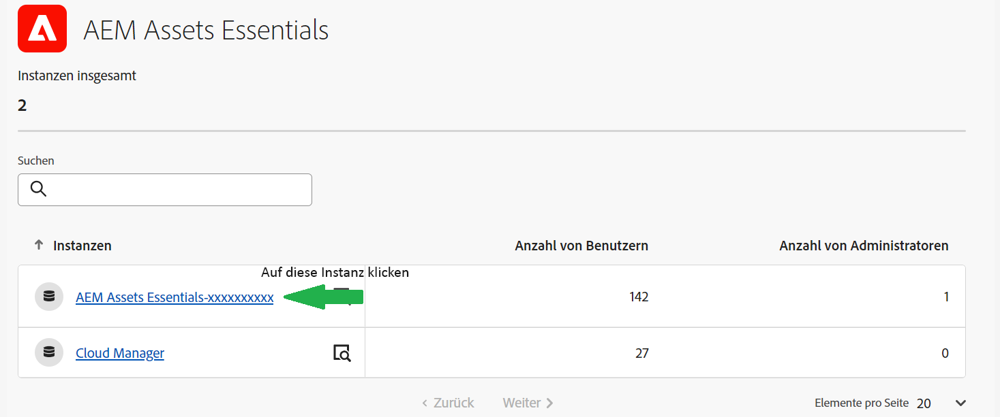

# Verwalten von Experience Manager Assets Essentials {#administer-assets-essentials}

## Ziel

* **Zielgruppe**: Assets Essentials-Administratoren

* **Ziel**: Konfigurieren des Zugriffs auf Assets Essentials mithilfe der Admin Console und Verwalten der Aufgaben, die nach der Anmeldung bei Assets Essentials ausgeführt werden können.

## Übersicht {#overview}

[!DNL Adobe Experience Manager Assets Essentials] wird von Adobe für seine Kunden bereitgestellt. Im Rahmen der Implementierung wird [!DNL Assets Essentials] in der [!DNL Adobe Admin Console] zur Organisation eines Kunden hinzugefügt. Administratoren verwenden die [!DNL Admin Console], um Benutzerberechtigungen für [!DNL Assets Essentials] zu verwalten, und ernennen Programmadministratoren, um Berechtigungen und Metadatenformulare in [!DNL Assets Essentials] einzurichten.

Das folgende Datenflussdiagramm zeigt die Aufgabensequenz, die ein Administrator zur Konfiguration und Verwaltung von Assets Essentials durchführen muss:

## Zugang zur Admin Console {#access-admin-console}

Nachdem die Assets Essentials-Lösung bereitgestellt wurde, erhält der Administrator eine E-Mail von Adobe. Die E-Mail enthält eine Willkommensnachricht und einen Link zu den ersten Schritten. Darüber hinaus startet Adobe den Prozess zur automatischen Bereitstellung von Assets Essentials. Der Bereitstellungsprozess dauert eine Stunde.

Greifen Sie über den Link in der E-Mail auf die [Admin Console](https://adminconsole.adobe.com) zu und melden Sie sich an. Wenn Sie Administratorzugriff auf mehr als ein Konto einer Organisation haben, wählen Sie die entsprechende Organisation aus oder wechseln Sie mithilfe des [Organisationsselektors](https://helpx.adobe.com/de/enterprise/using/admin-console.html) zu ihr. Sobald der automatische Bereitstellungsprozess abgeschlossen ist, wird die Produktkarte für [!DNL AEM Assets Essentials] in [!DNL Admin Console] angezeigt.

## Verwalten von Admin Console-Aufgaben {#manage-admin-console-tasks}

Führen Sie die folgenden Aufgaben in der Admin Console durch:

* [Hinzufügen von Benutzern zu Produktprofilen](#add-users-to-product-profiles)

* [Hinzufügen von Benutzergruppen](#add-user-groups)

* [Hinzufügen von Benutzern zu Gruppen](#add-users-to-user-groups)

### Hinzufügen von Benutzern zu Produktprofilen {#add-users-to-product-profiles}

Hinzufügen von Benutzern zu Produktprofilen, damit diese Zugriff auf Asset Essentials haben.

Hinzufügen von Benutzern zu Produktprofilen

1. Rufen Sie die [Admin Console](https://adminconsole.adobe.com) für Ihre Organisation auf, klicken Sie in der oberen Leiste auf **[!UICONTROL Produkte]**, dann auf **[!UICONTROL AEM Assets Essentials]** und anschließend auf die Instanz für [!DNL Assets Essentials]. Der Name der Instanz kann sich von dem im folgenden Screenshot unterscheiden.
   >[!NOTE]
   >
   >Die [!DNL Cloud Manager]-Instanz ist nur für spezielle Admin-Zwecke wie die Überprüfung des Service-Status und den Zugriff auf Service-Protokolle vorgesehen und kann nicht zum Hinzufügen von Benutzern zum Produkt verwendet werden. Weitere Informationen finden Sie im [Administratorhandbuch](deploy-administer.md#view-service-status-and-access-logs-view-logs).

   

   [!DNL Assets Essentials] verfügt über drei Produktprofile, die den Zugriff für Admins, Standardbenutzer und Privatkunden darstellen.

   

1. Um einen Benutzer zum Produkt hinzuzufügen, klicken Sie auf eines der drei Assets Essentials-Produktprofile und wählen Sie **[!UICONTROL Benutzer hinzufügen]**, geben Sie die Benutzerdetails an und klicken Sie auf **[!UICONTROL Speichern]**.

   

   Wenn Sie einen Benutzer hinzufügen, erhält der Benutzer eine Einladung per E-Mail. Sie können die E-Mail-Einladungen in den Produktprofileinstellungen in der [!DNL Admin Console] deaktivieren.

1. Um einen Benutzer aus einer Gruppe zu entfernen, klicken Sie auf die Gruppe, wählen Sie einen vorhandenen Benutzer aus und wählen Sie **[!UICONTROL Benutzer entfernen]** aus.

   >[!NOTE]
   >
   >Sie müssen einen Benutzer zum Produktprofil eines Assets Essentials-Administrators in der Admin Console hinzufügen, damit er in Assets Essentials Verwaltungsaufgaben ausführen kann. Diese Aufgaben umfassen das [Erstellen einer Ordnerstruktur](#create-folder-structure), [Verwalten von Berechtigungen für Ordner](#manage-permissions-for-folders) und [Einrichten von Metadatenformularen](#metadata-forms).

### Hinzufügen von Benutzergruppen {#add-user-groups}

Erstellen Sie Benutzergruppen und weisen Sie dann Ihre Benutzer den Benutzergruppen zu. Diese Benutzergruppen stehen in Assets Essentials zum Festlegen von Berechtigungen für Ordner zur Verfügung.

Sie können Benutzer zu Benutzergruppen (1) und [zu Assets Essentials-Produktprofilen (2)](#add-admin-users) hinzufügen. Es ist jedoch nicht möglich, Benutzergruppen direkt zu Assets Essentials-Produktprofilen (3) hinzuzufügen.

Informationen zum Verwalten von Benutzergruppen finden Sie unter `Create user groups` und `Edit user groups`, verfügbar unter [Verwalten von Benutzergruppen](https://helpx.adobe.com/de/enterprise/using/user-groups.html).

>[!NOTE]
>
>Wenn Ihre Admin Console so eingerichtet ist, dass sie ein externes System zur Verwaltung von Benutzer-/Gruppenzuweisungen wie Azure- oder Google-Connectoren, ein Benutzersynchronisierungs-Tool oder die User Management-Rest-API nutzt, werden Ihre Gruppen und Benutzerzuweisungen automatisch konfiguriert. Weitere Informationen finden Sie unter [Adobe Admin Console-Benutzer](https://helpx.adobe.com/de/enterprise/using/users.html).

### Hinzufügen von Benutzern zu Gruppen {#add-users-to-user-groups}

Nachdem Sie Benutzergruppen erstellt haben, können Sie damit beginnen, Benutzer zu Benutzergruppen hinzuzufügen.

Informationen zum Verwalten hinzugefügter Benutzer zu Benutzergruppen finden Sie unter `Add users to groups`, verfügbar unter [Verwalten von Benutzergruppen](https://helpx.adobe.com/de/enterprise/using/user-groups.html#add-users-to-groups).

## Verwalten von Assets Essentials-Verwaltungsaufgaben {#manage-assets-essentials-tasks}

Nach Ausführung der Admin Console-Aufgaben können Sie jetzt die folgenden Verwaltungsaufgaben in Assets Essentials ausführen:

* [Erstellen einer Ordnerstruktur](#create-folder-structure)

* [Verwaltung von Zugriffsberechtigungen für Ordner](#manage-permissions-for-folders)

* [Einrichten von Metadatenformularen](#metadata-forms)

>[!NOTE]
>
>Um diese Aufgaben, insbesondere die Verwaltung von Berechtigungen, durchführen zu können, muss Ihr Benutzer über Administratorrechte für Programme verfügen und dazu dem [Produktprofil eines Assets Essentials-Administrators](#add-users-to-product-profiles) hinzugefügt werden.

### Erstellen einer Ordnerstruktur {#create-folder-structure}

Sie können die folgenden Methoden verwenden, um eine Ordnerstruktur im Assets Essentials-Repository zu erstellen:

* Klicken Sie auf die Option **[!UICONTROL Ordner erstellen]** in der Symbolleiste, um einen leeren Ordner zu erstellen.

* Klicken Sie auf die Option **[!UICONTROL Assets hinzufügen]** in der Symbolleiste, um [eine auf Ihrem lokalen Computer vorhandene Ordnerstruktur hochzuladen](add-delete.md).

Erstellen Sie eine Ordnerstruktur entsprechend Ihren betrieblichen Anforderungen. Wenn Sie eine vorhandene Ordnerstruktur in das Assets Essentials-Repository hochladen, sollten Sie die Struktur überprüfen. Weitere Informationen finden Sie unter [Best Practices für die effektive Verwaltung von Zugriffsberechtigungen](permission-management-best-practices.md).

Beachten Sie die folgenden Punkte, wenn Sie mit der Erstellung einer Ordnerstruktur im Assets Essentials-Repository beginnen:

* Zukünftige Governance: Die Ordner, die von Administratoren verwaltet werden, und die Ordner, die [für Berechtigungen an andere Benutzer als Inhaber delegiert](manage-permissions.md##manage-permissions-folders) wurden.

* Skalierbar: Die Ordnerstruktur sollte den künftigen Anforderungen Ihres Unternehmens entsprechen und leicht skalierbar sein.

* Größe: Ein Ordner darf nicht zu viele Medienelemente enthalten. Dies kann zu Problemen bei der Benutzung führen und schwierig zu handhaben sein.

* Intuitiv: Die Ordnerstruktur sollte für die Endbenutzer einfach zu durchsuchen und intuitiv gestaltet sein. Benutzer sollten leicht erkennen können, wo ein neues Medienelement in die Ordnerstruktur hochgeladen werden soll.

Es gibt verschiedene mögliche Ordnerstrukturtypen, die Sie für Ihr Unternehmen verwenden können. Im Folgenden finden Sie einige Beispiele für typische Ordnerstrukturen:

### Verwaltung von Zugriffsberechtigungen für Ordner {#manage-permissions-for-folders}

Mit Assets Essentials können Administratoren die Zugriffsebenen für Ordner verwalten, die im Repository verfügbar sind. Als Administrator können Sie Benutzergruppen erstellen und diesen Gruppen Berechtigungen zum Verwalten von Zugriffsebenen zuweisen. Sie können Benutzergruppen die Berechtigung zur Zugriffsberechtigungsverwaltung auch auf Ordnerebene zuweisen.

>[!VIDEO](https://video.tv.adobe.com/v/341104)

Weitere Informationen finden Sie unter [Verwalten von Berechtigungen für Ordner](manage-permissions.md).

### Einrichten von Metadatenformularen {#metadata-forms}

Assets Essentials bietet standardmäßig viele Standard-Metadatenfelder. Unternehmen haben zusätzliche Metadatenanforderungen und benötigen mehr Metadatenfelder, um geschäftsspezifische Metadaten hinzuzufügen. Mit Metadatenformularen können Unternehmen benutzerdefinierte Metadatenfelder zur Seite [!UICONTROL Details] eines Assets hinzufügen. Die geschäftsspezifischen Metadaten verbessern die Verwaltung und Erkennung der Assets. Sie können Formulare von Grund auf neu erstellen oder ein vorhandenes Formular wiederverwenden.

Sie können Metadatenformulare für verschiedene Asset-Typen (verschiedene MIME-Typen) konfigurieren. Verwenden Sie denselben Formularnamen wie den MIME-Typ der Datei. Essentials passt den MIME-Typ der hochgeladenen Assets automatisch an den Namen des Formulars an und aktualisiert die Metadaten für die hochgeladenen Assets basierend auf den Formularfeldern.

Wenn beispielsweise ein Metadatenformular mit dem Namen `PDF` oder `pdf` vorhanden ist, enthalten die hochgeladenen PDF-Dokumente Metadatenfelder, wie sie im Formular definiert wurden.

Assets Essentials verwendet die folgende Sequenz, um nach Namen vorhandener Metadatenformulare zu suchen, um die Metadatenfelder auf die hochgeladenen Assets eines bestimmten Typs anzuwenden:

„MIME-Untertyp“ > „MIME-Typ“ > `default` „Formular“ > „Vorkonfiguriertes Formular“

Wenn beispielsweise ein Metadatenformular mit dem Namen `PDF` oder `pdf` vorhanden ist, enthalten die hochgeladenen PDF-Dokumente Metadatenfelder, wie sie im Formular definiert wurden. Wenn ein Metadatenformular nach dem Namen `PDF` oder `pdf` nicht vorhanden ist, sucht Assets Essentials nach einem Metadatenformular mit dem Namen `application`. Wenn ein Metadatenformular mit dem Namen `application` vorhanden ist, enthalten die hochgeladenen PDF-Dokumente Metadatenfelder, wie im Formular definiert. Wenn Assets Essentials immer noch kein übereinstimmendes Metadatenformular findet, sucht es nach dem `default`-Metadatenformular, um die im Formular definierten Metadatenfelder auf die hochgeladenen PDF-Dokumente anzuwenden. Wenn keiner dieser Schritte funktioniert, wendet Assets Essentials die im vorkonfigurierten Formular definierten Metadatenfelder auf alle hochgeladenen PDF-Dokumente an.

>[!IMPORTANT]
>
>Das neue Metadatenformular für einen bestimmten Dateityp ersetzt vollständig das Standard-Metadatenformular, das [!DNL Assets Essentials] bereitstellt. Wenn Sie ein Metadatenformular löschen oder umbenennen, sind die Standard-Metadatenfelder wieder für neue Assets verfügbar.

>[!VIDEO](https://video.tv.adobe.com/v/341275)

Weitere Informationen zu Metadatenformularen finden Sie unter [Metadatenformulare in Assets Essentials](metadata.md#metadata-forms).

## Wie geht es weiter

Nachdem Sie nun Assets Essentials konfiguriert und verwaltet haben, [integrieren Sie Creative Cloud-Programme mit Experience Manager Assets Essentials](integrate-assets-essentials-creative-cloud.md).
