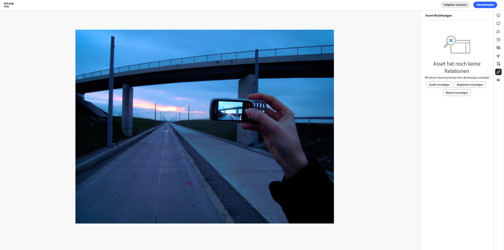
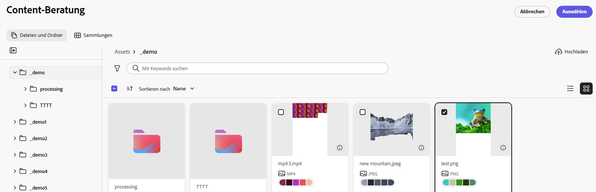
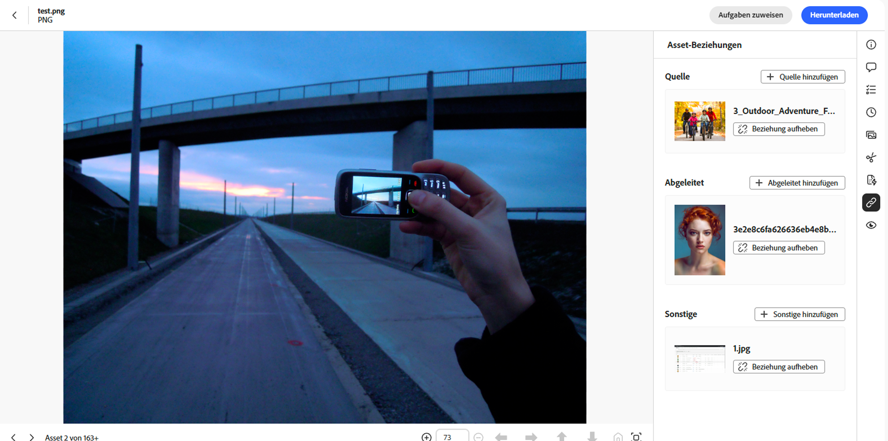

# Asset-Beziehungen {#related-assets}

Mit [!DNL Adobe Experience Manager Assets] können Sie Assets manuell entsprechend den Anforderungen Ihres Unternehmens verknüpfen. Verwenden Sie hierfür die Funktion „Verknüpfte Assets“. Beispielsweise können Sie einem Asset oder einem Bild/Video mit einer Lizenzdatei zu einem ähnlichen Thema verknüpfen. Sie können Assets verknüpfen, die bestimmte Attribute gemeinsam haben. Mit der Funktion können Sie außerdem Quellbeziehungen/abgeleitete Beziehungen zwischen Assets erstellen. Beispielsweise können Sie PDF-Dateien, die aus einer INDD-Datei generiert wurden, mit der INDD-Quelldatei verknüpfen.

Mit dieser Funktion können Sie eine PDF- oder JPG-Datei mit niedriger Auflösung für Anbieter oder Agenturen freigeben und die hochauflösende INDD-Datei nur auf Anfrage verfügbar machen.

>[!NOTE]
>
>Nur Benutzer mit Bearbeitungsberechtigungen für Assets können die Assets verknüpfen und die Verknüpfung aufheben.

## Schritte zum Verknüpfen von Assets {#steps-to-relate-assets}

1. Öffnen Sie in der [!DNL Experience Manager]-Benutzeroberfläche von die Seite **[!UICONTROL Eigenschaften]** für ein Asset, das Sie verknüpfen möchten.

   

1. Um das ausgewählte Asset mit einem anderen Asset zu verknüpfen, klicken Sie auf **[!UICONTROL Asset-Beziehungen]** .
1. Führen Sie einen der folgenden Schritte aus:

   * Um die Quelldatei für das Asset zu verknüpfen, wählen Sie aus der Liste die Option **[!UICONTROL Quelle hinzufügen]** aus. Sie können nur ein Asset als Quelle zuordnen.
   * Um eine abgeleitete Datei zu verknüpfen, wählen Sie aus der Liste die Option **[!UICONTROL Abgeleitete hinzufügen]** aus. Sie können mehrere Assets in dieser Kategorie zuordnen.
   * Um eine Zweiwege-Beziehung zwischen den Assets zu erstellen, wählen Sie aus der Liste die Option **[!UICONTROL Andere hinzufügen]** aus. Sie können mehrere Assets in dieser Kategorie zuordnen.

1. Navigieren Sie im Bildschirm **[!UICONTROL Assets auswählen]** zum Speicherort des Assets, das verknüpft werden soll, und wählen Sie es aus. Sie können jeweils ein Asset oder mehrere Assets gleichzeitig auswählen, indem Sie beim Klicken die Umschalttaste gedrückt halten, was beliebige [unterstützte Dateiformate in der Assets-Ansicht](supported-file-formats.md) umfassen kann.

   

1. Klicken Sie auf **[!UICONTROL Auswählen]**. Je nach Auswahl der Beziehung in Schritt 3 wird das verknüpfte Asset unter einer entsprechenden Kategorie im Abschnitt **[!UICONTROL Asset-Beziehungen]** aufgeführt. Wenn das verknüpfte Asset beispielsweise die Quelldatei des aktuellen Assets ist, wird es unter **[!UICONTROL Quelle]** aufgeführt.

   

1. Klicken Sie für alle zugehörigen Assets in jedem Abschnitt ([!UICONTROL Quelle], [!UICONTROL Abgeleitet] und [!UICONTROL Andere]) auf **[!UICONTROL Bezug aufheben]** , um die Verknüpfung eines Assets aufzuheben.

## Übersetzen verknüpfter Assets {#translating-related-assets}

Für die Übersetzungs-Workflows ist die Erstellung von Quellbeziehungen / abgeleiteten Beziehungen zwischen Assets mit der Funktion „Verknüpfte Assets“ nützlich. Wenn Sie für ein abgeleitetes Asset einen Übersetzungs-Workflow ausführen, ruft [!DNL Experience Manager Assets] automatisch beliebige Assets ab, die von der Quelldatei referenziert werden, und nimmt sie in die Übersetzung auf. Auf diese Weise wird das vom Quell-Asset referenzierte Asset zusammen mit dem Quell-Asset und den abgeleiteten Assets übersetzt. Ist die Quelldatei mit einem anderen Asset verknüpft, ruft [!DNL Experience Manager Assets] das referenzierte Asset ab und nimmt es für die Übersetzung auf.

Siehe [Übersetzen von Assets in AEM](https://experienceleague.adobe.com/de/docs/experience-manager-cloud-service/content/assets/admin/translate-assets).

## Nächste Schritte {#next-steps}

* Geben Sie Produkt-Feedback über die Option [!UICONTROL Feedback] in der Benutzeroberfläche der Assets-Ansicht

* Geben Sie Feedback zur Dokumentation durch  über die Option [!UICONTROL Diese Seite bearbeiten] oder durch  über die Option [!UICONTROL Problem protokollieren] in der rechten Seitenleiste

* Kontaktieren Sie die [Kundenunterstützung](https://experienceleague.adobe.com/de?support-solution=General#support)

>[!MORELIKETHIS]
>
>* [Anzeigen von Versionen eines Assets](manage-organize.md#view-versions)
>* [Übersetzen von Assets in AEM](https://experienceleague.adobe.com/de/docs/experience-manager-cloud-service/content/assets/admin/translate-assets)
>* [Unterstützte Dateiformate in der Assets-Ansicht](supported-file-formats.md)
