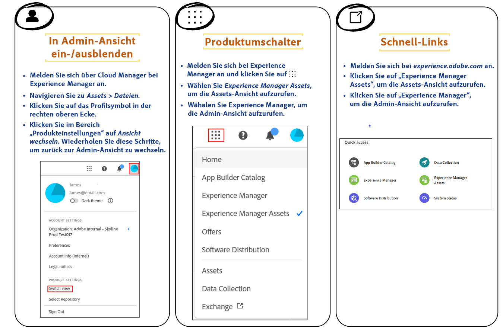
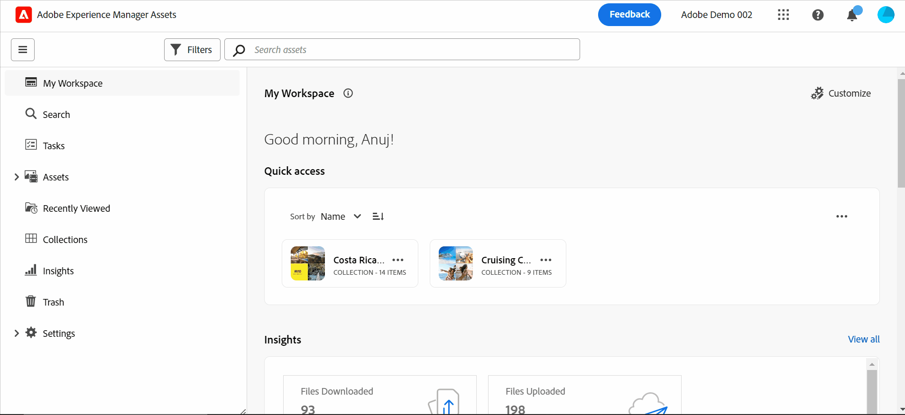

# Einführung in die Assets-Ansicht {#assets-view}

In der schnelllebigen Digital-First-Landschaft von heute, in der die Erstellung und Bereitstellung von Echtzeitinhalten unerlässlich sind, ist ein für nachgelagerte Marketing-Geschwindigkeit (Marketing Velocity) entwickeltes Digital Asset Management (DAM)-Erlebnis von größter Bedeutung. Adobe nutzt sein Know-how bei der Unterstützung von Marketing- und Kreativprofis und bietet damit ein völlig neues Anwendererlebnis. Dieser Workflow-First-Ansatz revolutioniert, wie Unternehmen mit ihren dynamischen digitalen Assets umgehen, und ermöglicht es Marketing-Fachleuten, die Effizienz bei der Suche, Zusammenarbeit, Personalisierung und Bereitstellung von Assets zu maximieren. Diese optimierten Workflows erhöhen die Inhaltsgeschwindigkeit und transportieren Ihre Marketing-Maßnahmen auf neue Höhen.

## Wie wird auf die Assets-Ansicht zugegriffen? {#access-assets-view}

Sie können wie folgt auf die Assets-Ansicht zugreifen:

<!--

* **Toggle in Admin view**

    * Log into [!DNL Experience Manager] using Cloud Manager.
    * Navigate to **[!UICONTROL Assets]** > **[!UICONTROL Files]**.
    * Click the profile icon on the top right corner.
    * Click **[!UICONTROL Switch View]** from the **[!UICONTROL Profile Settings]** section.
    Repeat these steps to switch back to the Admin view.

* **Product Switcher**
    * Log into [!DNL Experience Manager] and click .
    * Select **[!UICONTROL Experience Manager Assets]** to access the Assets view.
    * Select **[!UICONTROL Experience Manager]** to access the Admin view.

* **Quick Links** 
    * Log into experience.adobe.com.
    * Click **[!UICONTROL Experience Manager Assets]** to access the Assets view.
    * Click **[!UICONTROL Experience Manager Assets]** to access the Assets view.

    -->

## Was spricht für die Assets-Ansicht?

Die Assets-Ansicht hat gegenüber der Admin-Ansicht die folgenden wichtigen Vorteile:

* [Dashboard „Mein Arbeitsbereich“ zur Bereitstellung optimierter Erlebnisse](#my-workspace-for-streamlined-experience)
* [Search-First-Ansatz für mehr Effizienz](#search-first)
* [Erkenntnisse für datenbasierte Entscheidungen](#insights-data)
* [Adobe Photoshop Express-Integration für eine schnellere Zusammenarbeit](#accelerate-collaboration)
* [Ordner-Uploads zum Einrichten einer hierarchischen Struktur für Ihr Unternehmen](#folder-uploads)
* [Abonnieren von Repository-Inhalten für effizientes Asset-Management](#subscribe-content)
* [Vorläufiges Löschen von Assets für eine bessere Kontrolle durch Admins](#soft-delete-assets)

### Dashboard „Mein Arbeitsbereich“ zur Bereitstellung optimierter Erlebnisse {#my-workspace-for-streamlined-experience}

Freuen Sie sich auf eine Digital Asset Management-Lösung, die die unterschiedlichen Anforderungen verschiedener Unternehmensrollen versteht. Die neue Assets-Ansicht mit ihrem eleganten Design priorisiert Benutzerfreundlichkeit und Schnelligkeit und berücksichtigt dabei die Vorlieben von Marketing-Fachleuten, die sich eine ansprechende Ästhetik und übersichtliche Arbeitsbereiche wünschen. Mit dem benutzerspezifischen Dashboard „Mein Arbeitsbereich“ können Marketing-Fachleute Assets schnell finden, in der Vorschau anzeigen, bearbeiten, verwalten und bereitstellen – und das mit bemerkenswerter Effizienz. Keine unzähligen Stunden mehr für die Suche nach bestimmten Assets. Stattdessen ein optimiertes Erlebnis, mit dem Sie alles Nötige sofort finden.

### Erkenntnisse für datenbasierte Entscheidungen {#insights-data}

Um mit der Inhaltsgeschwindigkeit Schritt zu halten, sind umsetzbare Erkenntnisse unerlässlich. Die neue Assets-Ansicht bietet erweiterte Erkenntnisse innerhalb des Dashboards „Mein Arbeitsbereich“ und liefert wertvolle Daten zur Asset-Leistung, zur Zielgruppennutzung und zu Interaktionen. Marketing-Fachleute können datenbasierte Entscheidungen treffen, Inhaltsstrategien optimieren und die nachgelagerte Bereitstellung verfeinern, um optimale Ergebnisse zu erzielen. Durch den Zugriff auf aussagekräftige Erkenntnisse können Unternehmen dem Wettbewerb voraus bleiben und außergewöhnliche Ergebnisse erzielen.

### Adobe Photoshop Express-Integration für eine schnellere Zusammenarbeit {#accelerate-collaboration}

Das neue Erlebnis hält eine Reihe robuster Funktionen für die Zusammenarbeit bereit, darunter die Echtzeitbearbeitung mit integrierten Adobe Photoshop-Funktionen, -Versionskontrollfunktionen und Anmerkungswerkzeugen. Dies ermöglicht eine nahtlose Zusammenarbeit zwischen Design-, Kreativ-, Branding- und Marketing-Teams, sodass diese Engpässe überwinden und den Marketing-Prozess beschleunigen können. Marketing-Fachleute verfügen nun über leistungsstarke Tools, mit denen sie Projekte schneller bereitstellen und ihre Gesamtproduktivität steigern können.

Sehen Sie sich dieses Video an, um die Stärke der Assets-Ansichtsintegration in Adobe Photoshop Express nachzuvollziehen:

>[!VIDEO](https://video.tv.adobe.com/v/3420922)

Künftige Versionen werden auch eine [Adobe Firefly-Integration über Adobe Express](https://firefly.adobe.com/?gclid=EAIaIQobChMIlZeKuNfj_wIVeyCtBh3e5g2cEAAYASAAEgL56_D_BwE&amp;sdid=JM4FW6VL&amp;mv=search&amp;mv2=paidsearch&amp;ef_id=EAIaIQobChMIlZeKuNfj_wIVeyCtBh3e5g2cEAAYASAAEgL56_D_BwE:G:s&amp;s_kwcid=AL!3085!3!652077237594!e!!g!!adobe%20firefly!19870733758!148140507838) umfassen.

### Ordner-Uploads zum Einrichten einer hierarchischen Struktur für Ihr Unternehmen {#folder-uploads}

Richten Sie mithilfe der Assets-Ansicht schnell eine Ordnerstruktur für Ihr Unternehmen ein, indem Sie Ordner hochladen, die in Ihrem lokalen Dateisystem vorhanden sind. Sie müssen nicht erst Ordner im Stammordner erstellen und dann Assets manuell in diese Ordner hochladen, um die logische hierarchische Struktur beizubehalten. Alle Ordner und Assets im Stammordner werden automatisch nach Experience Manager Assets hochgeladen.

### Search-First-Ansatz für mehr Effizienz {#search-first}

Erschließen Sie das Potenzial der digitalen Asset-Bibliothek Ihres Unternehmens durch Suchvorgänge mit modernsten Funktionen. Sie müssen nicht mehr mühevoll unzählige Dateien und Ordner manuell durchgehen. Jede Benutzerin und jeder Benutzer kann sofort das perfekte Bild, Video oder Dokument für beeindruckende Marketing-Kampagnen, faszinierende Präsentationen und ansprechende Inhalte finden. Mit unserer Search-First-Suchmaschine können Sie mühelos durch Asset-Typen, Metadaten, Smarttags und sogar den Inhalt selbst navigieren, ohne das genaue Keyword zu kennen. Nutzen Sie die Zukunft des DAM mit unserem Search-First-Ansatz und entfesseln Sie das volle Potenzial Ihrer digitalen Asset-Bibliothek.

### Abonnieren von Repository-Inhalten für effizientes Asset-Management {#subscribe-content}

Die Assets-Ansicht ermöglicht es Ihnen, die Vorgänge zu überwachen, die mit den im Repository verfügbaren Assets, Ordnern oder Sammlungen durchgeführt werden. Sie müssen den Inhalt auswählen und abonnieren, für den die Benachrichtigungen an Sie gesendet werden sollen. Sie können auch die Ereignistypen konfigurieren, z. B. das Löschen von abonnierten Inhalten und Ändern von abonnierten Inhalten. Die Benachrichtigungen werden Ihnen dann nur für diese Ereignistypen gesendet.

### Vorläufiges Löschen von Assets für eine bessere Kontrolle durch Admins {#soft-delete-assets}

Im Papierkorb-Ordner, der in der Assets-Ansicht verfügbar ist, sind die aus dem Assets-Stammordner gelöschten Assets aufgelistet. Sie können ein Asset im Papierkorb-Ordner auswählen, um es entweder am ursprünglichen Speicherort wiederherzustellen oder dauerhaft zu löschen. Sie können auch ein Keyword angeben oder standardmäßige bzw. benutzerdefinierte Filter anwenden, um nach geeigneten Assets im Papierkorb-Ordner zu suchen.

Zusätzlich zu diesen Funktionen können Sie mit der Assets-Ansicht auch die folgenden Funktionen ausführen, die in der Admin-Ansicht nicht verfügbar sind:

* Hochladen einer neuen Asset-Version mit einem anderen Namen aus Ihrem lokalen Dateisystem in das Asset-Repository. Das hochgeladene Asset ist als neue Version mit demselben Namen wie das ursprüngliche Asset verfügbar.

* Umbenennen der im Repository verfügbaren Assets und Ordner.

## Zusammenfassung {#conclusion}

Das Digital-First-Zeitalter hat begonnen und es ist an der Zeit, unsere Marketing-Tools zu transformieren, um das sich weiterentwickelnde Geschäftsumfeld zu unterstützen. Die neue Assets-Ansicht in Adobe Experience Manager ist darauf zugeschnitten, Workflows zu optimieren, die Zusammenarbeit zu fördern und die Asset-Bereitstellung zu beschleunigen. Durch die schnelle Bereitstellung von Inhalten können Marketing-Fachleute das gesamte Potenzial ihrer digitalen Assets ausschöpfen und beispiellose Kreativität freisetzen. Machen Sie sich bereit, die Möglichkeiten der neuen Assets-Ansicht von Adobe zu nutzen und außergewöhnliche Ergebnisse in Ihren Marketing-Kampagnen zu erzielen. Es ist an der Zeit, die DAM-Zukunft zu begrüßen und Ihr Geschäft voranzubringen.

