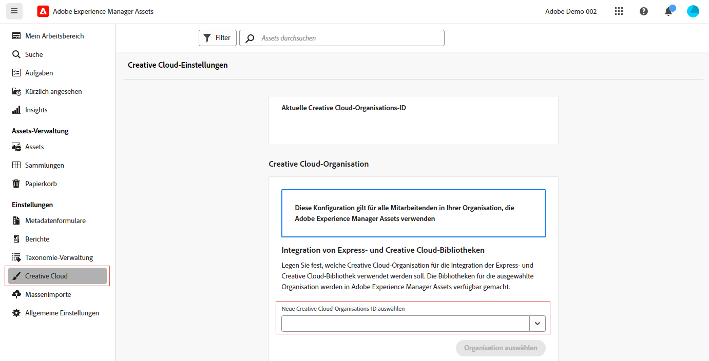

# Verbinden von AEM Assets mit Creative Cloud  {#cross-org-entitlements}

Experience Manager Assets bietet die Möglichkeit, eine Verbindung zu einer Creative Cloud-Berechtigung herzustellen, die einer anderen IMS-Organisation zugewiesen wurde, um die neuesten Creative Cloud-Integrationen in AEM Assets, einschließlich Express- und Creative Cloud-Bibliotheken, bequem verwenden zu können.

Wenn Ihre Creative Cloud-Produkte und AEM Assets für verschiedene IMS-Organisationen bereitgestellt werden, können Sie eine Verbindung zu einer anderen Creative Cloud-Organisation herstellen, um integrierte Workflows zwischen den beiden Lösungen ausführen zu können.

## Voraussetzungen {#prerequisites}

* Administratorrechte für Experience Manager Assets

* Aktive Creative Cloud-Berechtigung für dieselbe Benutzer-ID, die über Creative Cloud und Experience Manager hinweg verwendet wird. Berechtigungen für persönliche und Verbund-IDs mit derselben E-Mail-Adresse werden als unterschiedliche Benutzer-IDs behandelt.

## Herstellen einer Verbindung mit einer neuen Creative Cloud-Organisation {#connect-to-creative-cloud-org}

Gehen Sie wie folgt vor, um eine Verbindung zu einer neuen Creative Cloud-Organisation herzustellen:

1. Navigieren Sie zu **[!UICONTROL Einstellungen]** > **[!UICONTROL Creative Cloud]**.

1. Wählen Sie die neue Creative Cloud-Organisation mithilfe der Dropdown-Liste **[!UICONTROL Neue Creative Cloud-Organisations-ID auswählen]**. In der Liste werden alle Organisationen angezeigt, auf die Sie Zugriff haben. Wählen Sie eine Organisation mit aktiven Creative Cloud-Berechtigungen aus.

1. Klicken Sie auf **[!UICONTROL Organisationen wechseln]**, um zur neuen Organisation zu wechseln.

   

## Einschränkungen {#limitations}

* Sie können AEM Assets jeweils mit einer Creative Cloud-Organisation verbinden. Die gleichzeitige Verbindung mit mehreren Creative Cloud-Organisationen wird nicht unterstützt.

* Die Creative Cloud-Organisation, mit der Sie innerhalb von AEM Assets verbunden sind, gilt für alle Benutzenden in Ihrem Unternehmen.
