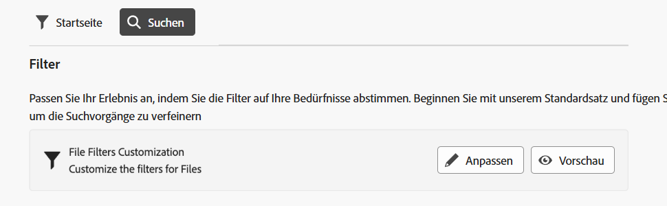

<table>
    <tr>
        <td>
            
<a href="https://experienceleague.adobe.com/de/docs/experience-manager-cloud-service/content/assets/dynamicmedia/dm-prime-ultimate"><b>Dynamic Media Prime und Ultimate</b></a>
        </td>
        <td>
            
<a href="https://experienceleague.adobe.com/de/docs/experience-manager-cloud-service/content/assets/assets-ultimate-overview"><b>AEM Assets Ultimate</b></a>
        </td>
        <td>
            
<a href="http://experienceleague.adobe.com/de/docs/experience-manager-cloud-service/content/assets/integrate-aem-assets-edge-delivery-services"><b>AEM Assets-Integration mit Edge Delivery Services</b></a>
        </td>
        <td>
            
            <a href="https://experienceleague.adobe.com/de/docs/experience-manager-cloud-service/content/assets/assets-view/aem-assets-view-ui-extensibility"><b>Erweiterbarkeit der Benutzeroberfläche</b></a>
        </td>
          <td>
            
            <a href="https://experienceleague.adobe.com/de/docs/experience-manager-cloud-service/content/assets/dynamicmedia/dm-prime-ultimate"><b>Aktivieren von Dynamic Media Prime und Ultimate</b></a>
        </td>
    </tr>
    <tr>
        <td>
            <a href="https://experienceleague.adobe.com/de/docs/experience-manager-cloud-service/content/assets/best-practices/search-best-practices"><b>Best Practices für die Suche</b></a>
        </td>
        <td>
            <a href="https://experienceleague.adobe.com/de/docs/experience-manager-cloud-service/content/assets/best-practices/metadata-best-practices"><b>Best Practices für Metadaten</b></a>
        </td>
        <td>
            <a href="https://experienceleague.adobe.com/de/docs/experience-manager-cloud-service/content/assets/content-hub/product-overview"><b>Content Hub</b></a>
        </td>
        <td>
            <a href="https://experienceleague.adobe.com/de/docs/experience-manager-assets-essentials/help/custom-search-filters"><b>Dynamic Media mit OpenAPI-Funktionen</b></a>
        </td>
        <td>
            <a href="https://developer.adobe.com/experience-cloud/experience-manager-apis/"><b>Entwicklerdokumentation zu AEM Assets</b></a>
        </td>
    </tr>
</table>

# Anpassen von Suchfiltern {#customize-search-filters}

Suchfilter ermöglichen es Ihnen, Suchergebnisse basierend auf verschiedenen Parametern wie Datum, Dateityp, Tags und Relevanz zu optimieren, wodurch die Präzision von Suchabfragen verbessert wird. Durch das Anwenden von Filtern können Sie schnell und effizient die relevantesten Ergebnisse durchsuchen. Dies spart nicht nur Zeit, sondern verbessert auch das Gesamterlebnis bei der Suche, indem die Ergebnisse auf konkrete Vorlieben und Bedürfnisse zugeschnitten werden.
Weitere Informationen über die [Suche](search.md).

Angepasste Suchfilter in AEM Assets können nur Einträgen in Ihrem durchsuchbaren Eigenschaftsindex zugeordnet werden. Stellen Sie sicher, dass alle benutzerdefinierten Metadaten enthalten sind, bevor Sie Ihr benutzerdefiniertes Filtererlebnis konfigurieren. Mit [!DNL Assets Essentials] können Suchfilter angepasst werden, um den Suchvorgang zu optimieren. Um die benutzerdefinierten Suchfilter von AEM Assets anzupassen, führen Sie die folgenden Schritte aus:

1. Navigieren Sie zu **[!UICONTROL Einstellungen]** > **[!UICONTROL Allgemeine Einstellungen]**.
1. Navigieren Sie zur Registerkarte **[!UICONTROL Suchen]**. Klicken Sie auf **[!UICONTROL Anpassen]**, um Ihr Suchformular zu konfigurieren.

   

1. Das Formular [!UICONTROL Filter konfigurieren] wird angezeigt. Stellen Sie sicher, dass Sie sich im Bearbeitungsmodus befinden, damit Sie Änderungen an der Vorlage vornehmen können. Sie können in den [!UICONTROL Vorschaumodus] wechseln, um die Vorschau eines vorhandenen Suchformulars anzuzeigen.
1. Legen Sie Filterelemente aus den [benutzerdefinierten Filtern](#available-custom-filters) auf der Arbeitsfläche ab. Sie können die Komponente bei Bedarf per Drag-and-Drop verschieben, um sie neu anzuordnen.

   >[!VIDEO](https://video.tv.adobe.com/v/3443080)

1. Klicken Sie auf **[!UICONTROL Vorschaumodus]**, um die Änderungen zu überprüfen.
1. Klicken Sie zum Speichern auf **[!UICONTROL Bestätigen]**.

## Verfügbare benutzerdefinierte Filter {#available-custom-filters}

Assets Essentials bietet die folgenden benutzerdefinierten Filter, die je nach Anforderung neu konfigurierbar sind:

* [Filterelemente](#filter-elements)
* [Vorkonfigurierte Filter](#preconfigured-filters)

### Filterelemente {#filter-elements}

Benutzerdefinierte Filter in AEM Assets ermöglichen Ihnen die Verwendung einer Sammlung von Filterelementen auf der Arbeitsfläche für benutzerdefinierte Suchfilter. Diese Elemente können basierend auf der Verwendbarkeit von Sucheigenschaftsattributen neu konfiguriert werden. Sie können jedoch die [Filtereigenschaften](#filter-properties) Ihren Anforderungen entsprechend anpassen. Die folgenden Filterelemente sind in [!DNL Assets Essentials] verfügbar:

<table>
    <tr>
        <th>Filterelemente</th>
        <th>Beschreibung</th>
        <th>Eigenschaften</th>
    </tr>
    <tr>
        <td>Text</td>
        <td>Ein Textfeld ist ein Eingabebereich, in den Sie Informationen zum Filter eingeben können.</td>
        <td>
            <ul>
                <li>Bezeichnung
                <li>Metadaten
                <li>Werte
                <li>Beschreibung
            </ul>
        </td>
    </tr>
    <tr>
        <td>Optionen</td>
        <td>Optionen beziehen sich auf die verfügbaren Alternativen zur Auswahl eines bevorzugten Elements aus einer Liste.</td>
        <td>
            <ul>
                <li>Bezeichnung
                <li>Metadaten
                <li>Werte
                <li>Optionen
                <li>Beschreibung
            </ul>
        </td>
    </tr>
    <tr>
        <td>Boolescher Wert</td>
        <td>Ein boolescher Wert stellt einen wahren Wert dar. Er kann dort verwendet werden, wo Sie konkret eine Option unter mehreren auswählen möchten.</td>
        <td>
            <ul>
                <li>Bezeichnung
                <li>Metadaten
                <li>Beschreibung
            </ul>
        </td>
    </tr>
    <tr>
        <td>Zahl</td>
        <td>Verwenden Sie dieses Filterelement, um einen numerischen Wert darzustellen.</td>
        <td>
            <ul>
                <li>Bezeichnung
                <li>Metadaten
                <li>Auswahlart
                <li>Schritte
                <li>Schrittwert
                <li>Beschreibung
            </ul>
        </td>
    </tr>
    <tr>
        <td>Dropdown</td>
        <td>Zur Auswahl zwischen verschiedenen Optionen, die in einer Liste mit Optionen angezeigt werden.</td>
        <td>
            <ul>
                <li>Bezeichnung
                <li>Metadaten
                <li>Optionen
                <li>Werte
                <li>Beschreibung
            </ul>
        </td>
    </tr>
    <tr>
        <td>Datum</td>
        <td>Wird zur Angabe des Datums verwendet.</td>
        <td>
            <ul>
                <li>Bezeichnung
                <li>Metadaten
                <li>Auswahlart
                <li>Beschreibung
            </ul>
        </td>
    </tr>
    <tr>
        <td>Pfad-Browser</td>
        <td>Wird zum Navigieren durch Dateien oder Ordner im Experience Manager-Repository verwendet.</td>
        <td>
            <ul>
                <li>Bezeichnung
                <li>Metadaten
                <li>Pfad-Explorer
                <li>Beschreibung
            </ul>
        </td>
    </tr>
    <tr>
        <td>Tags</td>
        <td>Wird verwendet, um Tags aus den verfügbaren Optionen auszuwählen. Tags bieten genauere Informationen über die Assets und verbessern ihre Auffindbarkeit. Bereits auf die ausgewählten Assets angewendete Tags werden im Panel <b>Eigenschaften</b> angezeigt. Wenn Sie Tags in einer benutzerdefinierten Metadateneigenschaft speichern und den Stammpfad verwenden, um ihn auf eine Hierarchie zu beschränken, können Sie dieselbe Konfiguration in Ihren Suchfiltern nutzen. Wenn Sie die entsprechenden Tags nicht finden können, erstellen Sie sie und weisen Sie sie den ausgewählten Assets zu. Weitere Informationen zum Erstellen von Tags und Zuweisen von diesen zu Assets finden Sie unter <a href = "/help/using/tagging-management.md">Verwalten von Tags in Assets Essentials</a>.</td>
        <td>
            <ul>
                <li>Bezeichnung
                <li>Metadaten
                <li>Tag-Wähler
                <li>Beschreibung
            </ul>
        </td>
    </tr>
    <tr>
        <td>Benutzerin bzw. Benutzer</td>
        <td>Wird verwendet, um den Benutzertyp unter Admins, Standardbenutzenden und Verbrauchenden anzugeben.</td>
        <td>
            <ul>
                <li>Bezeichnung
                <li>Metadaten
                <li>Beschreibung
            </ul>
        </td>
    </tr>
</table>

### Vorkonfigurierte Filter {#preconfigured-filters}

Die vorkonfigurierten Filter sind Voreinstellungen, die direkt auf der Arbeitsfläche verwendet werden können. Sie können jedoch die [Filtereigenschaften](#filter-properties) Ihren Anforderungen entsprechend anpassen. Die folgenden Filter sind in [!DNL Assets Essentials] vorkonfiguriert:

<table>
    <tr>
        <th>Vorkonfigurierte Filter</th>
        <th>Beschreibung</th>
        <th>Eigenschaften</th>
    </tr>
    <tr>
        <td>Dateityp</td>
        <td>Filtern Sie die Suchergebnisse nach den unterstützten Dateitypen „Bilder“, „Dokumente“ und „Videos“.</td>
        <td>
            <ul>
                <li>Bezeichnung
                <li>Metadaten
                <li>Auswahlart
                <li>Optionen
                <li>Werte
                <li>Beschreibung
            </ul>
        </td>
    </tr>
    <tr>
        <td>Dateiformat</td>
        <td>Assets Essentials unterstützt alle binären Dateiformate mit grundlegenden Services wie Speichern, Hochladen, Kopieren, Verschieben, Löschen und Hinzufügen von Metadaten.</td>
        <td>
            <ul>
                <li>Bezeichnung
                <li>Metadaten
                <li>Auswahlart
                <li>Beschreibung
            </ul>
        </td>
    </tr>
    <tr>
        <td>Bildgröße</td>
        <td>Geben Sie eine oder mehrere der minimalen und maximalen Abmessungen zum Filtern von Bildern an. Die Größe wird in Pixeln angegeben und ist nicht die Dateigröße der Bilder.</td>
        <td>
            <ul>
                <li>Bezeichnung
                <li>Metadaten
                <li>Auswahlart
                <li>Schritte
                <li>Schrittwert
                <li>Beschreibung
            </ul>
        </td>
    </tr>
    <tr>
        <td>Bildbreite</td>
        <td>Vertikale Abmessungen eines Bildes.</td>
        <td>
            <ul>
                <li>Bezeichnung
                <li>Metadaten
                <li>Auswahlart
                <li>Schritte
                <li>Schrittwert
                <li>Beschreibung
            </ul>
        </td>
    </tr>
    <tr>
        <td>Bildhöhe</td>
        <td>Horizontale Abmessungen eines Bildes.</td>
        <td>
            <ul>
                <li>Bezeichnung
                <li>Metadaten
                <li>Auswahlart
                <li>Schritte
                <li>Schrittwert
                <li>Beschreibung
            </ul>
        </td>
    </tr>
    <tr>
        <td>Erstellungsdatum</td>
        <td>Datumsbereich, in dem die Assets erstellt wurden.</td>
        <td>
            <ul>
                <li>Bezeichnung
                <li>Metadaten
                <li>Auswahlart
                <li>Beschreibung
            </ul>
        </td>
    </tr>
    <tr>
        <td>Änderungsdatum</td>
        <td>Datumsbereich, in dem Assets geändert wurden.</td>
        <td>
            <ul>
                <li>Bezeichnung
                <li>Metadaten
                <li>Auswahlart
                <li>Beschreibung
            </ul>
        </td>
    </tr>
    <tr>
        <td>Asset-Status</td>
        <td>In Assets Essentials können Sie den Status der im Repository verfügbaren Assets festlegen. Legen Sie einen Asset-Status fest, um die nachgelagerte Nutzung digitaler Assets besser steuern und verwalten zu können. Wählen Sie zwischen <b>„Genehmigt“, „Abgelehnt“ oder „Kein Status“</b>.</td>
        <td>
            <ul>
                <li>Bezeichnung
                <li>Metadaten
                <li>Auswahlart
                <li>Beschreibung
            </ul>
        </td>
    </tr>
    <tr>
        <td>Smart-Tags</td>
        <td>Filtern Sie Assets mithilfe von Smart-Tags, die im Experience Manager-Repository hinzugefügt werden.</td>
        <td>
            <ul>
                <li>Bezeichnung
                <li>Metadaten
                <li>Auswahlart
                <li>Unterstützung von Trennzeichen
                <li>Beschreibung
            </ul>
        </td>
    </tr>
    <tr>
        <td>Dynamic Media-Status</td>
        <td>Wählen Sie beim Status eines Assets zwischen „Veröffentlicht“ und „Unveröffentlicht“.</td>
        <td>
            <ul>
                <li>Bezeichnung
                <li>Metadaten
                <li>Auswahlart
                <li>Optionen
                <li>Werte
                <li>Beschreibung
            </ul>
        </td>
    </tr>
    <tr>
        <td>Ablaufdatum</td>
        <td>Filtern Sie Assets und geben Sie einen Datumsbereich an, nach dem die Assets nicht mehr gültig sind oder benötigt werden. </td>
        <td>
            <ul>
                <li>Bezeichnung
                <li>Metadaten
                <li>Auswahlart
                <li>Beschreibung
            </ul>
        </td>
    </tr>
    <tr>
        <td>Tags (Taxonomie)</td>
        <td>Es handelt sich um ein System zur Organisation und Klassifizierung digitaler Assets mithilfe von Tags, bei dem im Wesentlichen eine hierarchische Struktur von Keywords erstellt wird, mit der Benutzende mühelos relevante Inhalte suchen und finden können, indem sie bestimmte Tags auf jedes Asset anwenden. </td>
        <td>
            <ul>
                <li>Bezeichnung
                <li>Metadaten
                <li>Tag-Wähler
                <li>Beschreibung
            </ul>
        </td>
    </tr>
</table>

#### Filtereigenschaften {#filter-properties}

Jedes Filterelement ist mit einer Reihe von Eigenschaften verknüpft. AEM Assets passt Suchfilter an und verwendet die folgenden Eigenschaften in den Filtern und vorkonfigurierten Elementen:

<table>
    <tr>
        <th>Eigenschaften</th>
        <th>Werte</th>
        <th>Beschreibung</th>
    </tr>
    <tr>
        <td>Bezeichnung</td>
        <td>Text</td>
        <td>Eine Kennung des verwendeten Filters.</td>
    </tr>
    <tr>
        <td>Metadaten</td>
        <td>Dropdown</td>
        <td>Die Metadateneigenschaft wird verwendet, um genehmigte Metadaten aus dem Adobe Experience Manager Assets-Repository zuzuordnen. Sie können aus dem Dropdown-Menü den Metadatenwert auswählen, der dem Filterelement zugeordnet werden muss. </td>
    </tr>
    <tr>
        <td>Auswahlart</td> 
        <td>Einzel, Mehrfach, Exakt oder Bereich </td>
        <td>
            <ul>
                <li>Die <b>Einzelauswahl</b> ermöglicht die Auswahl eines Elements nach dem anderen und eignet sich ideal für unterschiedliche Auswahlmöglichkeiten.
                <li>Die <b>Mehrfachauswahl</b> ermöglicht die Auswahl mehrerer Elemente gleichzeitig und ist bei der Auswahl mehrerer Optionen nützlich. 
                <li>Die <b>exakte Auswahl</b> ermöglicht die Auswahl eines einzelnen Elements aus verschiedenen Optionen.
                <li>Die <b>Bereichsauswahl</b> ermöglicht die Auswahl eines kontinuierlichen Satzes von Werten innerhalb eines definierten Bereichs und ist für die Auswahl eines Datumsbereichs oder numerischer Werte nützlich.
            </ul>
        </td>   
    </tr>
    <tr>
        <td>Optionen</td>
        <td>Manuell, JSON-Pfad oder CSV-Upload</td>
        <td>
            <ul>
                <li>Wählen Sie <b>Manuell</b> aus, wenn Sie Optionen manuell hinzufügen möchten. 
                <li>Wählen Sie <b>JSON-Pfad</b> aus, um Optionen aus der JSON-Datei hinzuzufügen. 
                <li>Wählen Sie <b>CSV-Upload</b>, um eine CSV-Datei mit den in den Optionen hinzuzufügenden Werten zu importieren.
            </ul>
        </td>
    </tr>
    <tr>
       <td>Werte</td>
        <td>Hinzufügen oder Bearbeiten</td>
        <td>
        <ul>
        <li>Klicken Sie auf <b>Hinzufügen</b>, um einen neuen Wert hinzuzufügen. 
        <li>Klicken Sie auf ✎, um das Label zu bearbeiten. 
        <li>Klicken Sie auf 🗑, um den Optionswert zu löschen. 
        <li>Klicken Sie auf <b>Bearbeiten</b>, um die Bearbeitungsoptionen zu ändern. 
        <li>Sie können auch die Sequenz der Optionen ändern, indem Sie sie gedrückt halten.
        </td>
    </tr>
    <tr>
        <td>Unterstützung von Trennzeichen</td>
        <td>Aktivieren oder Deaktivieren</td>
        <td>Ein Trennzeichen ist ein Symbol zum Trennen verschiedener Elemente im Text. Beispielsweise Kommas, Leerzeichen oder Semikolons.</td>
    </tr>
    <tr>
        <td>Schritte</td>
        <td>Wert</td>
        <td>Aktivieren Sie die Schrittschaltflächen im Zahlenfeld, um den Wert beim Klicken zu erhöhen oder zu verringern. </td>
    </tr>
    <tr>
        <td>Schrittwert </td>
        <td>Zahl</td>
        <td>Gibt bei Verwendung der Schrittschaltfläche den Inkrement-/Dekrementwert an. Wird angezeigt, wenn Schritte aktiviert sind.</td>
    </tr>
    <tr>
        <td>Beschreibung</td>
        <td>Text</td>
        <td>Fügen Sie eine detaillierte Erklärung hinzu, um zusätzliche Informationen zum Filterelement bereitzustellen.</td>
    </tr>
</table>

## Löschen eines Filterelements {#delete-a-filter-element}

Um einen Suchfilter zu löschen, führen Sie die folgenden Schritte aus:

1. Navigieren Sie zu **[!UICONTROL Einstellungen]** > **[!UICONTROL Allgemeine Einstellungen]**.
1. Navigieren Sie zur Registerkarte **[!UICONTROL Suchen]**. Klicken Sie auf **[!UICONTROL Anpassen]**, um Ihr Suchformular zu konfigurieren.
1. Das Formular [!UICONTROL Filter konfigurieren] wird angezeigt. Stellen Sie sicher, dass Sie sich im Bearbeitungsmodus befinden, damit Sie Änderungen an der Vorlage vornehmen können.
1. Wählen Sie das Filterelement aus, das Sie löschen möchten. Wählen Sie beispielsweise **[!UICONTROL Bildhöhe]** aus.
1. Klicken Sie auf **[!UICONTROL Kategorie löschen]**, um das Filterelement zu löschen. Das Element **[!UICONTROL Bildhöhe]** wird von der Arbeitsfläche entfernt.
1. Klicken Sie auf **[!UICONTROL Bestätigen]**, um das Formular zu speichern.

## Verwenden benutzerdefinierter Suchfilter{#using-custom-search-filters}

Nachdem Sie die Suchfilter konfiguriert haben, können Sie sie für die Suche nach Assets im Repository verwenden.

>[!MORELIKETHIS]
>
>* [Suchen von Assets](/help/using/search.md)
