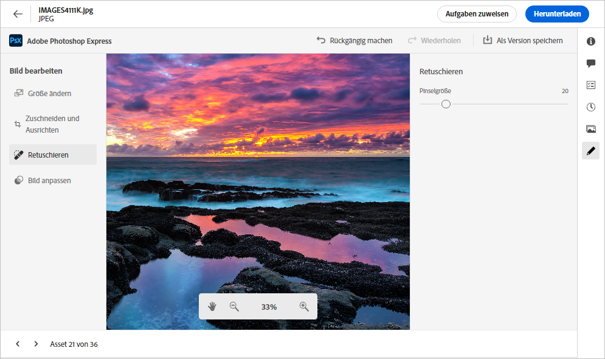
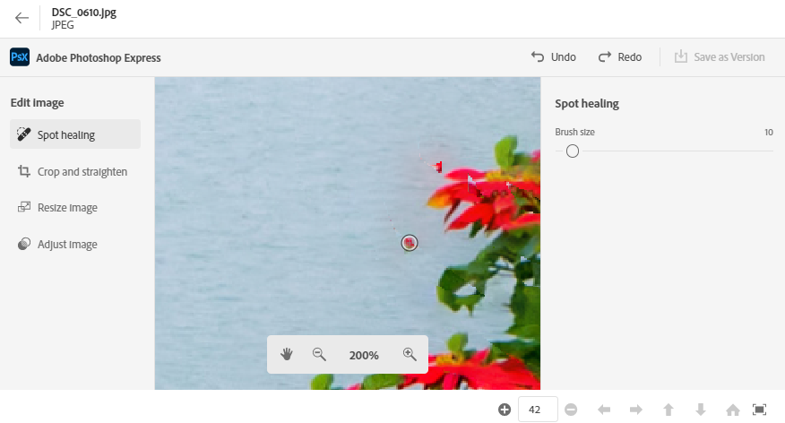
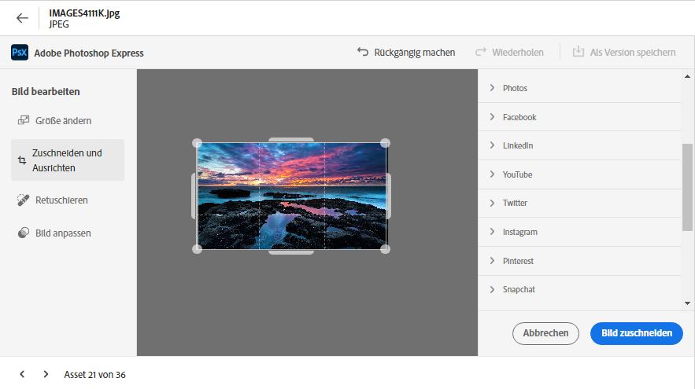
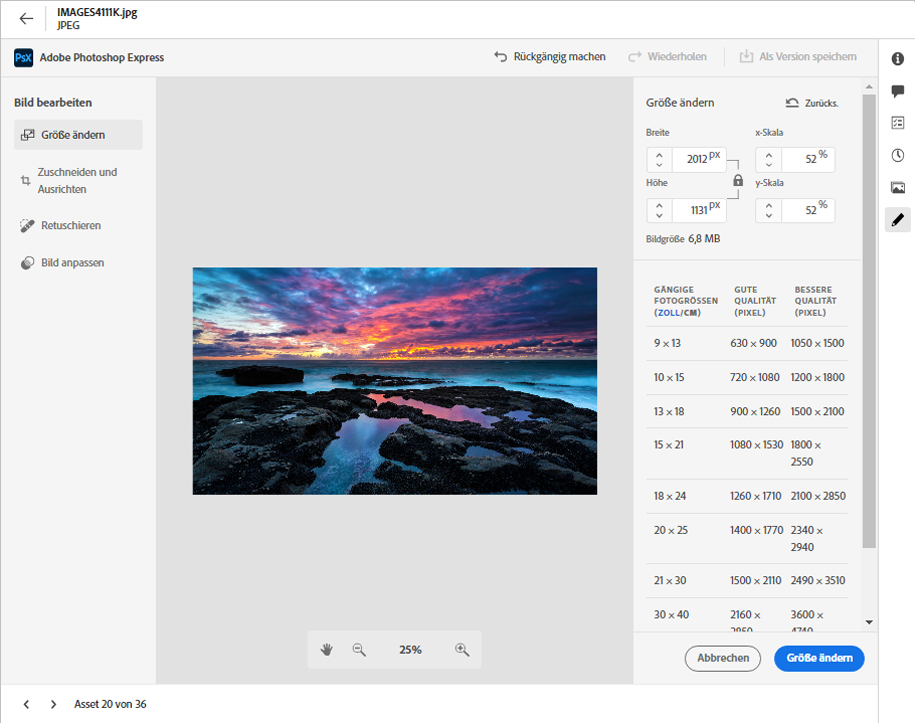
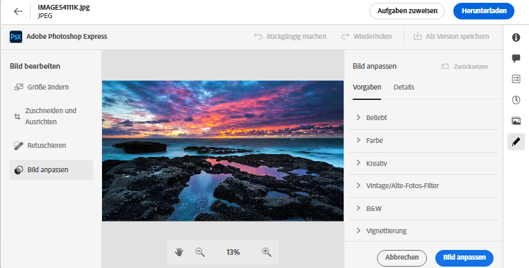

# Bearbeiten von Bildern in [!DNL Assets Essentials] {#edit-images-in-assets-essentials}

Die Benutzeroberfläche von Assets Essentials ermöglicht eine grundlegende Bildbearbeitung, einschließlich Größenanpassung, Hintergrundentfernung, Zuschneiden und Konvertierung zwischen JPEG- und PNG-Format. Darüber hinaus ermöglicht sie eine erweiterte Bearbeitung durch die Integration mit Adobe Express. Nachdem Sie ein Bild bearbeitet haben, können Sie das neue Bild als neue Version speichern. Mit der Versionierung können Sie bei Bedarf später zum Original-Asset zurückkehren. Um ein Bild zu bearbeiten, [öffnen Sie seine Vorschau](https://experienceleague.adobe.com/de/docs/experience-manager-assets-essentials/help/navigate-view#preview-assets) und klicken Sie auf **Bild bearbeiten**.

>[!NOTE]
>
>Sie können mit Adobe Express Bilder vom Dateityp PNG und JPEG bearbeiten.

<!--The editing actions that are available are Spot healing, Crop and straighten, Resize image, and Adjust image.-->

## Bearbeiten eines Bildes {#edit-images}

Öffnen Sie die Benutzeroberfläche von Assets Essentials, indem Sie auf den Link für die [Benutzeroberfläche von Assets Essentials](https://experience.adobe.com/#/assets) klicken und das richtige Repository auswählen. Wenden Sie sich an die Admins Ihrer Organisation, um Zugriff zu erhalten.
Weitere Informationen finden Sie in folgenden Referenzen: [Erste Schritte mit Adobe Experience Manager Assets Essentials](https://experienceleague.adobe.com/de/docs/experience-manager-assets-essentials/help/get-started), [Grundlegendes zur Benutzeroberfläche](https://experienceleague.adobe.com/de/docs/experience-manager-assets-essentials/help/navigate-view), [Assets Essentials-Anwendungsbeispiele](https://experienceleague.adobe.com/de/docs/experience-manager-assets-essentials/help/get-started#use-cases) und [Bekannte Probleme](https://experienceleague.adobe.com/de/docs/experience-manager-assets-essentials/help/release-notes).
<!--
>[!CONTEXTUALHELP]
>id="assets_express_integration"
>title="Adobe Express Integration"
>abstract="Easy and intuitive image-editing tools powered by Adobe Express available directly within AEM Assets to increase content reuse and accelerate content velocity."-->

### Bearbeiten von Bildern in der Benutzeroberfläche von Essentials mit Adobe Express {#edit-image-on-essentials-ui-using-adobe-express}

Nachdem Sie die Benutzeroberfläche von Essentials geöffnet haben, klicken Sie auf **Assets**. Wählen Sie ein Bild aus und klicken Sie in der oberen Leiste auf **Bearbeiten**. Im neuen Bildschirm werden die verfügbaren Bearbeitungsoptionen angezeigt, darunter Größenanpassung, Hintergrundentfernung, Zuschneiden und Konvertierung zwischen JPEG- und PNG-Formaten.

#### Ändern der Bildgröße {#resize-image-using-express}

Ein beliebtes Anwendungsbeispiel ist die Größenanpassung eines Bildes auf eine bestimmte Größe. Assets Essentials ermöglicht es Ihnen, die Größe von Bildern schnell an die gängigen Bildgrößen anzupassen, indem vorab berechnete, neue Auflösungen für bestimmte Bildgrößen bereitgestellt werden. Gehen Sie wie folgt vor, um mit Assets Essentials die Bildgröße zu ändern:

1. Klicken Sie im linken Bereich auf **Bildgröße ändern**.
2. Wählen Sie in der Dropdown-Liste „Größe ändern“ die entsprechende Social-Media-Plattform aus und wählen Sie in den angezeigten Optionen die Bildgröße aus.
3. Falls erforderlich, skalieren Sie das Bild mithilfe des Feldes **Bildskala**.
4. Klicken Sie auf **Anwenden**, um Ihre Änderungen anzuwenden.
   

   Ihr bearbeitetes Bild kann heruntergeladen werden. Sie können das bearbeitete Asset entweder als neue Version desselben Assets oder als neues Asset speichern.
   

#### Entfernen des Hintergrunds {#remove-background-using-express}

Gehen Sie wie folgt vor, um den Hintergrund aus einem Bild zu entfernen:

1. Klicken Sie im linken Bereich auf **Hintergrund entfernen**. Experience Manager Assets zeigt das Bild ohne Hintergrund an.
2. Klicken Sie auf **[!UICONTROL Anwenden]**, um Ihre Änderungen anzuwenden.
   

   Ihr bearbeitetes Bild kann heruntergeladen werden. Sie können das bearbeitete Asset entweder als neue Version desselben Assets oder als neues Asset speichern.

#### Zuschneiden eines Bildes {#crop-image-using-express}

Mit den eingebetteten Schnellaktionen von [!DNL Adobe Express] ist es einfach, ein Bild in eine perfekte Größe umzuwandeln.

1. Klicken Sie im linken Bereich auf **[!UICONTROL Bild zuschneiden]**.
2. Ziehen Sie die Griffe an den Ecken des Bildes, um den gewünschten Zuschnitt zu erstellen.
3. Klicken Sie auf **[!UICONTROL Übernehmen]**.
   
Das zugeschnittene Bild kann heruntergeladen werden. Sie können das bearbeitete Asset entweder als neue Version desselben Assets oder als neues Asset speichern.

#### Konvertieren zwischen Bilddateitypen {#convert-image-types-using-express}

Mithilfe von Adobe Express können Sie schnell zwischen JPEG- und PNG-Bildformaten konvertieren. Führen Sie die folgenden Schritte aus:

1. Klicken Sie im linken Bereich auf die Option zum Konvertieren von **JPEG in PNG** oder **PNG in JPEG**.
   
2. Klicken Sie auf **[!UICONTROL Herunterladen]**.

#### Einschränkungen {#limitations-adobe-express}

* Unterstützte Bildauflösung: Minimum – 50 Pixel, Maximum – 6000 Pixel pro Dimension.
* Maximal unterstützte Dateigröße: 17 MB.

### Bearbeiten von Bildern im eingebetteten Adobe Express-Editor {#edit-images-in-adobe-express-embedded-editor}

Benutzende mit Express-Berechtigung können den eingebetteten Express-Editor über die Assets Essentials-Benutzeroberfläche verwenden, um Inhalte einfach zu bearbeiten und neue Inhalte mit GenAI von Adobe Firefly zu erstellen. Dies ermöglicht eine bessere Wiederverwendung von Inhalten und erhöht die Content-Geschwindigkeit. Sie können auch vordefinierte Elemente verwenden, um Ihr Asset atemberaubend zu gestalten, oder Schnellaktionen durchführen, um Ihr Bild mit nur wenigen Klicks schnell und bequem zu bearbeiten.

Gehen Sie wie folgt vor, um Bilder mit dem eingebetteten Adobe Express-Editor zu bearbeiten:

1. Navigieren Sie über den Link für die [Benutzeroberfläche von AEM Assets Essentials](https://experience.adobe.com/#/assets) zur AEM Assets Essentials-Benutzeroberfläche und wählen Sie das richtige Repository aus.
1. Klicken Sie auf **Assets**, geben Sie einen Ordner an und wählen Sie ein Bild aus.
1. Klicken Sie auf **In Adobe Express öffnen**. Das Bild wird in einer Express-Arbeitsfläche geöffnet.
1. Nehmen Sie die erforderlichen Änderungen am Bild vor.
1. Wenn Sie für Ihr Projekt weitere Seiten hinzufügen müssen, klicken Sie auf **Hinzufügen** und wählen Sie „Assets“ aus. Geben Sie einen Ordner an, wählen Sie ein Bild aus, das in die Arbeitsflächenseite geladen werden soll, und nehmen Sie dann die erforderlichen Änderungen am Bild vor.
1. Klicken Sie auf **Speichern**, um das Bild bzw. die Bilder zu speichern. Das Dialogfeld „Speichern“ wird angezeigt.

   >[!NOTE]
   >
   > **1. Für eine einzelne Seite**
   >
   > **Als Version speichern:** Diese Funktion unterstützt nur das Speichern eines einzelnen Assets. Wählen Sie diese Option aus, um das Bild als neue Version zu exportieren (wobei das Originalformat beibehalten wird) und im selben Ordner zu speichern.
   > **Als neues Asset speichern:** Wählen Sie diese Option aus, um das Asset in einem anderen Format wie ursprünglich zu exportieren und es als neues Asset in einem beliebigen Ordner zu speichern.
   >  
   > **2. Für mehrere Seiten**
   >
   > **Als Version speichern:** Diese Funktion unterstützt nur das Speichern eines einzelnen Assets. Wenn Sie eine einzelne Seite von mehreren Seiten speichern möchten, wählen Sie diese Option aus, um das Asset in seinem ursprünglichen Format und an seinem ursprünglichen Speicherort zu speichern.\
   > **Als neues Asset speichern:** Mit dieser Option exportieren Sie entweder mehrere Assets oder ein einzelnes Asset in einen beliebigen Ordner und speichern diese als neue Assets in ihrem ursprünglichen oder einem anderen Dateiformat.

1. Im Dialogfeld „Speichern“:
   1. Geben Sie einen Namen für die Datei in das Feld **Speichern unter** ein.
   1. Wählen Sie einen Zielordner aus.
   1. Optional: Geben Sie Details wie den Projekt- oder Kampagnennamen, Keywords, Kanäle, den Zeitrahmen und die Region an.
1. Klicken Sie auf **Als Version speichern** oder **Als neues Asset speichern**, um das Asset bzw. die Assets zu speichern.

#### Einschränkungen beim Bearbeiten von Bildern im Express-Editor {#limitations-of-editing-images-in-the-express-editor}

* Unterstützter Dateityp: JPEG oder PNG.
* Maximal unterstützte Dateigröße: 40 MB.
* Unterstützte Breite und Höhe: zwischen 50 und 8000 Pixel.
* Laden Sie die Seite neu, um das zuletzt gespeicherte neue Asset im Quellordner anzuzeigen.

### Erstellen neuer Assets in Adobe Express {#create-new-assets-using-embedded-editor}

In Assets Essentials können Sie mithilfe des eingebetteten Adobe Express-Editors eine komplett neue Vorlage erstellen. Gehen Sie wie folgt vor, um mit Adobe Express ein neues Asset zu erstellen:

1. Navigieren Sie zu **Mein Arbeitsbereich** und klicken Sie im Adobe Express-Banner ganz oben in Adobe Express auf **Erstellen**. In der Assets Essentials-Benutzeroberfläche wird eine leere Adobe Express-Arbeitsfläche angezeigt.
1. Erstellen Sie Inhalte mithilfe von [Vorlagen](https://helpx.adobe.com/de/express/using/work-with-templates.html). Navigieren Sie andernfalls zu Ihrem Inhalt, um vorhandene Inhalte zu ändern.
1. Klicken Sie nach Abschluss der Bearbeitung auf **Speichern**.
1. Geben Sie einen Zielpfad für das erstellte Asset ein und klicken Sie auf **Als neues Asset speichern**.

#### Einschränkungen {#limitations}

* Sie können nur Bilder mit den Formattypen `JPEG` und `PNG` ändern.
* Das Asset muss kleiner als 40 MB sein.
* Sie können ein Bild im Format `PDF`, `JPEG` oder `PNG` speichern.

<!--
## Edit images using [!DNL Adobe Photoshop Express] {#edit-using-photoshop-express}

<!--
After editing an image, you can save the new image as a new version. Versioning helps you to revert to the original asset later, if needed. To edit an image, [open its preview](/help/using/navigate-view.md#preview-assets) and click **[!UICONTROL Edit Image]**  from the rail on the right.

*Figure: The options to edit images are powered by [!DNL Adobe Photoshop Express].*
-->
<!--
### Spot heal images {#spot-heal-images-using-photoshop-express}

If there are minor spots or small objects on an image, you can edit and remove the spots using the spot healing feature provided by Adobe Photoshop.

The brush samples the retouched area and makes the repaired pixels blend seamlessly into the rest of the image. Use a brush size that is only slightly larger than the spot you want to fix.

<!-- 
TBD: See if we should give backlinks to PS docs for these concepts.
For more information about how Spot Healing works in Photoshop, see [retouching and repairing photos](https://helpx.adobe.com/photoshop/using/retouching-repairing-images.html). 
-->
<!--
### Crop and straighten images {#crop-straighten-images-using-photoshop-express}

Using the crop and straighten option that you can do basic cropping, rotate image, flip it horizontally or vertically, and crop it to dimensions suitable for popular social media websites.

To save your edits, click **[!UICONTROL Crop Image]**. After editing, you can save the new image as a version.

Many default options let you crop your image to the best proportions that fit various social media profiles and posts.

### Resize image {#resize-image-using-photoshop-express}

You can view the common photo sizes in centimeters or inches to know the dimensions. By default, the resizing method retains the aspect ratio. To manually override the aspect ratio, click .

Enter the dimensions and click **[!UICONTROL Resize Image]** to resize the image. Before you save the changes as a version, you can either undo all the changes done before saving by clicking [!UICONTROL Undo] or you can change the specific step in the editing process by clicking [!UICONTROL Revert].

### Adjust image {#adjust-image-using-photoshop-express}

[!DNL Assets Essentials] lets you adjust the color, tone, contrast, and more, with just a few clicks. Click **[!UICONTROL Adjust image]** in the edit window. The following options are available in the right sidebar:

* **Popular**: [!UICONTROL High Contrast & Detail], [!UICONTROL Desaturated Contrast], [!UICONTROL Aged Photo], [!UICONTROL B&W Soft], and [!UICONTROL B&W Sepia Tone].
* **Color**: [!UICONTROL Natural], [!UICONTROL Bright], [!UICONTROL High Contrast], [!UICONTROL High Contrast & Detail], [!UICONTROL Vivid], and [!UICONTROL Matte].
* **Creative**: [!UICONTROL Desaturated Contrast], [!UICONTROL Cool Light], [!UICONTROL Turquoise & Red], [!UICONTROL Soft Mist], [!UICONTROL Vintage Instant], [!UICONTROL Warm Contrast], [!UICONTROL Flat & Green], [!UICONTROL Red Lift Matte], [!UICONTROL Warm Shadows], and [!UICONTROL Aged Photo].
* **B&W**: [!UICONTROL B&W Landscape], [!UICONTROL B&W High Contrast], [!UICONTROL B&W Punch], [!UICONTROL B&W Low Contrast], [!UICONTROL B&W Flat], [!UICONTROL B&W Soft], [!UICONTROL B&W Infrared], [!UICONTROL B&W Selenium Tone], [!UICONTROL B&W Sepia Tone], and [!UICONTROL B&W Split Tone].
* **Vignetting**: [!UICONTROL None], [!UICONTROL Light], [!UICONTROL Medium], and [!UICONTROL Heavy].

<!--
TBD: Insert a video of the available social media options.
-->

### Nächste Schritte {#next-steps}

* Geben Sie Produkt-Feedback über die Option [!UICONTROL Feedback] in der Benutzeroberfläche von Assets Essentials

* Geben Sie Feedback zur Dokumentation durch  über die Option [!UICONTROL Diese Seite bearbeiten] oder durch  über die Option [!UICONTROL Problem protokollieren] in der rechten Seitenleiste

* Kontaktieren Sie die [Kundenunterstützung](https://experienceleague.adobe.com/?support-solution=General&amp;lang=de#support)

>[!MORELIKETHIS]
>
>* [Anzeigen des Versionsverlaufs eines Assets](/help/using/navigate-view.md)
