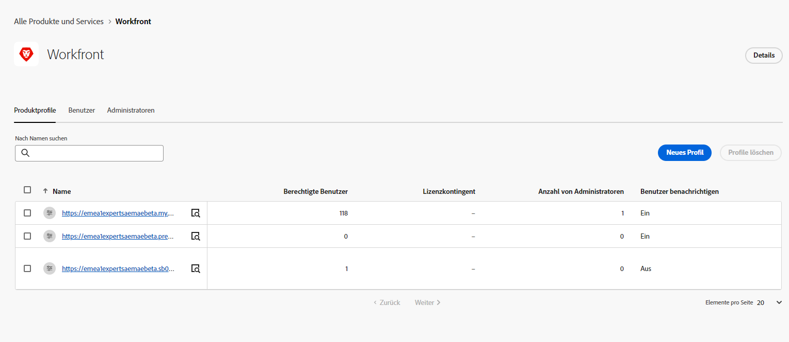
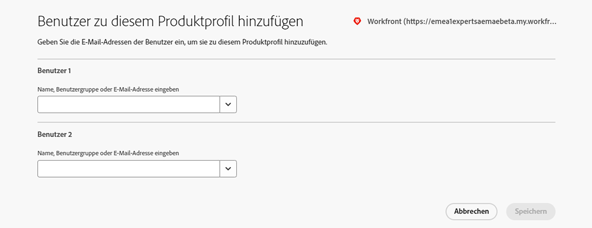

# Integrieren von Assets Essentials mit Adobe Workfront {#integrate-assets-essentials-workfront}

[[!DNL Adobe Workfront]](https://www.workfront.com/) ist ein Programm für Work-Management, mit dem Sie den gesamten Arbeitszyklus an einem Ort verwalten können. Durch die native Integration von [!DNL Adobe Workfront] und [!DNL Assets Essentials] können Unternehmen die Geschwindigkeit von Inhalten und die Markteinführungszeit verbessern, indem sie Work- und Asset-Management miteinander verbinden. Im Rahmen der Verwaltung ihrer Arbeit haben Benutzer in derselben Lösung Zugriff auf die erforderlichen Dokumente und Bilder.

Führen Sie die folgenden Aufgaben aus, um Workfront mit Experience Manager Assets Essentials zu integrieren:

* [Hinzufügen von Benutzern zu Workfront-Produktprofilen](#add-users-to-product-profiles)

* [Hinzufügen von Benutzern zu Assets Essentials-Produktprofilen](#add-workfront-users-assets-essentials-product-profiles)

* [Konfigurieren der Integration von Experience Manager Assets Essentials](#configure-assets-essentials-integration)

## Hinzufügen von Benutzern zu Workfront-Produktprofilen {#add-users-to-product-profiles}

Hinzufügen von Benutzern zu Workfront-Produktprofilen

1. Rufen Sie die [Admin Console](https://adminconsole.adobe.com) für Ihre Organisation auf, klicken Sie in der oberen Leiste auf **[!UICONTROL Produkte]**, klicken Sie auf **[!UICONTROL Workfront]** und dann auf die erste Instanz in der Liste. Klicken Sie nicht auf die zweite oder dritte Instanz in der Liste.

   

   Die Admin Console zeigt das einzige verfügbare Produktprofil an.

1. Um einen Benutzer zu einem Produktprofil hinzuzufügen, klicken Sie auf das Profil, klicken Sie auf **[!UICONTROL Benutzer hinzufügen]**, geben Sie die Benutzerdetails ein und klicken Sie auf **[!UICONTROL Speichern]**.

   

   Wenn Sie einen Benutzer hinzufügen, erhält der Benutzer eine Einladung per E-Mail. Sie können die E-Mail-Einladungen in den Produktprofileinstellungen in der [!DNL Admin Console] deaktivieren.

1. Um einen Benutzer aus einer Gruppe zu entfernen, klicken Sie auf die Gruppe, wählen Sie einen vorhandenen Benutzer aus und wählen Sie **[!UICONTROL Benutzer entfernen]** aus.

Weitere Informationen zum Erstellen von Benutzern und Systemadministratoren in Workfront mit der Adobe Admin Console finden Sie unter [Verwalten von Benutzern in der Adobe Admin Console](https://one.workfront.com/s/document-item?bundleId=the-new-workfront-experience&amp;topicId=Content%2FAdministration_and_Setup%2FAdd_users%2FCreate_and_manage_users%2Fadmin-console.htm&amp;_LANG=enus).

## Hinzufügen von Benutzern zu Assets Essentials-Produktprofilen {#add-workfront-users-assets-essentials-product-profiles}

Weisen Sie die Workfront-Benutzer einem der folgenden Assets Essentials-Produktprofile zu:

* **[!DNL Assets Essentials]-Benutzer** haben Zugriff auf die komplette Assets Essentials-Benutzeroberfläche. Diese Benutzer können in Assets Essentials digitale Assets hochladen, organisieren, taggen und suchen. Darüber hinaus haben die Benutzer Zugriff auf das Erlebnis der Asset-Auswahl im [!DNL Adobe Workfront]-Programm.
* Endverbraucher-Benutzer von **[!DNL Assets Essentials]** haben Zugriff auf die eingebettete Asset-Auswahl in [!DNL Adobe Workfront].

Darüber hinaus gibt es auch das Produktprofil **[!DNL Assets Essentials]-Administratoren**, das Administratorzugriff auf das Programm bietet.

Weitere Informationen zum Zuweisen von Benutzern zu Assets Essentials-Produktprofilen finden Sie unter [Zuweisen von Benutzern zu Assets Essentials-Produktprofilen](deploy-administer.md#add-users-to-product-profiles).

## Konfigurieren der Integration von Experience Manager Assets Essentials {#configure-assets-essentials-integration}

Nachdem Sie Benutzer mithilfe der Admin Console zu den Workfront- und Assets Essentials-Produktprofilen hinzugefügt haben, können Sie [die Integration von Experience Manager Assets Essentials mit Adobe Workfront konfigurieren](https://one.workfront.com/s/document-item?bundleId=the-new-workfront-experience&amp;topicId=Content%2FDocuments%2FAdobe_Workfront_for_Experience_Manager_Assets_Essentials%2F_workfront-for-aem-asset-essentials.htm).

Nach der Einrichtung der Integration haben Sie folgende Möglichkeiten:

* [Verknüpfen von Assets und Ordnern aus Experience Manager Assets Essentials](https://one.workfront.com/s/document-item?bundleId=the-new-workfront-experience&amp;topicId=Content%2FDocuments%2FAdobe_Workfront_for_Experience_Manager_Assets_Essentials%2Flink-to-aem.htm&amp;_LANG=enus)

* [Senden eines Dokuments an Experience Manager Assets Essentials](https://one.workfront.com/s/document-item?bundleId=the-new-workfront-experience&amp;topicId=Content%2FDocuments%2FAdobe_Workfront_for_Experience_Manager_Assets_Essentials%2Fsend-to-aem.htm&amp;_LANG=enus)

* [Testen eines verknüpften Assets für Experience Manager Assets Essentials](https://one.workfront.com/s/document-item?bundleId=the-new-workfront-experience&amp;topicId=Content%2FDocuments%2FAdobe_Workfront_for_Experience_Manager_Assets_Essentials%2Fproof-linked-asset-aem.htm)

* [Anzeigen oder Herunterladen eines verknüpften Assets aus Experience Manager Assets Essentials](https://one.workfront.com/s/document-item?bundleId=the-new-workfront-experience&amp;topicId=Content%2FDocuments%2FAdobe_Workfront_for_Experience_Manager_Assets_Essentials%2Fview-download-asset.htm)
