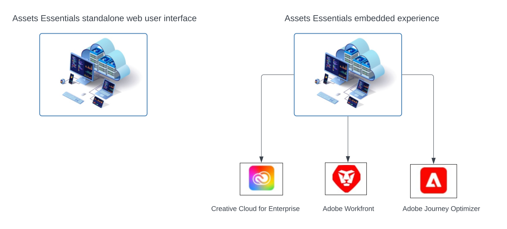

# Überblick über [!DNL Adobe Experience Manager Assets Essentials] {#assets-essentials}

<!-- TBD: Update this banner to remove Beta label. 

-->

Adobe bietet stabile DAM-Lösungen (Digital Asset Management), mit denen Sie Ihre digitalen Assets optimal nutzen können. Adobe Experience Manager Assets Essentials ist die einfache Asset-Management-Lösung von Adobe zum Speichern, Verwalten, Entdecken und Verwenden digitaler Assets.

## Was ist Assets Essentials? {#assets-essemtials-overview}

Experience Manager Assets Essentials ist eine schlanke Edition von Adobe Experience Manager Assets Cloud Service. Assets Essentials bietet ein einheitliches Asset-Management und Zusammenarbeit mit einer vereinfachten und modernen Benutzeroberfläche. Durch die Benutzerfreundlichkeit dieser Lösung können mehr Kreativ- und Marketing-Teams digitale Assets speichern, finden und verteilen.

Assets Essentials ermöglicht Ihnen:

* Verwalten, Organisieren und Steuern von Assets an einem zentralen Speicherort.

* Zusammenarbeit bei der Team-übergreifenden Entwicklung von Inhalten.

* Zugreifen auf, Suchen und Finden von endgültig genehmigten Assets.

* Freigeben und Herunterladen von Assets für die nachgelagerte Bereitstellung.

## Wie greife ich auf Assets Essentials zu? {#access-options}

Assets Essentials bietet eine eigenständige Web-Benutzeroberfläche für Endbenutzer und Administratoren, über die sie auf alle Funktionen der Lösung zugreifen können. Anwender anderer Adobe-Lösungen können über ein eingebettetes Erlebnis, das in Creative Cloud für Unternehmen, Adobe Journey Optimizer und Adobe Workfront verfügbar ist, auch auf Assets aus Assets Essentials zugreifen und mit ihnen arbeiten.

## Warum Assets Essentials? {#assets-essentials-features}

Assets Essentials bietet wichtige Vorteile, die Ihnen Folgendes ermöglichen:

* **Schneller Einstieg** mit nativen Tools für das Asset-Management.

* Erweitern des Zugriffs auf Assets auf mehr Teams, um mit **vereinfachtem Asset-Management** konsistente Kundenerlebnisse zu schaffen.

* Vereinheitlichen des Inhaltslebenszyklus mit nativen **Integrationen in andere Adobe-Lösungen**.

* Nutzen einer **Cloud-basierten Plattform**, sicher und skalierbar, jederzeit und überall.

* Beginnen Sie mit den grundlegenden DAM-Funktionen und **wachsen Sie** bis hin zum Unternehmens-DAM.

**Schneller Einstieg**

Assets Essentials wird den Kunden von Adobe bereitgestellt und steht ihnen nach Abschluss des Bereitstellungsprozesses zur Verfügung. Administratoren erhalten Zugriff auf das Produkt in der Adobe Admin Console und können sofort mit der Systemkonfiguration und dem Onboarding von Benutzern beginnen.

Weitere Informationen zu [Administration und Onboarding von Benutzern](deploy-administer.md) von Assets Essentials.

**Vereinfachtes Asset-Management**

Die vereinfachte Benutzeroberfläche von Assets Essentials erleichtert das Verwalten, Erkennen und Verteilen digitaler Assets. Ein breites Spektrum von Benutzern aus verschiedenen Funktionen, einschließlich Kreativ-, Marketing- und Branchen-Teams, kann an Assets zusammenarbeiten und auf die richtigen, genehmigten Assets zugreifen, wo und wann immer sie benötigt werden.

Weitere Informationen finden Sie unter [Erste Schritte mit Ihren Asset-Management-Anforderungen mit Assets Essentials](get-started.md).

**Integration mit anderen Adobe-Programmen**

Assets Essentials lässt sich gut mit den unterstützten Adobe-Lösungen integrieren und bietet ein eingebettetes Erlebnis direkt über die Benutzeroberflächen dieser Programme. Damit können Benutzer direkt in ihrem Programm problemlos auf Assets zugreifen, die sie benötigen. Alle Benutzer können mit denselben zentral verwalteten Assets in ihren vertrauten Tools und Programmen arbeiten.

Das eingebettete Assets Essentials-Erlebnis steht für Creative Cloud für Unternehmen, Adobe Journey Optimizer und Adobe Workfront zur Verfügung.

Weitere Informationen finden Sie unter [Integration mit anderen Adobe-Lösungen](integration.md).

**Cloud-basierte Plattform**

Basierend auf der Cloud-Infrastruktur von Adobe ermöglicht Assets Essentials es Unternehmen, sich auf ihre Geschäftsanforderungen zum Erstellen, Verwalten und Verteilen digitaler Assets zu konzentrieren. Darüber hinaus stellt Adobe sicher, dass die Lösung verfügbar, sicher, skalierbar und stets auf dem neuesten Stand ist, mit Produktinnovationen, die Benutzern nahtlos über häufige Updates bereitgestellt werden.

**Leistungsstarke Funktionen**

Profitieren Sie von den zentralen Funktionen für Digital Asset Management über verschiedene Teams hinweg, um Assets Essentials schnell zu nutzen.

Wenn Ihr Geschäftsbedarf wächst und Sie Unterstützung für erweiterte Digital-Asset-Management-Anforderungen wie Anpassungen, Erweiterbarkeit und Integrationen, Automatisierung, Dynamic Media und Brand Portal benötigen, bietet Ihnen Adobe auch [Adobe Experience Manager Assets as a Cloud Service](https://experienceleague.adobe.com/docs/experience-manager-cloud-service/content/assets/home.html?lang=de).

## Nächste Schritte {#next-steps}

* Geben Sie Produkt-Feedback über die Option [!UICONTROL Feedback] in der Benutzeroberfläche von Assets Essentials

* Geben Sie Feedback zur Dokumentation durch  über die Option [!UICONTROL Diese Seite bearbeiten] oder durch  über die Option [!UICONTROL Problem protokollieren] in der rechten Seitenleiste

* Kontaktieren Sie die [Kundenunterstützung](https://experienceleague.adobe.com/?support-solution=General&amp;lang=de#support)

>[!MORELIKETHIS]
>
>* [[!DNL Assets Essentials] Tutorials-Seite](https://experienceleague.adobe.com/docs/experience-manager-learn/assets-essentials/overview.html?lang=de)
