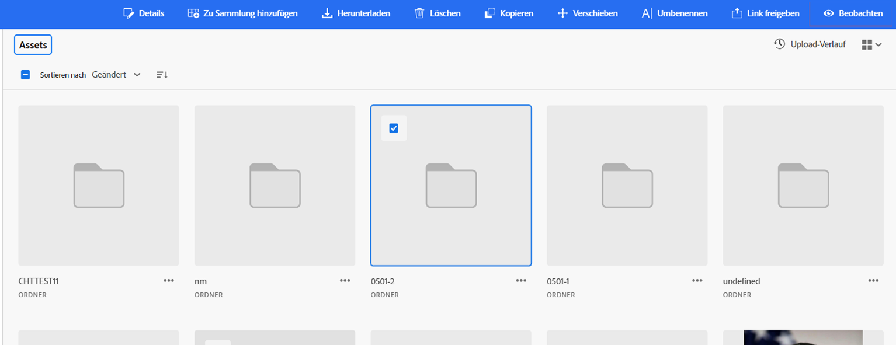

# Überwachen von Assets, Ordnern und Sammlungen {#watch-assets-folders}

Assets Essentials-Benachrichtigungen ermöglichen es Ihnen, die Vorgänge zu überwachen, die mit den im Repository verfügbaren Assets, Ordnern oder Sammlungen durchgeführt werden. Sie müssen den Inhalt auswählen und abonnieren, für den die Benachrichtigungen an Sie gesendet werden sollen. Sie können auch die Kategorien konfigurieren, für die die Benachrichtigungen an Sie gesendet werden.

## Abonnieren von Benachrichtigungskategorien {#subscribe-to-notification-categories}

Sie können aus einer Liste von Kategorien auswählen und diese abonnieren, um Benachrichtigungen zu erhalten. Assets Essentials sendet Ihnen die Benachrichtigungen nur für die Kategorien, die Sie aus den verfügbaren Optionen ausgewählt haben:

<table>
    <tbody>
     <tr>
      <th><strong>Benachrichtigungskategorie</strong></th>
      <th><strong>Beschreibung</strong></th>
     </tr>
     <tr>
      <td>Anfragen</td>
      <td>Wenn Sie einem Benutzer eine Aufgabe zuweisen, erhalten Sie Benachrichtigungen, wenn von diesem Benutzer Aktionen zu dieser Aufgabe durchgeführt werden.</td>
     </tr>
     <tr>
      <td>Mir zugewiesen</td>
      <td>Sie erhalten eine Benachrichtigung, wenn Ihnen eine Aufgabe von einem anderen Benutzer zugewiesen wurde.</td>
     </tr>
     <tr>
      <td>Kommentar zu abonnierten Inhalten</td>
      <td>Sie erhalten eine Benachrichtigung, wenn ein Nutzer einen Kommentar zu Ihrem abonnierten Asset abgibt.</td>
     </tr>
     <tr>
      <td>Löschung abonnierter Inhalte</td>
      <td>Sie erhalten eine Benachrichtigung, wenn Benutzende Ihr abonniertes Asset, Ihren abonnierten Ordner oder Ihre abonnierte Sammlung löschen.</td>
     </tr>
     <tr>
      <td>Externe Freigabe abonnierter Inhalte</td>
      <td>Sie erhalten eine Benachrichtigung, wenn Benutzende einen öffentlichen Link für Ihr abonniertes Asset, Ihren abonnierten Ordner oder Ihre abonnierte Sammlung erstellen.</td>
     </tr>
     <tr>
      <td>Änderung von abonnierten Inhalten</td>
      <td>Sie erhalten eine Benachrichtigung, wenn ein Benutzer eine neue Version für Ihr abonniertes Asset erstellt.</td>
     </tr>
     <tr>
      <td>Verschieben/Umbenennen abonnierter Inhalte</td>
      <td>Sie erhalten eine Benachrichtigung, wenn ein Benutzer Ihr abonniertes Asset oder Ihren Ordner verschiebt oder umbenennt.</td>
     </tr>
     <tr>
      <td>Aktualisierungen von abonnierten Ordnern und Sammlungen</td>
      <td>Sie erhalten eine Benachrichtigung, wenn Benutzende ein Asset zu einem abonnierten Ordner oder einer abonnierten Sammlung hinzufügt oder daraus entfernen.</td>
     </tr>    
    </tbody>
   </table>

So abonnieren Sie die Benachrichtigungskategorien:

1. Klicken Sie in der Benutzeroberfläche von Assets Essentials am rechten Ende der Menüleiste auf das .

1. Klicken Sie auf das Symbol , um die Seite [!UICONTROL Experience Cloud-Einstellungen] anzuzeigen.

1. Klicken Sie auf die Option **[!UICONTROL Benachrichtigungen]** im linken Fensterbereich.

1. Navigieren Sie im Abschnitt **[!UICONTROL Benachrichtigungen]** zum Abschnitt [!UICONTROL Assets Essentials] und vergewissern Sie sich, dass die Umschaltoption auf EIN geschaltet ist.

   

1. Klicken Sie auf **[!UICONTROL Anpassen]**, um die Benachrichtigungskategorien anzuzeigen.
   

1. Wählen Sie die Benachrichtigungskategorien aus, für die Sie benachrichtigt werden möchten.

## Beobachten oder Nicht-Beobachten von Ordnern, Assets oder Sammlungen {#watch-unwatch-assets}

Nachdem Sie [die Benachrichtigungskategorien abonniert haben](#subscribe-to-notification-categories), müssen Sie den Inhalt abonnieren, damit Sie Benachrichtigungen erhalten.

>[!NOTE]
>
>* Für die Benachrichtigungskategorien **[!UICONTROL Anfragen]** und **[!UICONTROL Mir zugewiesen]** müssen Sie den Inhalt nicht abonnieren, nachdem Sie die Benachrichtigungskategorien abonniert haben. Sie werden automatisch benachrichtigt, wenn Sie eine Anfrage erstellen oder wenn Ihnen eine Aufgabe zugewiesen wird.
>* Assets Essentials sendet nur Benachrichtigungen, wenn sonstige Benutzende Aktionen für abonnierte Inhalte ausführen. Sie erhalten keine Benachrichtigungen über die Aktionen, die Sie für den abonnierte Inhalte ausführen.

Um den Inhalt zu abonnieren, wählen Sie den zu abonnierenden Ordner, das zu abonnierende Asset oder die zu abonnierende Kollektion und klicken Sie auf **[!UICONTROL Ansehen]**.

Assets Essentials zeigt eine Erfolgsmeldung an. Sie können auf **[!UICONTROL Zu den Benachrichtigungseinstellungen gehen]** klicken, die auf der Erfolgsmeldung verfügbar sind, um Ihr [Abonnement für Benachrichtigungskategorien](#subscribe-to-notification-categories) zu bearbeiten.

Assets Essentials sendet jetzt Benachrichtigungen für die abonnierten Kategorien. Sie können auch mehrere Assets, Ordner oder Kollektionen auswählen und auf **[!UICONTROL Ansehen]** klicken, um Zeit zu sparen. Wenn Sie jedoch mehrere Entitäten auswählen, von denen einige bereits abonniert wurden, wird die Option **[!UICONTROL Ansehen]** nicht angezeigt.

Um ein Abonnement zu kündigen, wählen Sie das abonnierte Asset, den abonnierten Ordner oder die abonnierte Kollektion aus und klicken Sie auf **[!UICONTROL Nicht mehr beobachten]**.

## Anzeigen von Benachrichtigungen {#view-notifications}

>[!CONTEXTUALHELP]
>id="assets_express_integration"
>title="Integration mit Adobe Express"
>abstract="[!DNL Experience Manager Assets] bietet standardmäßig viele Standard-Metadatenfelder. Organisationen haben zusätzliche Anforderungen bezüglich Metadaten und benötigen mehr Metadatenfelder, um geschäftsspezifische Metadaten hinzuzufügen. Mit Metadatenformularen können Unternehmen benutzerdefinierte Metadatenfelder zur Seite „Details“ eines Assets hinzufügen. Die geschäftsspezifischen Metadaten verbessern die Verwaltung und Erkennung der Assets."

Die Benachrichtigungen werden in der Benutzeroberfläche von Assets Essentials am rechten Ende der Menüleiste angezeigt.

Wenn Sie auf eine Benachrichtigung klicken, gelangen Sie in Assets Essentials zum entsprechenden Asset oder Ordner, auf das oder den sich die Benachrichtigung bezieht.
