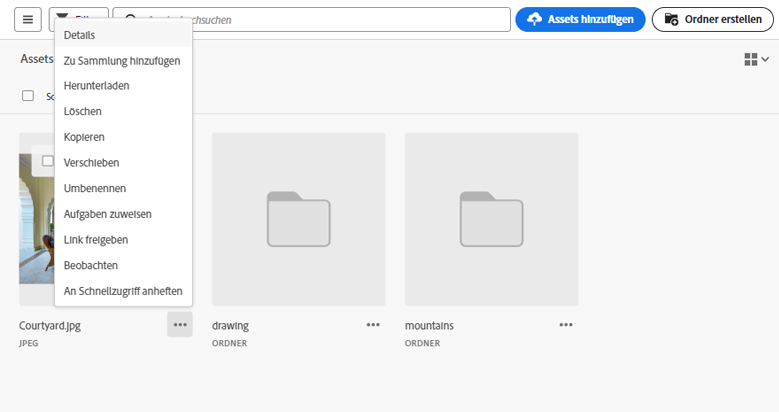
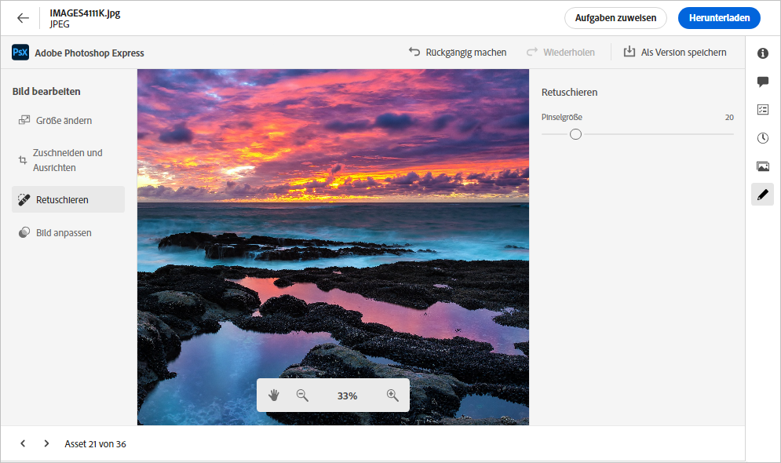
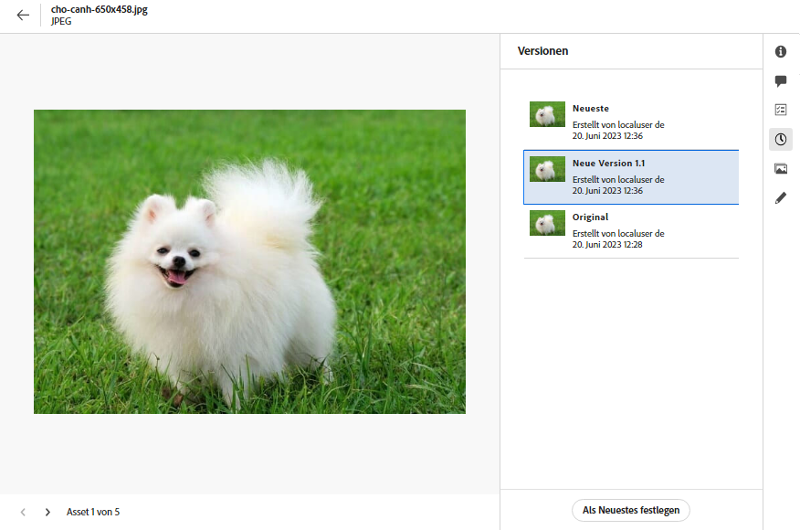

# Verwalten von Assets {#manage-assets}

Mithilfe der benutzerfreundlichen Oberfläche von [!DNL Assets Essentials] können Sie mühelos verschiedene Aufgaben des Digital Asset Management (DAM) ausführen. Nachdem Sie die Assets hinzugefügt haben, können Sie sie suchen, herunterladen, verschieben, kopieren, umbenennen, löschen, aktualisieren und bearbeiten.

Verwenden Sie [!DNL Assets Essentials], um die folgenden Asset-Management-Aufgaben auszuführen. Wenn Sie ein Asset auswählen, werden die folgenden Optionen in der Symbolleiste oben angezeigt.

*Abbildung: In der Symbolleiste verfügbare Optionen für ein ausgewähltes Bild.*

Sie können die Assets auswählen, die in den Suchergebnissen angezeigt werden, und die folgenden Aktionen ausführen:

*  Aufheben der Auswahl.

*  Suchen Sie anhand der Metadaten und Smart Tags nach ähnlichen Bild-Assets in der Assets-Benutzeroberfläche.

*  Anklicken, um ein Asset in der Vorschau anzuzeigen und die detaillierten Metadaten anzuzeigen. Aus der Vorschau heraus können Sie die Versionen anzeigen und ein Bild bearbeiten.

*  Lädt das ausgewählte Asset in Ihr lokales Dateisystem herunter.

*  Fügt das ausgewählte Asset zu einer Sammlung hinzu

*  Heftet ein Asset an, um bei späterem Bedarf schneller darauf zugreifen zu können. Alle angehefteten Elemente werden im Dashboard „Mein Arbeitsbereich“ im Abschnitt **Schnellzugriff** angezeigt.

*  Bearbeiten eines Bildes in der integrierten Adobe Express-Anwending in Adobe Experience Manager Assets.

*  Bearbeiten des Bildes mit Adobe Express.

*  für Assets mit anderen Benutzenden, damit diese darauf zugreifen und die Assets herunterladen können.

*  Löscht das ausgewählte Asset oder den ausgewählten Ordner.

*  Kopiert die ausgewählte Datei oder den ausgewählten Ordner.

*  Verschiebt das ausgewählte Asset oder den ausgewählten Ordner an einen anderen Speicherort in der Repository-Hierarchie.

*  Benennt das ausgewählte Asset oder den ausgewählten Ordner um. Verwenden Sie einen eindeutigen Namen, sonst schlägt die Umbenennung mit einer Warnung fehl. Sie können es mit einem neuen Namen erneut versuchen.
Außerdem können Sie auf den Titel eines Assets oder Ordners klicken, um es umzubenennen. Erwähnen Sie den neuen Text im **Asset umbenennen** Textfeld und klicken Sie auf **Speichern**. Diese Funktion ist in den Ansichten &quot;Raster&quot;, &quot;Galerie&quot;, &quot;Wasserfall&quot;und &quot;Liste&quot;verfügbar.

*  [!UICONTROL Wasserfallansicht].

*  Fügt ein Asset zur Bibliothek hinzu.

*  Weist anderen Benutzenden Aufgaben zu, damit sie an einem Asset zusammenarbeiten können.

*  Überwachen der an einem Asset ausgeführten Vorgänge.

Sie können die gleichen Optionen bei den Miniaturansichten der Assets anzeigen.

[!DNL Assets Essentials] zeigt nur die relevanten Optionen in der Symbolleiste an, die vom Typ des ausgewählten Assets abhängen.

*Abbildung: In der Symbolleiste verfügbare Optionen für einen ausgewählten Ordner.*

*Abbildung: In der Symbolleiste verfügbare Optionen für eine ausgewählte PDF-Datei.*

## Herunterladen und Verteilen von Assets {#download}

Sie können ein oder mehrere Assets oder Ordner oder eine Kombination aus beiden auswählen und die Auswahl in Ihr lokales Dateisystem herunterladen. Sie können die Assets bearbeiten und erneut hochladen oder die Assets außerhalb von [!DNL Assets Essentials] verteilen. Sie können auch [die Ausgabedarstellungen eines Assets herunterladen](/help/using/add-delete.md#renditions).

## Asset-Versionierung {#versions-of-assets}

<!-- 
TBD: query for engineering: How many versions are maintained. What happens when we reach that limit? Are old versions automatically removed? -->

[!DNL Assets Essentials] versioniert die Assets, wenn die Assets, die aktualisiert oder bearbeitet werden, erneut hochgeladen werden. Sie können den Versionsverlauf und frühere Versionen anzeigen und eine frühere Version von Assets als neueste Version wiederherstellen, die bei Bedarf auf eine frühere Version zurückgesetzt wird. Asset-Versionen werden in den folgenden Szenarien erstellt:

* Ein neues Asset wird mit demselben Dateinamen wie ein vorhandenes Asset und in denselben Ordner wie das vorhandene Asset hochgeladen. [!DNL Assets Essentials] fordert dazu auf, entweder das vorherige Asset zu überschreiben oder das neue Asset als Version zu speichern. Siehe [Hochladen von Asset-Duplikaten](/help/using/add-delete.md#resolve-upload-fails).

  

  *Abbildung: Beim Hochladen eines Assets mit dem Namen eines vorhandenen Assets können Sie eine Version des Assets erstellen.*

* Bearbeiten Sie ein Bild und klicken Sie auf **[!UICONTROL Als Version speichern]**. Siehe [Bearbeiten von Bildern](/help/using/edit-images.md).

  

  *Abbildung: Speichern Sie das bearbeitete Bild als Version.*

* Öffnen Sie die Versionen eines vorhandenen Assets. Klicken Sie auf **[!UICONTROL Neue Version]** und laden Sie eine neuere Version des Assets in das Repository hoch.

  

### Anzeigen von Versionen eines Assets {#view-versions}

Beim Hochladen eines Duplikats oder einer geänderten Kopie eines Assets können Sie dessen Versionen erstellen. Mit der Versionierung können Sie historische Assets überprüfen und bei Bedarf zu einer früheren Version zurückkehren.

Um Versionen anzuzeigen, öffnen Sie die Vorschau eines Assets und klicken Sie in der rechten Seitenleiste auf **[!UICONTROL Versionen]** . Um eine bestimmte Version in der Vorschau anzuzeigen, wählen Sie sie aus. Um zu ihr zurückzukehren, klicken Sie auf **[!UICONTROL Neueste erstellen]**.

Sie können Versionen auch aus der Versions-Zeitleiste erstellen. Wählen Sie die neueste Version aus, klicken Sie auf **[!UICONTROL Neue Version]** und laden Sie eine neue Kopie des Assets aus Ihrem lokalen Dateisystem hoch.

*Abbildung: Zeigen Sie Versionen eines Assets an, kehren Sie zu einer früheren Version zurück oder laden Sie eine andere neue Version hoch.*

## Verwalten des Asset-Status {#manage-asset-status}

**Erforderliche Berechtigungen:**  `Can Edit`, `Owner` oder Administratorrechte für ein Asset.

Mit Assets Essentials können Sie den Status für im Repository verfügbare Assets festlegen. Legen Sie einen Asset-Status fest, um die nachgelagerte Nutzung digitaler Assets besser steuern und verwalten zu können.

Sie können die folgenden Status für Assets festlegen:

* Genehmigt

* Abgelehnt

* Kein Status

### Festlegen eines Asset-Status {#set-asset-status}

Festlegen eines Asset-Status

1. Wählen Sie das Asset aus und klicken Sie in der Symbolleiste auf **[!UICONTROL Details]**.

1. Wählen Sie in der Registerkarte **[!UICONTROL Allgemein]** den Asset-Status aus der Dropdown-Liste **[!UICONTROL Status]** aus. Zu den zulässigen Werten gehören „Genehmigt“, „Abgelehnt“ und „Kein Status“ (Standard).

   >[!VIDEO](https://video.tv.adobe.com/v/342495)

### Festlegen des Ablaufdatums eines Assets {#set-asset-expiration-date}

Mit Assets Essentials können Sie ein Ablaufdatum für im Repository verfügbare Assets festlegen. Sie können dann die [Suchergebnisse filtern](search.md#refine-search-results), auf der Grundlage des Asset-Status `Expired`. Darüber hinaus können Sie einen Zeitraum für das Ablaufdatum für Assets angeben, um Ihre Suchergebnisse weiter zu filtern.

So legen Sie das Ablaufdatum eines Assets fest:

1. Wählen Sie das Asset aus und klicken Sie in der Symbolleiste auf **[!UICONTROL Details]**.

1. Legen Sie auf der Registerkarte **[!UICONTROL Standard]** im Feld **[!UICONTROL Ablaufdatum]** das Ablaufdatum für das Asset fest.

Das Kennzeichen `Expired` der Asset-Karte hat Vorrang vor dem Kennzeichen `Approved` oder `Rejected`, das für ein Asset festgelegt wurde.

Sie können Assets auch nach einem Asset-Status filtern. Weitere Informationen finden Sie unter [Suchen nach Assets in Assets Essentials](search.md).

## Anpassen von Metadatenformularen zur Aufnahme eines Asset-Statusfeldes {#customize-asset-status-metadata-form}

**Erforderliche Berechtigungen:** Administrator

Assets Essentials bietet standardmäßig viele Standard-Metadatenfelder. Unternehmen haben zusätzliche Metadatenanforderungen und benötigen mehr Metadatenfelder, um geschäftsspezifische Metadaten hinzuzufügen. Mit Metadatenformularen können Unternehmen benutzerdefinierte Metadatenfelder zur Seite [!UICONTROL Details] eines Assets hinzufügen. Die geschäftsspezifischen Metadaten verbessern die Verwaltung und Erkennung der Assets.

Weitere Informationen zum Hinzufügen zusätzlicher Metadatenfelder zum Metadatenformular finden Sie unter [Metadaten-Formulare](metadata.md##metadata-forms).

**Hinzufügen des Metadatenfelds „Asset-Status“ zum Formular**

Um das Metadatenfeld „Asset-Status“ zum Formular hinzuzufügen, ziehen Sie die Komponente **[!UICONTROL Asset-Status]** von der linken Leiste in das Formular. Die Zuordnungseigenschaft wird automatisch vorausgefüllt. Speichern Sie das Formular, um die Änderungen zu bestätigen.

**Hinzufügen des Metadatenfelds „Ablaufdatum“ zum Formular**

Um das Metadatenfeld „Ablaufdatum“ zum Formular hinzuzufügen, ziehen Sie die Komponente **[!UICONTROL Datum]** aus der linken Leiste in das Formular. Geben Sie **Ablaufdatum** als Bezeichnung und `pur:expirationDate` als Zuordnungseigenschaft an. Speichern Sie das Formular, um die Änderungen zu bestätigen.

## Nächste Schritte {#next-steps}

* [Video zum Verwalten von Assets in Assets Essentials ansehen](https://experienceleague.adobe.com/docs/experience-manager-learn/assets-essentials/basics/managing.html?lang=de)

* Geben Sie Produktfeedback über die Option [!UICONTROL Feedback], die auf der Benutzeroberfläche von Assets Essentials verfügbar ist.

* Geben Sie Feedback zur Dokumentation durch  über die Option [!UICONTROL Diese Seite bearbeiten] oder durch  über die Option [!UICONTROL Problem protokollieren] in der rechten Seitenleiste

* Kontaktieren Sie die [Kundenunterstützung](https://experienceleague.adobe.com/?support-solution=General&amp;lang=de#support)
