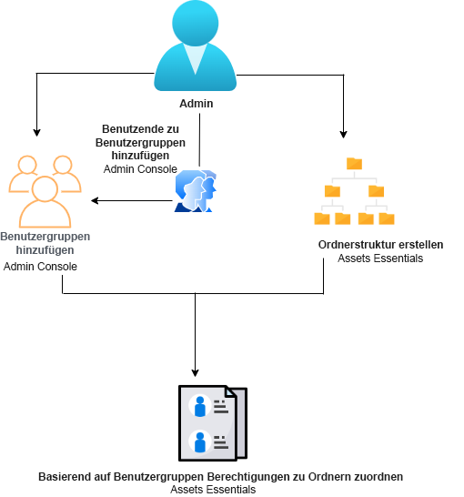
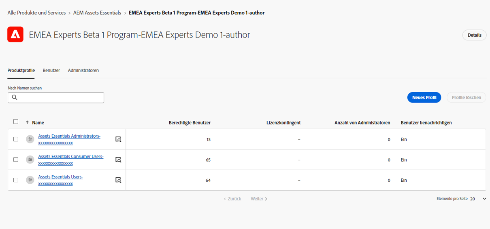
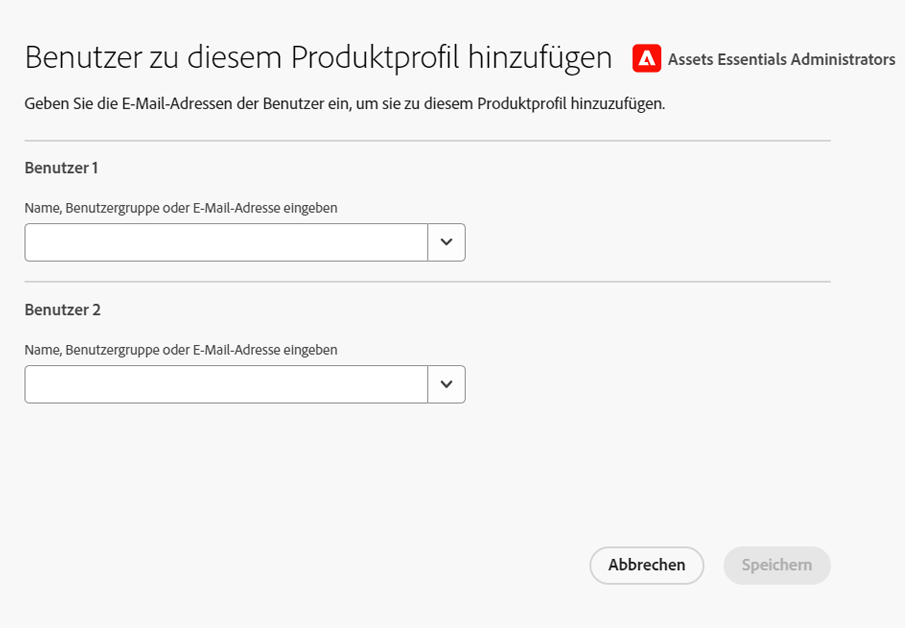
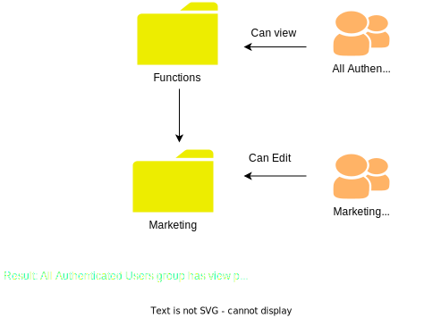
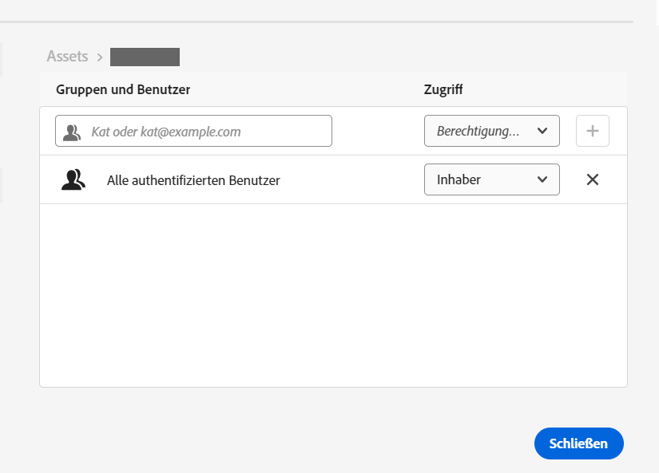
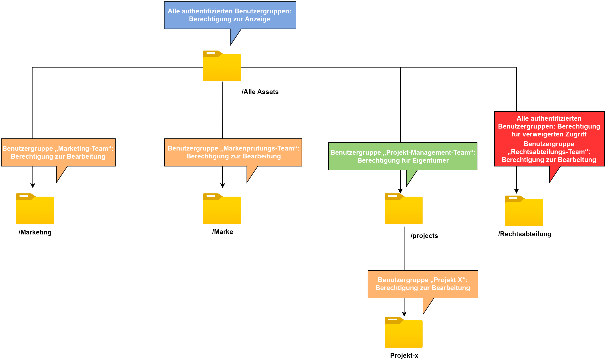

# Verwaltung von Zugriffsberechtigungen für Ordner {#manage-permissions}

>[!CONTEXTUALHELP]
>id="assets_permissions_folders"
>title="Verwalten von Berechtigungen"
>abstract="[!DNL Assets Essentials] ermöglicht es den Administrierenden, die Zugriffsebenen für die im Repository verfügbaren Ordner zu verwalten. Als Administrator können Sie Benutzergruppen erstellen und diesen Gruppen Berechtigungen zum Verwalten von Zugriffsebenen zuweisen. Sie können Benutzergruppen die Berechtigung zur Zugriffsberechtigungsverwaltung auch auf Ordnerebene zuweisen."

Mit Assets Essentials können Administratoren die Zugriffsebenen für Ordner verwalten, die im Repository verfügbar sind. Als Administrator können Sie Benutzergruppen erstellen und diesen Gruppen Berechtigungen zum Verwalten von Zugriffsebenen zuweisen. Sie können Benutzergruppen die Berechtigung zur Zugriffsberechtigungsverwaltung auch auf Ordnerebene zuweisen.

Das folgende Datenflussdiagramm zeigt die Abfolge von Aufgaben, die Sie zum Konfigurieren und Verwalten von Zugriffsberechtigungen für Ordner ausführen müssen, die im Assets Essentials-Repository verfügbar sind:

## Vor dem Verwalten von Zugriffsberechtigungen für Ordner {#before-managing-permissions}

Bevor Sie mit der Verwaltung von Zugriffsberechtigungen für Ordner in Ihrem Assets Essentials-Repository beginnen, müssen Sie bestimmte Aufgaben ausführen, z. B. das Hinzufügen von Administratoren, die eine logische Ordnerstruktur erstellen, Benutzergruppen erstellen und Ordnerberechtigungen für verschiedene Benutzergruppen verwalten.

### Hinzufügen von Administratoren {#add-admin-users}

Fügen Sie Administratoren für das Assets Essentials-Programm hinzu, damit sie Ordnerberechtigungen für andere Benutzergruppen verwalten können.

So fügen Sie Administratoren hinzu:

1. Rufen Sie die [Admin Console](https://adminconsole.adobe.com) für Ihr Unternehmen auf, klicken Sie in der oberen Leiste auf **[!UICONTROL Produkte]**, dann auf **[!UICONTROL AEM Assets Essentials]** und anschließend auf die [!DNL Assets Essentials]-Umgebung. [!DNL Assets Essentials] verfügt über drei Produktprofile, die den Zugriff für Administratoren, Standardbenutzer und Privatkunden darstellen.

   

1. Um einen Benutzer zu einer Gruppe hinzuzufügen, klicken Sie auf die Gruppe „Assets Essentials-Administratoren“, wählen Sie **[!UICONTROL Benutzer hinzufügen]**, geben Sie die Benutzerdetails ein und klicken Sie auf **[!UICONTROL Speichern]**.

   

   Wenn Sie einen Benutzer hinzufügen, erhält der Benutzer eine Einladung per E-Mail. Sie können die E-Mail-Einladungen in den Produktprofileinstellungen in der [!DNL Admin Console] deaktivieren.

1. Um einen Benutzer aus einer Gruppe zu entfernen, klicken Sie auf die Gruppe, wählen Sie einen vorhandenen Benutzer aus und wählen Sie **[!UICONTROL Benutzer entfernen]** aus.

### Hinzufügen von Benutzergruppen {#add-user-groups}

Verwalten Sie Ordnerzugriffsebenen im Assets Essentials-Repository, indem Sie Benutzergruppen erstellen und diesen Gruppen Berechtigungen zuweisen. Anschließend können Sie Ihre Benutzer den Benutzergruppen zuweisen.

Sie können Benutzer zu Benutzergruppen (1) und [zu Assets Essentials-Produktprofilen (2)](#add-admin-users) hinzufügen. Es ist jedoch nicht möglich, Benutzergruppen direkt zu Assets Essentials-Produktprofilen (3) hinzuzufügen.

Informationen zum Verwalten von Benutzergruppen finden Sie unter `Create user groups` und `Edit user groups`, verfügbar unter [Verwalten von Benutzergruppen](https://helpx.adobe.com/de/enterprise/using/user-groups.html).

>[!NOTE]
>
>Wenn Ihre Admin Console so eingerichtet ist, dass sie ein externes System zur Verwaltung von Benutzer-/Gruppenzuweisungen wie Azure- oder Google-Connectoren, ein Benutzersynchronisierungs-Tool oder die User Management-Rest-API nutzt, werden Ihre Gruppen und Benutzerzuweisungen automatisch konfiguriert. Weitere Informationen finden Sie unter [Adobe Admin Console-Benutzer](https://helpx.adobe.com/de/enterprise/using/users.html).

### Hinzufügen von Benutzern zu Gruppen {#add-users-to-uesr-groups}

Nachdem Sie Benutzergruppen erstellt haben, können Sie damit beginnen, Benutzer zu Benutzergruppen hinzuzufügen.

Informationen zum Verwalten hinzugefügter Benutzer zu Benutzergruppen finden Sie unter `Add users to groups`, verfügbar unter [Verwalten von Benutzergruppen](https://helpx.adobe.com/de/enterprise/using/user-groups.html#add-users-to-groups).

### Erstellen einer Ordnerstruktur {#create-folder-structure}

Sie können die folgenden Methoden verwenden, um eine Ordnerstruktur im Assets Essentials-Repository zu erstellen:

* Klicken Sie auf die Option **[!UICONTROL Ordner erstellen]** in der Symbolleiste, um einen leeren Ordner zu erstellen.

* Klicken Sie auf die Option **[!UICONTROL Assets hinzufügen]** in der Symbolleiste, um [eine auf Ihrem lokalen Computer vorhandene Ordnerstruktur hochzuladen](add-delete.md).

Erstellen Sie eine Ordnerstruktur entsprechend Ihren betrieblichen Anforderungen. Wenn Sie eine vorhandene Ordnerstruktur in das Assets Essentials-Repository hochladen, sollten Sie die Struktur überprüfen. Weitere Informationen finden Sie unter [Best Practices für die effektive Verwaltung von Zugriffsberechtigungen](permission-management-best-practices.md).

## Verwalten von Zugriffsberechtigungen für Ordner {#manage-permissions-on-folders}

Sie können den Benutzergruppen oder Benutzern die folgenden Berechtigungen zuweisen. Adobe rät davon ab, Benutzern Berechtigungen zuzuweisen.

| Berechtigungsname | Beschreibung |
|-----|------|
| Anzeigen | <ul><li>Lesezugriff zum Anzeigen und Navigieren in Ordnern </li><li>Vorschau von Medienelementen</li><li>Herunterladen von Medienelementen</li><li>Kopieren von Medienelementen</li><li>Freigeben von Links zu Medienelementen</li><ul> |
| Bearbeiten | <ul><li>Alle Rechte, die für Anzeige-Berechtigungen verfügbar sind </li><li>Erstellen von Ordnern</li><li>Entfernen von Ordnern</li><li>Umbenennen von Ordnern</li><li>Erstellen von Medienelementen</li><li>Aktualisieren von Medienelementen</li><li>Entfernen von Medienelementen</li><li>Verschieben von Medienelementen</li><li>Umbenennen von Medienelementen</li><ul> |
| Inhaber | <ul><li>Alle Rechte, die für Bearbeitungsberechtigungen verfügbar sind</li><li>Verwalten von Berechtigungen für Ordner und deren Unterordner</li>Diese Berechtigung erlaubt es den Administratoren, Administratorberechtigungen für einen Ordner und dessen Unterordner an andere zu delegieren.<ul> |
| Verweigern des Zugriffs | Entfernen der Anzeige- und Bearbeitungsberechtigungen sowie der Inhaberberechtigungen für einen Ordner und dessen Unterordner. |

**Standardberechtigungen**

Alle Benutzer, die authentifiziert sind und sich beim Assets Essentials-Programm anmelden können, haben zunächst `Can Edit`-Berechtigungen für das Assets Essentials-Repository. Der Administrator kann die Standardberechtigungen ändern, indem er [Berechtigungen für das gesamte Assets Essentials-Repository bearbeitet.](#edit-permissions-entire-repository)

**Reihenfolge bei der Zuweisung von Ordnerberechtigungen zu Benutzergruppen**

Erstellen Sie Regeln, um Benutzergruppen Ordnerberechtigungen zuzuweisen. Die Reihenfolge, in der Sie einem Ordner Berechtigungen zuweisen, ist wichtig und entscheidet über den Zugriff, der den Benutzergruppen und schließlich den Benutzern zur Verfügung steht.

Wenn Sie beispielsweise die `Can View`-Berechtigungen für einen Ordner zu einer Übergruppe und dann `Can Edit`-Berechtigungen zu ihrer Untergruppe zuweisen, haben nur die Mitglieder der Untergruppe Bearbeitungsberechtigungen für den Ordner. Die Benutzer der Übergruppe haben Ansichtszugriff auf den Ordner.

Wenn Sie Bearbeitungsberechtigungen für den Ordner `Marketing` nur der Marketing-Abteilung Ihres Unternehmens und für andere nur Ansichtsberechtigungen erteilen möchten, weisen Sie der Übergruppe `All Authenticated Users` `Can View`-Berechtigungen und ihrer Untergruppe `Marketing` `Can Edit`-Berechtigungen zu.

**Vererbung von Berechtigungen**

Assets Essentials verwendet die Berechtigungsvererbung, mit der Sie die für den übergeordneten Ordner festgelegten Berechtigungen an den untergeordneten Ordner vererben können. Wenn der übergeordnete Ordner beispielsweise `Can View`-Berechtigungen für die Gruppe `All Authenticated Users` und der untergeordnete Ordner `Can Edit`-Berechtigungen für die Benutzergruppe `Marketing` hat, haben alle authentifizierten Benutzer Anzeigeberechtigungen für den untergeordneten Ordner und die Benutzergruppe `Marketing` hat auch Bearbeitungsberechtigungen für den untergeordneten Ordner. Die Benutzergruppe `Marketing` hat Bearbeitungsberechtigungen für weitere Ordnerebenen unter dem untergeordneten Ordner (Marketing).

>[!NOTE]
>
> Das Festlegen einer `Deny Access`-Berechtigung für eine Gruppe auf einem hierarchisch höheren Ordner und das anschließende Wiederherstellen des Zugriffs (`Can view`, `Can edit` oder `Owner`) für diese Gruppe oder ihre Mitglieder wird nicht unterstützt. Verwenden Sie `Deny Access` sparsam.

### Hinzufügen von Berechtigungen zu Benutzergruppen {#add-permissions}

So weisen Sie Gruppenberechtigungen für Ordner zu:

1. Wählen Sie den Ordner aus und klicken Sie auf **[!UICONTROL Berechtigungen verwalten]**.

1. Geben Sie im Dialogfeld **[!UICONTROL Berechtigungen verwalten]** im Feld **[!UICONTROL Gruppen und Benutzer]** den Namen der Gruppe oder eines Benutzers ein.

1. Wählen Sie die [Zugriffsebene](#manage-permissions-folders) aus der Dropdown-Liste **[!UICONTROL Zugriff]**.

1. Klicken Sie auf **[!UICONTROL Hinzufügen]**, um für den Benutzer oder die Benutzergruppe eine sofortige Änderung an den Berechtigungen vorzunehmen.

1. Wiederholen Sie die Schritte 1 bis 3, um dem Dialogfeld **[!UICONTROL Berechtigungen verwalten]** weitere Regeln hinzuzufügen.

   

   >[!NOTE]
   >
   > Die Reihenfolge, in der Sie einem Ordner Berechtigungen zuweisen, ist wichtig und entscheidet über den Zugriff, der den Benutzergruppen und schließlich den zu den Gruppen hinzugefügten Benutzern zur Verfügung steht.

   Wenn Sie Berechtigungen für mehrere Ordner verwalten, können Sie auch einen anderen Ordner im linken Bereich auswählen und mit der Verwaltung der Berechtigungen für diesen Ordner beginnen.

1. Klicken Sie auf **[!UICONTROL Schließen]**.

>[!CAUTION]
>
> Es wird empfohlen, Berechtigungen für Benutzergruppen und nicht für einzelne Benutzer zu verwalten. Das Festlegen der `Deny access`-Berechtigung wird nur für Benutzergruppen, aber nicht für einzelne Benutzer unterstützt.

### Bearbeiten von Berechtigungen, die Benutzergruppen zugewiesen sind {#edit-permissions}

So bearbeiten Sie Berechtigungen, die Benutzergruppen für Ordner zugewiesen sind:

1. Wählen Sie den Ordner aus und klicken Sie auf **[!UICONTROL Berechtigungen verwalten]**.

1. Bearbeiten Sie im Dialogfeld **[!UICONTROL Berechtigungen verwalten]** die [Zugriffsebene](#manage-permissions-folders) in der Dropdown-Liste **[!UICONTROL Zugriff]**.

1. [Fügen Sie bei Bedarf weitere Benutzergruppen oder Benutzer](#add-permissions) zu den vorhandenen Berechtigungsregeln hinzu.

1. Klicken Sie auf „X“, um die einer Benutzergruppe zugewiesenen Berechtigungen zu entfernen.

### Bearbeiten von Berechtigungen für das gesamte Assets Essentials-Repository {#edit-permissions-entire-repository}

Ein Programmadministrator kann die Berechtigungen für das gesamte Assets Essentials-Repository von der Standardebene `Can Edit` auf eine beliebige andere Zugriffsebene ändern.

So bearbeiten Sie Berechtigungen für das gesamte Assets Essentials-Repository:

1. Wählen Sie einen beliebigen Ordner aus und klicken Sie auf **[!UICONTROL Berechtigungen verwalten]**.

1. Klicken Sie im Dialogfeld **[!UICONTROL Berechtigungen verwalten]** in der linken Leiste auf **[!UICONTROL Alle Assets]**.

1. [Bearbeiten Sie die Berechtigungen](#edit-permissions) und schließen Sie das Dialogfeld.

>[!NOTE]
>
>Ein Administrator kann nicht die Berechtigungsstufe `Deny Access` für das gesamte Assets Essentials-Repository auswählen, damit sichergestellt ist, dass die Benutzer zumindest Lesezugriff auf das Programm haben. Ebenso haben `All Authenticated Users` zumindest Leserechte für das Repository, auch wenn der Administrator die Berechtigungen `Can Edit` im Dialogfeld [!UICONTROL Berechtigungen verwalten] ausdrücklich entfernt.

## Beispiele für effektive Berechtigungsverwaltung {#example-permission-management}

**Nutzungsszenario**

* Die Gruppe aller authentifizierten Benutzer hat Anzeigezugriff auf das Repository.
* Team-spezifische Benutzergruppen haben Bearbeitungsberechtigungen für ihren eigenen funktionsspezifischen Ordner.
* Der Ordner „Legal“ ist für keinen authentifizierten Benutzer außer dem Personal der Rechtsabteilung einsehbar.

Erstellen Sie die folgenden Benutzergruppen in der Admin Console:

* Marketing-Team

* Team der Markenvalidierer

* Team der Projekt-Manager

* Projekt-X-Team

* Rechtsabteilung

Die folgende Abbildung zeigt die Ordnerhierarchie und die den einzelnen Benutzergruppen zugewiesenen Berechtigungen:

Im Folgenden finden Sie die Zugriffsebenen für alle Benutzergruppen in der Ordnerhierarchie:

* /All Assets: Der Administrator ändert die Berechtigungen auf der Stammebene von der Standardeinstellung `Can Edit` in `Can View`. Alle Benutzer können Ordner und Medienelemente ansehen, sie jedoch nicht bearbeiten.

* /marketing: Alle Benutzer können die Ordner und die Unterordner basierend auf der Vererbung von Berechtigungen anzeigen. Die Benutzergruppe „Marketing-Team“ hat jedoch Bearbeitungsberechtigungen für den Ordner.

* /brand: Alle Benutzer können die Ordner und die Unterordner basierend auf der Vererbung von Berechtigungen anzeigen. Die Benutzergruppe „Team der Markenvalidierer“ hat jedoch Bearbeitungsberechtigungen für den Ordner.

* /projects: Alle Benutzer können die Ordner und Unterordner auf der Grundlage der Vererbung von Berechtigungen anzeigen. Die Benutzergruppe „Projekt-Manager-Team“ kann:

   * Berechtigungen bearbeiten

   * Inhaber-Berechtigungen: Verwalten von Berechtigungen für einen Ordner und dessen Unterordner.

* /projects/project-x: Alle Benutzer können die Ordner und die Unterordner einsehen. Die Benutzergruppe „Projekt-Manager-Team“ hat Bearbeitungsberechtigungen und kann Berechtigungen für einen Ordner und dessen Unterordner verwalten (Inhaber-Berechtigungen). Die Benutzergruppe „Projekt-X-Team“ verfügt über Bearbeitungsberechtigungen.

* /legal: Keiner der Benutzer kann auf den Ordner zugreifen, der auf den `Deny Access`-Berechtigungen für die Gruppe `All Authenticated Users` basiert. Die Benutzergruppe „Rechtsabteilung“ verfügt über Bearbeitungsberechtigungen.

## Nächste Schritte {#next-steps}

* [Video zum Verwalten von Berechtigungen in Assets Essentials ansehen](https://experienceleague.adobe.com/docs/experience-manager-learn/assets-essentials/configuring/permissions-management.html?lang=de)

* Geben Sie Feedback zur Dokumentation durch  über die Option [!UICONTROL Diese Seite bearbeiten] oder durch  über die Option [!UICONTROL Problem protokollieren] in der rechten Seitenleiste

* Kontaktieren Sie die [Kundenunterstützung](https://experienceleague.adobe.com/?support-solution=General&amp;lang=de#support)
