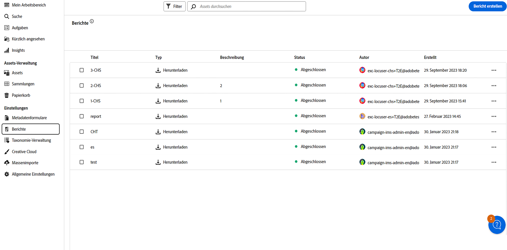
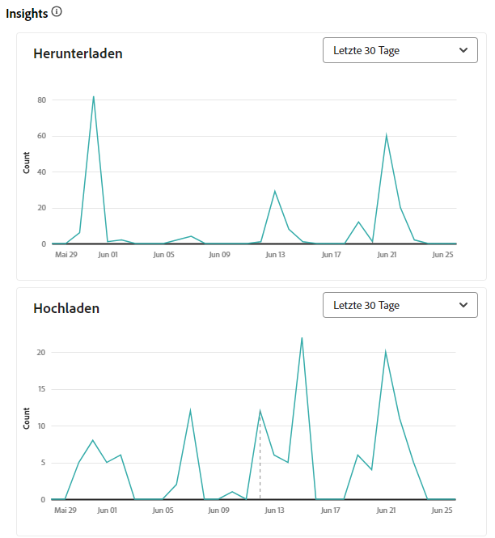
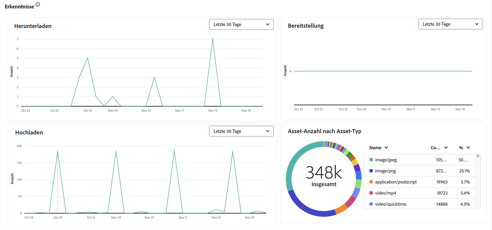
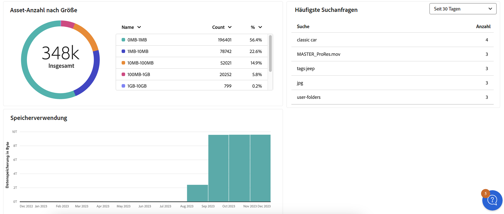

# Verwalten von Berichten {#manage-reports}

Das Asset-Reporting bietet Admins Einblicke in die Aktivität der Adobe Experience Manager Assets Essentials-Umgebung. Diese Daten liefern nützliche Informationen darüber, wie Benutzende mit Inhalten und dem Produkt interagieren. Alle Benutzenden können auf das Insights-Dashboard zugreifen, und diejenigen, die dem Produktprofil der Admins zugewiesen sind, können benutzerdefinierte Berichte erstellen.

## Zugreifen auf Berichte {#access-reports}

Alle Benutzenden, die dem [Produktprofil Assets Essentials-Administrierende](deploy-administer.md) zugeordnet sind, können in Assets Essentials auf das Dashboard „Erkenntnisse“ zugreifen oder benutzerdefinierte Berichte erstellen.

Navigieren Sie unter **[!UICONTROL Einstellungen]** zu **[!UICONTROL Berichte]**, um auf Berichte zuzugreifen.

<!--
In the **[!UICONTROL Reports]** screen, various components are shown in the tabular format which includes the following:

* **Title**: Title of the report
* **Type**: Determines whether the report is uploaded or downloaded to the repository
* **Description**: Provide details of the report that was given during uploading/downloading the report
* **Status**: Determines whether the report is completed, under progress, or deleted.
* **Author**: Provides email of the author who has uploaded/downloaded the report.
* **Created**: Gives information of the date when the report was generated.
-->

## Erstellen eines Berichts {#create-report}

Die AEM Assets Essentials-Umgebung bietet über das Berichte-Dashboard umfassende Berichtsfunktionen. Mit dieser Funktion können Benutzende CSV-Berichte erstellen und herunterladen, die Details zu Asset-Uploads und -Downloads innerhalb eines bestimmten Zeitraums angeben. Die Intervalle können einmalig, täglich, wöchentlich, monatlich oder jährlich sein.

**So erstellen Sie einen Bericht:**

1. Navigieren Sie zu **Berichte** und klicken Sie auf **Bericht erstellen** (oben rechts). Im Dialogfeld **Bericht erstellen** werden die folgenden Felder angezeigt:
   

   **Auf der Registerkarte „Konfiguration“:**

   1. **Berichtstyp:** Wählen Sie unter dem Berichtstyp [!UICONTROL Upload] oder [!UICONTROL Download] aus.
   1. **Titel:** Fügen Sie dem Bericht einen Titel hinzu.
   1. **Beschreibung:** Fügen Sie dem Bericht eine optionale Beschreibung hinzu.
   1. **Ordnerpfad auswählen:** Wählen Sie einen Ordnerpfad aus, um den Bericht der hochgeladenen und heruntergeladenen Assets in diesem bestimmten Ordner zu generieren. Wenn Sie beispielsweise den Bericht der Assets benötigen, die in einen Ordner hochgeladen wurden, geben Sie den Pfad zu diesem Ordner an.
   1. **Datumsintervall auswählen:** Wählen Sie den Datumsbereich aus, für den die Upload- oder Download-Aktivität im Ordner angezeigt werden soll.
    

   >[!NOTE]
   >
   > Assets Essentials konvertiert alle lokalen Zeitzonen in die koordinierte Weltzeit (UTC).

   **Auf der Registerkarte „Spalten“:** Wählen Sie die Spaltennamen aus, die im Bericht angezeigt werden sollen. In der folgenden Tabelle wird die Verwendung aller Spalten erläutert:

   <table>
    <tbody>
     <tr>
      <th><strong>Spaltenname</strong></th>
      <th><strong>Beschreibung</strong></th>
      <th><strong>Berichtstyp</strong></th>
     </tr>
     <tr>
      <td>Titel</td>
      <td>Der Titel des Assets.</td>
      <td>Hochladen und Herunterladen</td>
     </tr>
     <tr>
      <td>Pfad</td>
      <td>Der Ordnerpfad, in dem das Asset in Assets Essentials verfügbar ist.</td>
      <td>Hochladen und Herunterladen</td>
     </tr>
     <tr>
      <td>MIME-Typ</td>
      <td>Der MIME-Typ für das Asset.</td>
      <td>Hochladen und Herunterladen</td>
     </tr>
     <tr>
      <td>Größe</td>
      <td>Die Größe des Assets in Bytes.</td>
      <td>Hochladen und Herunterladen</td>
     </tr>
     <tr>
      <td>Heruntergeladen von</td>
      <td>Die E-Mail-ID des Benutzers, der das Asset heruntergeladen hat.</td>
      <td>Herunterladen</td>
     </tr>
     <tr>
      <td>Herunterladen-Datum</td>
      <td>Das Datum, an dem die Aktion zum Herunterladen des Assets durchgeführt wurde.</td>
      <td>Herunterladen</td>
     </tr>
     <tr>
      <td>Autor</td>
      <td>Der Autor des Assets.</td>
      <td>Hochladen und Herunterladen</td>
     </tr>
     <tr>
      <td>Erstellungsdatum</td>
      <td>Das Datum, an dem das Asset in Assets Essentials hochgeladen wurde.</td>
      <td>Hochladen und Herunterladen</td>
     </tr>
     <tr>
      <td>Änderungsdatum</td>
      <td>Das Datum der letzten Änderung des Assets.</td>
      <td>Hochladen und Herunterladen</td>
     </tr>
     <tr>
      <td>Abgelaufen</td>
      <td>Der Ablaufstatus des Assets.</td>
      <td>Hochladen und Herunterladen</td>
     </tr>
     <tr>
      <td>Heruntergeladen von Benutzername</td>
      <td>Der Name der Benutzerin oder des Benutzers, die/der das Asset heruntergeladen hat.</td>
      <td>Herunterladen</td>
     </tr>              
    </tbody>
   </table>

## Anzeigen und Herunterladen von vorhandenen Berichten {#View-and-download-existing-report}

Vorhandene Berichte werden auf der Registerkarte **Ausgeführte Berichte** angezeigt. Klicken Sie auf **Berichte** und wählen Sie **Ausgeführte Berichte** aus, um alle erstellten Berichte mit dem Status **Abgeschlossen** anzuzeigen. Dieser Status bedeutet, dass sie zum Herunterladen bereit sind. Um den Bericht im CSV-Format herunterzuladen oder den Bericht zu löschen, wählen Sie die Berichtszeile aus und danach **CSV herunterladen** oder **Löschen**.

## Planen eines Berichts {#schedule-report}

In der AEM Essentials-Benutzeroberfläche wird durch **Bericht planen** eine automatische Generierung von Berichten in bestimmten zukünftigen Intervallen eingerichtet, z. B. täglich, wöchentlich, monatlich oder jährlich. Diese Funktion hilft, die wiederkehrenden Berichtsanforderungen zu optimieren, und stellt zeitnahe Datenaktualisierungen sicher. **Bericht erstellen** generiert dagegen Berichte für vergangene Daten. Abgeschlossene Berichte werden unter **Ausgeführte Berichte** aufgelistet, und die anstehenden Berichte finden Sie unter **Geplante Berichte**.

Gehen Sie wie folgt vor, um einen Bericht zu planen:

1. Klicken Sie im linken Bereich auf „Berichte“ und dann oben rechts auf „Bericht erstellen“.
1. Im Dialogfeld „Bericht“ werden die folgenden Informationen angezeigt:
   1. **Berichtstyp:** Wählen Sie zwischen dem Upload- und dem Download-Typ aus.
   1. **Titel:** Fügen Sie dem Bericht einen Titel hinzu.
   1. **Beschreibung**: Fügen Sie dem Bericht eine optionale Beschreibung hinzu.
   1. **Ordnerpfad auswählen**: Wählen Sie einen Ordnerpfad aus, um einen Bericht für Assets zu generieren, die in Zukunft in diesen bestimmten Ordner hochgeladen bzw. aus diesem Ordner heruntergeladen werden.
   1. Umschalter **Bericht planen**: Schalten Sie zwischen den beiden Optionen um, den Bericht entweder für einen späteren Zeitpunkt oder für ein wiederholtes Vorkommen zu planen.
      

   1. **Häufigkeit auswählen**: Geben Sie das Intervall für die Generierung des Berichts an (z. B. täglich, wöchentlich, monatlich, jährlich oder einmalig) und legen Sie Datum und Uhrzeit für die Ausführung des Berichts zusammen mit dem Enddatum für das Intervall fest. Wählen Sie für einen einmaligen Bericht den Datumsbereich für den Bericht über den ausgewählten Aktivitätstyp in der AEM-Umgebung aus. Wenn Sie beispielsweise einen Bericht zu den vom 10. bis zum 29. (Datumsangaben in der Zukunft) eines bestimmten Monats heruntergeladenen Assets benötigen, wählen Sie diese Datumsangaben im Feld **Datumsintervall auswählen** aus.

   >[!NOTE]
   >
   > Assets Essentials konvertiert alle lokalen Zeitzonen in die koordinierte Weltzeit (UTC).

## Anzeigen geplanter Berichte {#view-scheduled-reports}

Geplante Berichte werden systematisch organisiert auf der Registerkarte **Geplante Berichte** angezeigt. Alle abgeschlossenen Berichte für jeden geplanten Bericht werden in einem einzigen Berichtsordner gespeichert. Klicken Sie auf , um die abgeschlossenen Berichte anzuzeigen. Wenn Sie beispielsweise einen täglichen Bericht geplant haben, werden alle abgeschlossenen Berichte in einem Ordner gruppiert. Diese Organisation vereinfacht die Navigation und die Erkennung von Berichten. Um geplante Berichte anzuzeigen, klicken Sie auf **Berichte** und dann auf **Geplante Berichte**. Alle geplanten Berichte werden angezeigt, wobei ihr Status entweder „Laufend“ oder „Abgeschlossen“ ist. Die abgeschlossenen Berichte können heruntergeladen werden.

## Bearbeiten und Abbrechen von geplanten Berichten {#edit-cancel-scheduled-reports}

1. Navigieren Sie zur Registerkarte **Geplante Berichte**.
1. Wählen Sie die Berichtszeile aus.
1. Klicken Sie auf **Bearbeiten**.
1. Klicken Sie auf **Zeitplan abbrechen** und dann auf **Bestätigen**, um den geplanten Bericht abzubrechen. Bei abgebrochenen Berichten ist „Zeit der nächsten Ausführung“ leer und der Status ist „Abgebrochen“.
   

### Zeitplan fortsetzen {#resume-schedule}

Um den abgebrochenen Zeitplan wieder aufzunehmen, wählen Sie die Berichtszeile aus und klicken Sie auf **Zeitplan fortsetzen**. Nach dem Fortsetzen werden die Einträge für die nächsten Ausführungen erneut angezeigt und der Status ist „Laufend“.

>[!NOTE]
>
> Wenn Sie einen abgebrochenen Bericht vor dem geplanten Enddatum fortsetzen, werden die Berichte vom Abbruchdatum bis zum Fortsetzungsdatum automatisch generiert.

## Anzeigen von Insights {#view-live-statistics}

>[!CONTEXTUALHELP]
>id="assets_reports"
>title="Berichte"
>abstract="Im Insights-Dashboard können Sie Echtzeit-Ereignismetriken für Ihre Experience Manager Assets-Umgebung während der letzten 30 Tage oder der letzten 12 Monate anzeigen. Die Ereignisliste enthält die Anzahl der Downloads, Uploads, Top-Suchbegriffe usw."

In Assets Essentials können Sie mit dem Dashboard „Erkenntnisse“ Echtzeitdaten für Ihre Assets Essentials-Umgebung anzeigen. Sie können Echtzeit-Ereignismetriken für die letzten 30 Tage oder für die letzten 12 Monate anzeigen.

<!---->

Klicken Sie auf **[!UICONTROL Erkenntnisse]** im linken Navigationsbereich, um die folgenden automatisch generierten Diagramme anzuzeigen:

* **Downloads**: Die Anzahl der Assets, die in den letzten 30 Tagen oder 12 Monaten aus der Assets Essentials-Umgebung heruntergeladen wurden, dargestellt als Liniendiagramm.
  

* **Uploads**: Die Anzahl der Assets, die in den letzten 30 Tagen oder 12 Monaten in die Assets Essentials-Umgebung hochgeladen wurden, dargestellt als Liniendiagramm.
  

<!--* **Asset Count by Size**: The division of count of assets based on their range of various sizes from 0 MB to 100 GB.-->

* **Speichernutzung**: Darstellung der Speichernutzung in Byte für die Assets Essentials-Umgebung mithilfe eines Balkendiagramms.
  
  <!--* **Delivery**: The graph depicts the count of assets as the delivery dates.-->

<!--* **Asset Count by Asset Type**: Represents count of various MIME types of the available assets. For example, application/zip, image/png, video/mp4, application/postscripte.-->

* **Häufigste Suchanfragen**: Die am häufigsten gesuchten Begriffe und die Suchhäufigkeit dieser Begriffe in den letzten 30 Tagen oder 12 Monaten in Ihrer Assets Essentials-Umgebung, dargestellt in Tabellenform.
  

  <!--
   
   
   -->

* **Asset-Anzahl nach Größe:** Segmentiert die gesamte Asset-Anzahl in Ihrer Assets Essentials-Umgebung in unterschiedliche Größenbereiche und hebt die Anzahl und den Prozentsatz der Assets in jedem Größenbereich hervor, dargestellt durch ein Ringdiagramm.
  

* **Asset-Anzahl nach Asset-Typ:** Segmentiert die gesamte Asset-Anzahl in Ihrer Assets Essentials-Umgebung und hebt die Anzahl und den Prozentsatz der Assets anhand ihrer Dateitypen hervor, dargestellt durch ein Ringdiagramm.
  

