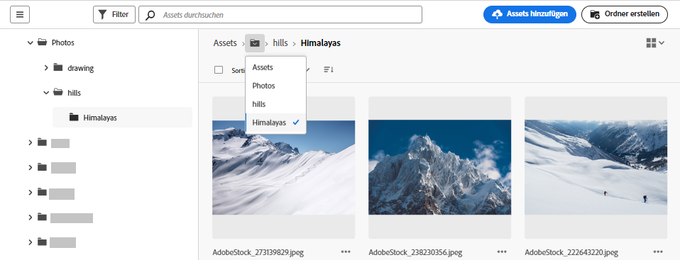
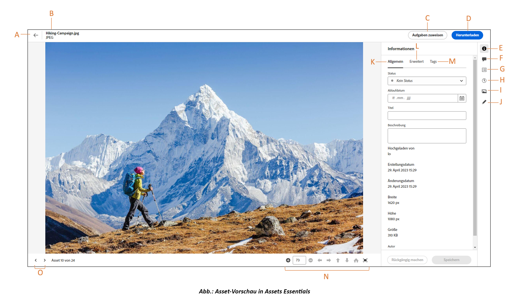

# Navigieren zu Dateien und Ordnern und Anzeigen von Assets {#view-assets-and-details}

<!-- TBD: Give screenshots of all views with many assets. Zoom out to showcase how the thumbnails/tiles flow on the UI in different views. -->

<!-- TBD: The options in left sidebar may change. Shared with me and Shared by me are missing for now. Update this section as UI is updated. -->

## Grundlegendes zur Benutzeroberfläche von [!DNL Assets Essentials]  {#understand-interface-navigation}

[!DNL Assets Essentials] bietet eine intuitive und benutzerfreundliche Benutzeroberfläche. Die klare Benutzeroberfläche erleichtert das Auffinden und Speichern von Assets und zugehörigen Informationen.

Wenn Sie sich bei [!DNL Assets Essentials] anmelden, sehen Sie die folgende Oberfläche.

![[!DNL Assets Essentials]-Benutzeroberfläche](assets/essentials-interface.png)

**A**: Linke Seitenleiste zum Durchsuchen des Repositorys und Aufruf einiger weiterer Optionen **B**: Linke Seitenleiste ein- und ausblenden, um den Asset-Ansichtsbereich zu vergrößern **C**: Suchergebnisse filtern **D**: Den gesamten Inhalt des ausgewählten Ordners auswählen **E**: Optionen zum Sortieren von Assets **F**: Suchfeld **G**: Dateien mithilfe der Schaltfläche `Add Assets` hochladen oder ziehen **H**: Einen neuen Ordner erstellen **I**: Zwischen verschiedenen Ansichten wechseln

<!-- TBD: Need an embedded video here with narration. It has to be hosted on MPC to be embeddable. -->

## Durchsuchen und Anzeigen von Assets und Ordnern {#browse-repository}

Sie können die Ordner über die Hauptbenutzeroberfläche oder die linke Seitenleiste durchsuchen. Experience Manager Assets zeigt jetzt beim Durchsuchen oder Suchen nach Inhalten eine visuelle Vorschau der Ordnerinhalte in der Ordnerminiaturansicht an, wodurch es erleichtert wird, die im AEM Assets-Repository verfügbaren Assets zu finden. Mit dieser Ordnerminiaturansicht sparen Sie Zeit bei der Suche nach bestimmten Assets in einem Ordner im AEM Assets-Repository.
Beim Durchsuchen von Assets in einem Ordner können Sie die Benutzeroberfläche verwenden, um Asset-Miniaturansichten anzuzeigen und auf diese Weise das Repository visuell zu durchsuchen oder um Asset-Details anzuzeigen und so das gewünschte Asset schnell zu finden. Die in der linken Seitenleiste verfügbaren Optionen sind:

* [Mein Arbeitsbereich](https://experienceleague.adobe.com/docs/experience-manager-assets-essentials/help/my-workspace.html?lang=de): Assets enthält jetzt einen anpassbaren Arbeitsbereich, der Widgets für den bequemen Zugriff auf wichtige Bereiche der Assets-Benutzeroberfläche und Informationen bereitstellt, die für Sie am relevantesten sind. Diese Seite dient als zentrale Anlaufstelle, um einen Überblick über Ihre Arbeitselemente zu erhalten und schnellen Zugriff auf wichtige Workflows zu ermöglichen. Ein bequemerer Zugriff auf diese Optionen erhöht Ihre Effizienz und inhaltliche Geschwindigkeit.
* [Aufgaben](https://experienceleague.adobe.com/docs/experience-manager-assets-essentials/help/my-workspace.html?lang=de): Sie können die Aufgaben, die Ihnen zugewiesen wurden, auf der Registerkarte **Meine Aufgaben** ansehen. Die Aufgaben, die von Ihnen erstellt wurden, können hingegen auf der Registerkarte **Zugewiesene Aufgaben** angesehen werden. Darüber hinaus finden Sie die Aufgaben, die Sie abgeschlossen haben, auf der Registerkarte **Abgeschlossene Aufgaben**.
* [Assets](https://experienceleague.adobe.com/docs/experience-manager-assets-essentials/help/manage-organize.html?lang=de): Liste aller Ordner in einer Baumstrukturansicht, auf die Sie Zugriff haben.
* **Kürzlich angesehen**: Liste der Assets, die Sie kürzlich in der Vorschau betrachtet haben. [!DNL Assets Essentials] zeigt nur die Assets an, die Sie in der Vorschau anzeigen. Hier werden die Assets, an denen Sie beim Durchsuchen der Repository-Dateien oder -Ordner vorbeiscrollen, nicht angezeigt.
* [Sammlungen](https://experienceleague.adobe.com/docs/experience-manager-assets-essentials/help/manage-collections.html?lang=de): Eine Sammlung ist ein Satz von Assets, Ordnern oder sonstigen Sammlungen in Adobe Experience Manager Assets Essentials. Anhand von Sammlungen können Assets von mehreren Benutzenden gemeinsam verwendet werden. Im Gegensatz zu Ordnern kann eine Sammlung Assets von verschiedenen Speicherorten enthalten. Sie können mehrere Sammlungen für eine Benutzerin bzw. einen Benutzer freigeben. Jede Sammlung enthält Verweise auf Assets. Die referenzielle Integrität von Assets wird sammlungsübergreifend aufrechterhalten.

* [Erkenntnisse](https://experienceleague.adobe.com/docs/experience-manager-assets-essentials/help/manage-reports.html?lang=de#view-live-statistics): In [!DNL Assets Essentials] können Sie Echtzeiterkenntnisse in Ihrem Dashboard anzeigen. In Assets Essentials können Sie mit dem Dashboard „Erkenntnisse“ Echtzeitdaten für Ihre Assets Essentials-Umgebung anzeigen. Sie können Echtzeit-Ereignismetriken während der letzten 30 Tage oder für die letzten 12 Monate anzeigen.

* **Papierkorb**: Enthält eine Liste der Assets, die aus dem Stammordner **[!UICONTROL Assets]** gelöscht wurden. Sie können ein Asset im Papierkorb-Ordner auswählen, um es am ursprünglichen Speicherort wiederherzustellen oder dauerhaft zu löschen. Sie können ein Keyword angeben oder Filter wie Asset-Status, Dateityp, MIME-Typ, Bildgröße, Asset-Erstellung, Änderung und Ablaufdaten anwenden sowie Filterung nach Assets, die von der aktuellen Benutzerin bzw. dem aktuellen Benutzer verworfen wurden. Sie können auch benutzerdefinierte Filter anwenden, um im Papierkorb-Ordner nach geeigneten Assets zu suchen. Weitere Informationen zum Verwenden standardmäßiger und benutzerdefinierter Filter finden Sie unter [Suchen nach Assets in Assets Essentials](search.md).

* **Einstellungen**: Sie können verschiedene Optionen von Assets Essentials mithilfe von **Einstellungen** konfigurieren, wie etwa Metadatenformulare, Berichte und Taxonomieverwaltung.

<!-- TBD: Not sure if we want to publish these right now. CC Libs are beta as per Greg.
* **Libraries**: Access to [!DNL Adobe Creative Cloud Team] (CCT) Libraries view. This view is visible only if the user is entitled to CCT Libraries.
-->

<!-- TBD: My Work Space shows task inbox and it is not visible on AEM Cloud Demos as of now. It is the source of truth server hence not documenting My Work Space option for now.
-->

Sie können die linke Seitenleiste erweitern oder minimieren, um den verfügbaren Asset-Anzeigebereich zu vergrößern.

In [!DNL Assets Essentials] können Sie Assets, Ordner und Suchergebnisse in vier verschiedenen Layout-Typen anzeigen:

*  [!UICONTROL Listenansicht]
*  [!UICONTROL Rasteransicht]
*  [!UICONTROL Galerieansicht]
*  [!UICONTROL Wasserfallansicht]

Um ein Asset zu finden, können Sie die Assets in auf- oder absteigender Reihenfolge von `Name`, `Relevancy`, `Size`, `Modified` und `Created` sortieren.

Um in einem Ordner zu navigieren, doppelklicken Sie auf die Miniaturansichten des Ordners oder wählen Sie den Ordner in der linken Seitenleiste aus. Um Details zu einem Ordner anzuzeigen, wählen Sie ihn aus und klicken Sie oben in der Symbolleiste auf „Details“. Um in der Hierarchie nach oben und unten zu navigieren, verwenden Sie entweder die linke Seitenleiste oder die Breadcrumbs oben.

*Abbildung: Verwenden Sie die Breadcrumbs oben oder links in der Seitenleiste, um die Hierarchie zu durchsuchen.*

## Anzeigen einer Vorschau für Assets {#preview-assets}

Bevor Sie ein Asset verwenden, freigeben oder herunterladen, können Sie es sich genauer ansehen. Mit der Vorschaufunktion können Sie nicht nur die Bilder, sondern auch einige andere unterstützte Asset-Typen anzeigen.

Um ein Asset in der Vorschau anzuzeigen, wählen Sie es aus und klicken Sie oben in der Symbolleiste auf [!UICONTROL Details] . Sie können nicht nur das Asset, sondern auch seine detaillierten Metadaten anzeigen und andere Aktionen durchführen.

**A**: Zurück zum aktuellen Ordner oder Suchergebnis im Repository **B**: Name und Format der Datei in der Vorschau **C**: Zugewiesene Aufgaben **D**: Erweiterte Metadaten **E**: Schlüsselwörter und Smart-Tags **F**: Kommentare und Anmerkungen **G**: Mit dem ausgewählten Asset verbundene Aufgaben anzeigen **H**: Versionen anzeigen und verwalten **I**: Ausgabedarstellungen des Bildes anzeigen **J**: Bild bearbeiten **K**: Grundlegende Metadaten **L**: Erweiterte Metadaten **M**: Keywords und Smart-Tags **N**: Genauere Vorschau. Zoom, Vollbild und andere Optionen **O**: Mit dem vorherigen oder nächsten Asset im aktuellen Ordner fortfahren, ohne zum Ordner zurückzukehren

Sie können auch eine Vorschau der Videos anzeigen.

Wenn Sie ein Asset explizit in der Vorschau anzeigen, wird es in [!DNL Assets Essentials] als kürzlich angesehenes Asset angezeigt.

<!-- TBD: Describe the options.

Explicitly previewed assets are displayed as recently viewed assets. Give screenshot of this.
Other use cases after previewing.
-->

## Konfigurieren der Spaltenanzeige für die Assets-Listenansicht {#configure-columns-list-view}

Sie können die Spalten auswählen, die in der Assets-Listenansicht angezeigt werden, z. B. Status, Format, Dimensionen, Größe usw.:

1. Wählen Sie **[!UICONTROL Assets]** aus dem linken Navigationsbereich aus und klicken Sie auf das Symbol .

1. Wählen Sie die Spalten aus, die in der Listenansicht angezeigt werden sollen, und klicken Sie auf **[!UICONTROL Bestätigen]**.

   

## Nächste Schritte {#next-steps}

* Geben Sie Produkt-Feedback über die Option [!UICONTROL Feedback] in der Benutzeroberfläche von Assets Essentials

* Geben Sie Feedback zur Dokumentation durch  über die Option [!UICONTROL Diese Seite bearbeiten] oder durch  über die Option [!UICONTROL Problem protokollieren] in der rechten Seitenleiste

* Kontaktieren Sie die [Kundenunterstützung](https://experienceleague.adobe.com/?support-solution=General&amp;lang=de#support)

>[!MORELIKETHIS]
>
>* [Anzeigen von Versionen eines Assets](/help/using/manage-organize.md#view-versions).
