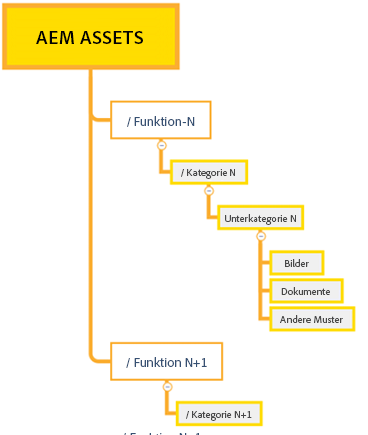
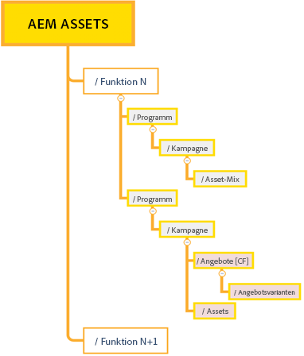
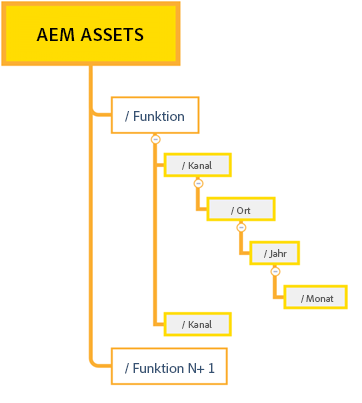

# Best Practices für die effektive Verwaltung von Zugriffsberechtigungen {#best-practices-permissions-management}

Bevor Sie als Administrator mit der Verwaltung der Ordnerberechtigungen für das Assets Essentials-Repository beginnen, gibt es verschiedene Best Practices, die Sie implementieren können, um die Infrastruktur für Administratoren und Endbenutzer während der Verwaltung von Vorgängen intuitiv zu gestalten.

Sie können diese Best Practices bei den folgenden Aufgaben einbinden:

* [Erstellen von Benutzergruppen in der Admin Console](#admin-console-best-practices)

* [Erstellen der Ordnerstruktur im Assets Essentials-Repository](#folder-structure-assets-essentials)

* [Verwalten von Zugriffsberechtigungen im Assets Essentials-Repository](#folder-permissions)

## Admin Console {#admin-console-best-practices}

Identifizieren Sie die Zugriffsanforderungen anhand von Benutzergruppen in Ihrem Unternehmen. Planen und erstellen Sie Benutzergruppen für Ihr Unternehmen und fügen Sie Benutzer zu diesen Benutzergruppen hinzu. Es ist einfacher, Ordnerberechtigungen auf der Basis von Benutzergruppen und nicht einzelnen Benutzern zu verwalten.

## Ordnerstruktur für das Assets Essentials-Repository {#folder-structure-assets-essentials}

Beachten Sie die folgenden Punkte, wenn Sie mit der Erstellung einer Ordnerstruktur im Assets Essentials-Repository beginnen:

* Zukünftige Governance: Die Ordner, die von Administratoren verwaltet werden, und die Ordner, die [für Berechtigungen an andere Benutzer als Inhaber delegiert](manage-permissions.md##manage-permissions-folders) wurden.

* Skalierbar: Die Ordnerstruktur sollte den künftigen Anforderungen Ihres Unternehmens entsprechen und leicht skalierbar sein.

* Größe: Ein Ordner darf nicht zu viele Medienelemente enthalten. Dies kann zu Problemen bei der Benutzung führen und schwierig zu handhaben sein.

* Intuitiv: Die Ordnerstruktur sollte für die Endbenutzer einfach zu durchsuchen und intuitiv gestaltet sein. Benutzer sollten leicht erkennen können, wo ein neues Medienelement in die Ordnerstruktur hochgeladen werden soll.

Es gibt verschiedene mögliche Ordnerstrukturtypen, die Sie für Ihr Unternehmen verwenden können. Im Folgenden finden Sie einige Beispiele für typische Ordnerstrukturen:

* Basierend auf Funktion und Kategorisierung

  

* Kampagnenbasiert

  

* Basierend auf Angebotsposition (oder Kanal)

  

## Ordnerberechtigungen {#folder-permissions}

Nachdem Sie Benutzergruppen für Ihr Unternehmen erstellt, Benutzer zu diesen Benutzergruppen hinzugefügt und eine Ordnerstruktur im Assets Essentials-Repository ausgewählt und erstellt haben, die den Anforderungen Ihres Unternehmens entspricht, können Sie mit dem Verwalten von Ordnerberechtigungen für Ihr Unternehmen beginnen. Beachten Sie beim Verwalten von Ordnerberechtigungen die folgenden Punkte:

* Wenden Sie Zugriffsberechtigungen für Benutzergruppen an, nicht für einzelne Benutzer. Damit erzielen Sie eine einfachere, effizientere Struktur der Zugriffsberechtigungen.

* Halten Sie die Struktur der Zugriffsberechtigungen so einfach wie möglich, um effiziente Arbeitsabläufe zu gewährleisten.

* Verwenden Sie das Verweigern von Zugriffsberechtigungen mit Bedacht und wenden Sie eher positive Berechtigungen (Bearbeiten, Anzeigen, Inhaber) auf die Ordnerstruktur an.

Beispiele für das Erzielen einer effizienten und einfachen Ordnerstruktur finden Sie unter [Verwalten von Zugriffsberechtigungen auf Ordner](manage-permissions.md##manage-permissions-folders).

## Nächste Schritte {#next-steps}

* Geben Sie Produkt-Feedback über die Option [!UICONTROL Feedback] in der Benutzeroberfläche von Assets Essentials

* Geben Sie Feedback zur Dokumentation durch  über die Option [!UICONTROL Diese Seite bearbeiten] oder durch  über die Option [!UICONTROL Problem protokollieren] in der rechten Seitenleiste

* Kontaktieren Sie die [Kundenunterstützung](https://experienceleague.adobe.com/de?support-solution=General&amp;lang=de#support)
