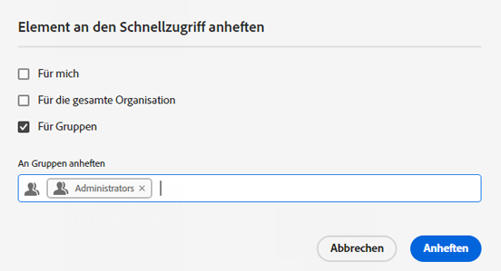
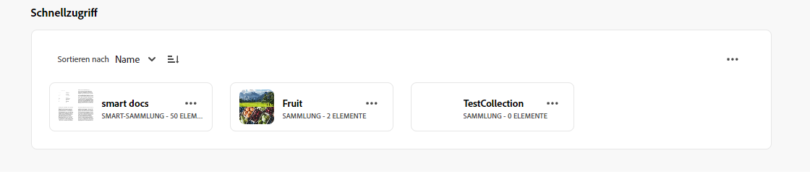
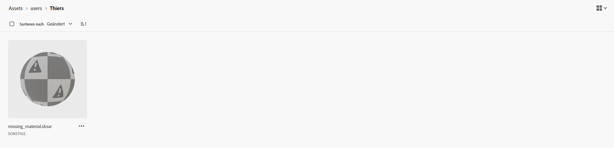
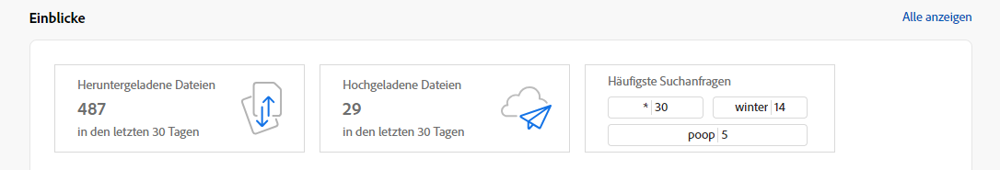
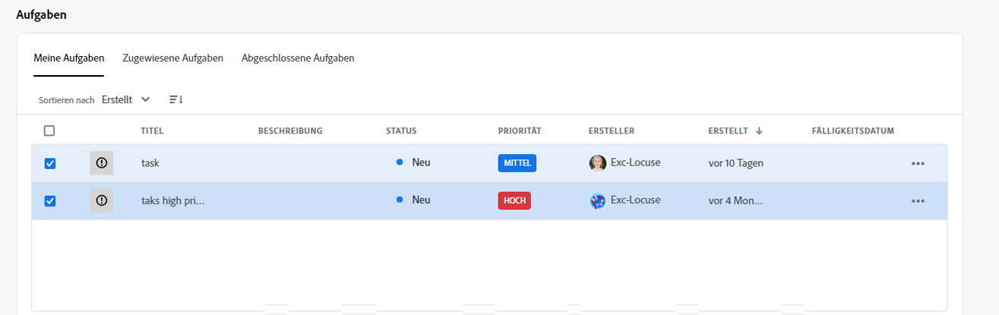
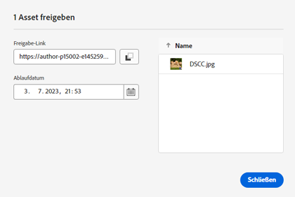

# Versionshinweise zu [!DNL Assets Essentials] {#release-notes}

Die aktuelle Version von Assets Essentials wurde am Freitag, 18. April 2024 veröffentlicht.

Folgende Funktionen wurden kürzlich hinzugefügt:

**Kontextsuche**

Sie können jetzt auch im Repository verfügbare Assets durchsuchen, indem Sie Textaufforderungen definieren. Experience Manager Assets wandelt diese Textaufforderungen automatisch in Suchfilter um und zeigt die Suchergebnisse an. Mithilfe des Bedienfelds &quot;Filter&quot;können Sie automatische Filter anzeigen und ändern, um die Suchergebnisse weiter einzugrenzen.

<!--

**Dynamic renditions**

You can now view and download dynamic renditions (including smart crops) in Experience Manager Assets. Dynamic renditions are customized versions of image assets created in real-time to meet specific needs, such as resizing images based on device resolution or cropping to fit different aspect ratios. These renditions enable organizations to deliver personalized and optimized experiences to diverse audience needs.

-->

**Ersetzende Umbenennung für Assets und Ordner**

Experience Manager Assets bietet jetzt eine vereinfachte Benutzererfahrung, indem es die Möglichkeit bietet, ein Asset oder einen Ordner per Klick umzubenennen.

**Schnellaktionen für Videos**

Experience Manager Assets enthält jetzt einfache und intuitive Tools zur Videobearbeitung, die von Adobe Expreß unterstützt werden, um die Wiederverwendung von Inhalten zu steigern und die Geschwindigkeit der Inhaltswiedergabe zu beschleunigen. Für die leichte Bearbeitung von Videos in AEM Assets sind keine umfangreichen Kenntnisse der Videobearbeitungswerkzeuge und -konzepte erforderlich. Zu den Bearbeitungsoptionen gehören das Zuschneiden, Zuschneiden, Ändern der Größe eines Videos und das Konvertieren einer MP4-Datei in eine GIF-Datei.

**Zuweisen oder Entfernen von Metadatenformularen zu mehreren Ordnern**

Sie können jetzt Metadatenformulare mehreren Ordnern zuweisen oder daraus entfernen.

**Berechtigungen für private Sammlungen verwalten**

Sie können Administratoren erlauben, die Zugriffsebene für private Sammlungen zu verwalten, die im Repository verfügbar sind. Sie können den Benutzergruppen oder Benutzenden Berechtigungen zuweisen, beispielsweise `Can View` und `Can Edit`. Sie können auch Benutzergruppen Zugriffsverwaltungsberechtigungen zuweisen.

**Verbesserungen auf der Basis von Kunden-Feedback**

Verbesserungen und Fehlerbehebungen basierend auf Kunden-Feedback.

## Bekannte Probleme {#known-issues}

Die Liste der bekannten Probleme mit [!DNL Assets Essentials]-Angeboten wird laufend überarbeitet und aktualisiert:

<!--

* Assets Essentials does not support creating Private collections.

-->

* Private Sammlungen sind für Erstellende und Benutzende mit Administratorrechten verfügbar. Als Admin können Sie die Berechtigungen für den Zugriff auf die Sammlung nicht an andere Benutzende delegieren.

Wenn Sie auf Probleme stoßen oder Verbesserungsanfragen haben, können Sie dem Team [Feedback senden](#provide-feedback).

## Frühere Versionen {#past-releases}

### Version Januar 2024 {#january-2024-release}

**Smart-Tags-Blockierungsliste**

Mit Assets Essentials können Sie jetzt eine Blockierungsliste mit Wörtern festlegen, die beim Hochladen in das Repository nicht als Smart-Tags zu Assets hinzugefügt werden sollen. Diese Funktion hilft Ihnen, die Markenkonformität zu wahren und reduziert den Aufwand für die Moderation von Smart-Tags.

**GenAI-Bilder mit Adobe Firefly erstellen**

Erstellen Sie neue Bilder auf Basis von Suchabfragen mit Integration einer Adobe Firefly Text-zu-Bild-Funktion (Adobe Firefly-Lizenz erforderlich).

**Nach ähnlichen Bildern suchen**

Sie können jetzt Inhalte einfach finden, indem Sie ein Bild auswählen und ähnliche Bilder im Experience Manager Assets-Repository anzeigen.

**Eingebetteter Adobe Express-Editor in AEM Assets**

Benutzende mit Zugriff auf Express verfügen jetzt über integrierte Tools von Adobe Express und Adobe Firefly zur Bildbearbeitung und -erstellung, die direkt in AEM Assets verfügbar sind, um die Wiederverwendung von Inhalten zu verbessern und die Geschwindigkeit von Inhalten zu beschleunigen.

**Speichernutzungsberichte in Insights**:

Admins haben jetzt die Möglichkeit, die im Rahmen von Insights verfügbaren Speichernutzungsberichte anzuzeigen.

**Erste Homepage-Konfiguration durchsuchen**

Mit Assets Essentials können Sie jetzt das Startseitenerlebnis Ihres Unternehmens konfigurieren. Wenn Sie die Startseite als erste Suche festlegen, können Sie die Ausrichtung des Suchbalkens, das Hintergrundbild und das Logo Ihres Unternehmens konfigurieren.

### Version Oktober 2023 {#october2023-release}

**Massenimport von Assets aus einer OneDrive-Datenquelle**

Admins können jetzt eine [große Anzahl von Assets aus einer Datenquelle in AEM Assets importieren](/help/using/bulk-import-assets-view.md). Die aktualisierte Liste der unterstützten Datenquellen für den Massenimport enthält Azure, AWS, Google Cloud, Dropbox und OneDrive.

**Unterstützung von Cross-Org-Berechtigungen für Bibliotheken**

Mit Experience Manager Assets können Sie jetzt den Zugriff auf Creative Cloud-Bibliotheken in einer anderen IMS-Organisation konfigurieren. Dies ermöglicht einen einfacheren Zugriff auf die neuesten produktübergreifenden Workflows zwischen Creative Cloud und Experience Manager und reduziert Zeit und Aufwand bei der Erstellung kreativer Inhalte.

### Version September 2023 {#september2023-release}

**Metadatenformular einem Ordner zuweisen**

Sie können jetzt in Ihrer Assets Essentials-Bereitstellung ein Metadatenformular einem bestimmten Ordner zuweisen. Alle Assets im Ordner, einschließlich Assets in den Unterordnern, zeigen dann die im zugewiesenen Metadatenformular definierten Eigenschaften an.

**Massenimport von Assets aus Datenquellen**

Admins können jetzt eine große Anzahl von Assets aus einer Datenquelle in AEM Assets importieren. Die Admins müssen keine einzelnen Assets oder Ordner mehr in AEM Assets hochladen. Zu den unterstützten Datenquellen für den Massenimport gehören Azure, AWS, Google Cloud und Dropbox.

**Bildbearbeitungswerkzeuge basierend auf Adobe Express**

Einfache und intuitive Bildbearbeitungs-Tools von Adobe Express, die direkt in AEM Assets verfügbar sind, um die Wiederverwendung von Inhalten zu steigern und die Geschwindigkeit der Inhaltswiedergabe zu beschleunigen.

**Flexibilität beim Anheften von Elementen für den Schnellzugriff „Mein Arbeitsbereich“**

Möglichkeit, Elemente für Sie, für Ihre gesamtes Unternehmen oder für eine Liste von Gruppen auszuwählen und anzuheften, damit sie je nach Ihrer Auswahl im Abschnitt „Schnellzugriff“ in „Mein Arbeitsbereich“ angezeigt werden.

### Version Juli 2023 {#july2023-release}

**Verbessertes KI-Framework für Smart-Tags für Bilder**

Experience Manager Assets verwendet jetzt ein verbessertes Framework mit künstlicher Intelligenz für Smart-Tags für Bilder. Diese inhaltsbezogene Intelligenz führt zu einer besseren Relevanz und Genauigkeit von Smart-Tags, die für alle Bild-Assets bei der Aufnahme verfügbar sind.

**Konfigurieren der Spaltenanzeige für die Assets-Listenansicht**

Assets Essentials bietet jetzt die Möglichkeit, die Spalten auszuwählen, die in der Assets-Listenansicht angezeigt werden, z. B. Status, Format, Dimensionen, Größe usw.

**Sortieren von Suchergebnissen nach Relevanz**

Assets Essentials sortiert die Suchergebnisse nun standardmäßig nach Relevanz. Sie können die gesuchten Assets in aufsteigender oder absteigender Reihenfolge nach `Name`, `Relevance`, `Size`, `Modified` und `Created` sortieren.

### Version Juni 2023 {#june2023-release}

**Hierarchisches Tagging von Assets für ein schnelleres Sucherlebnis**

Flache Listen mit kontrolliertem Vokabular werden im Laufe der Zeit immer unübersichtlicher. Assets Essentials unterstützt nun die hierarchische Tagging-Struktur, die etwa die Anwendung relevanter Metadaten, die Kategorisierung von Assets, die Unterstützung von Suchvorgängen, die Wiederverwendung von Tags und eine bessere Auffindbarkeit ermöglicht.

**Anheften von Dateien, Ordnern und Sammlungen zwecks Schnellzugriffs**

Sie können nun Dateien, Ordner und Sammlungen anheften, um schneller auf diese Elemente zugreifen zu können, wenn Sie sie zu einem späteren Zeitpunkt benötigen. Alle angehefteten Elemente werden im Dashboard „Mein Arbeitsbereich“ im Abschnitt **Schnellzugriff** angezeigt. Sie können über „Mein Arbeitsbereich“ darauf zugreifen, anstatt zu dem Speicherort zu navigieren, an dem sie im Repository gespeichert sind.

**Filtern von Assets im Papierkorb-Ordner**

Mit Assets Essentials können Sie nun im Papierkorb-Ordner verfügbare Assets filtern. Sie können standardmäßige oder benutzerdefinierte Filter anwenden, um im Papierkorb-Ordner nach geeigneten Assets zum Wiederherstellen oder dauerhaften Löschen zu suchen.

**Miniaturansichtsvorschau für 3D-Assets**

Assets Essentials generiert nun Miniaturansichtsvorschauen für gängige 3D-Dateiformate wie gLB, USDz, FBX, 3DS, OBJ und SBSAR. Wenn diese Dateien in Assets Essentials hochgeladen werden, werden vom System standardmäßig und automatisch Miniaturansichten generiert.

**Anzeigen der am häufigsten gesuchten Begriffe**

Assets Essentials unterstützt nun das Anzeigen der am häufigsten gesuchten Begriffe in Ihrer Assets Essentials-Bereitstellung, und zwar mithilfe des Abschnitts **Erkenntnisse** im Dashboard „Mein Arbeitsbereich“. Sie können zudem zu detaillierten Erkenntnissen navigieren, um die häufigsten Suchanfragen der letzten 30 Tage oder 12 Monate anzuzeigen.

**Verbesserungen bei Metadatenformularen**

Assets Essentials ermöglicht es Ihnen nun, Metadatenformularen Eigenschaftskomponenten für Mehrfachwerttext und Dropdown-Listen hinzuzufügen.

### Mehrere Versionen im Jahr 2023 {#multiple-releases-2023}

Die Liste der kürzlich hinzugefügten Funktionen umfasst:

**Die am häufigsten heruntergeladenen Assets**

Im Abschnitt [!UICONTROL Inhalt] von „Mein Arbeitsbereich“ werden jetzt die zehn am häufigsten heruntergeladenen Assets für Ihre Assets Essentials-Umgebung angezeigt. Sie können für jedes aufgelistete Asset auch den Formattyp und die Anzahl der Downloads anzeigen.

**Massenaktualisierungen von Asset-Metadaten**

Massenaktualisierungen von Metadaten ermöglichen es, allgemeine Metadatenaktualisierungen für mehrere Assets gleichzeitig durchzuführen. Sie müssen Datensätze nicht einzeln aktualisieren und können Eigenschaften schnell auf Assets oder Ordner anwenden, auf die über eine Suche zugegriffen wird.

**Mein Arbeitsbereich mit konfigurierbaren Widgets**

Assets bietet Ihnen jetzt einen benutzerdefinierten Arbeitsbereich, der als zentrale Lösung dient und Ihnen einfachen Zugriff auf wichtige Bereiche der Assets-Benutzeroberfläche und Informationen bietet, die für Sie am relevantesten sind. Der schnellere Zugriff auf diese Optionen erhöht die inhaltliche Geschwindigkeit und Effizienz Ihrer Projekte.

„Mein Arbeitsbereich“ enthält Widgets für Erkenntnisse, Aufgaben und Inhalte. Sie können je nach Ihren Voreinstellungen konfigurieren, wie diese Widgets in Ihrem Arbeitsbereich angezeigt werden.

**Benutzeroberfläche für dedizierte Aufgabenverwaltung**

Mit Assets Essentials können Sie jetzt die Liste der Aufgaben verwalten, die Ihnen derzeit zugewiesen sind, von Ihnen erstellt wurden und bereits an einem zentralen Ort von Ihnen abgeschlossen wurden. Verwenden Sie dazu die neue Option **[!UICONTROL Aufgaben]**, die im linken Navigationsbereich verfügbar ist. Sie können auch geeignete Aktionen durchführen, indem Sie eine Aufgabe auswählen, um sie zu genehmigen oder abzulehnen, oder die Aufgabendetails öffnen, um sie zu genehmigen, abzulehnen, zu bearbeiten oder zu löschen.

**Automatisch generierte Links zum Freigeben von Assets**

Assets Essentials generiert jetzt automatisch einen Link, sobald Sie ein Asset über die Assets Essentials-Benutzeroberfläche freigeben. Der generierte Link bleibt auch dann gültig, wenn Sie das Ablaufdatum ändern.

**Verbesserungen auf der Basis von Kunden-Feedback**

Verbesserungen und Fehlerbehebungen basierend auf Kunden-Feedback.

### 2022.11.0 {#november-2022}

Die November-Version von [!DNL Assets Essentials] wurde am 17. November 2022 veröffentlicht.

Was diese Version bietet:

**Vorschau von Dokumenten mit dem Document Cloud Viewer**

Mit Assets Essentials können Sie jetzt Dokumente in anderen unterstützten Formattypen hochladen und sie mit dem integrierten Document Cloud Viewer in der Vorschau anzeigen. Zu den unterstützten Formattypen gehören TXT, RTF, DOC, DOCX, PPT, PPTX, XLS und XLSX.

<!--

**View Smart Tags moderation reports**

Asset reporting now provides administrators with visibility into the Smart Tags promoted or deleted for an asset. You can specify a folder path and the report lists the Smart Tags promoted or deleted for all assets available at the folder path.

-->

<!--
**Read-only access to large number of users**

Assets Essentials allows administrators to provide read-only access to a large number of users for selected assets or folders in the repository. 
You can easily synchronize the user groups available on the external identity management of an organization with Adobe Admin Console and then manage permissions in Admin Console and Assets Essentials to provide the users with read-only access for selected assets or folders.

-->

**Neue Option zum Speichern von Metadaten**

In der Benutzeroberfläche von Assets Essentials ist jetzt eine neue Option zum Speichern von Metadaten verfügbar, um die Kontrolle von Metadaten zu verbessern.

**Verbesserungen auf der Basis von Kunden-Feedback**

Verbesserungen und Fehlerbehebungen basierend auf Kunden-Feedback.

**Adobe Asset Link, Version 3.3**

[Adobe Asset Link](https://helpx.adobe.com/de/enterprise/using/adobe-asset-link.html) Version 3.3 wird am 13. Dezember 2022 veröffentlicht und verfügt über die folgenden Funktionen:

* Support für [Creative Cloud für Teams](https://www.adobe.com/de/creativecloud/business/teams.html) zusätzlich zur bisherigen Unterstützung von [Creative Cloud für Unternehmen](https://www.adobe.com/de/creativecloud/business/enterprise.html).

* Support für die neuesten Anwendungen von Adobe InDesign, Photoshop und Illustrator 2023.

* Support für die Verwendung des Adobe Asset Link CEP Plugin in Umgebungen mit Proxy-Servern.

### 2022.8.0 {#august-2022}

Die August-Version von [!DNL Assets Essentials] wurde am 22. August 2022 veröffentlicht.

Was diese Version bietet:

**Benachrichtigungen für Sammlungen**

Assets Essentials-Benachrichtigungen ermöglichen es Ihnen, die Vorgänge zu überwachen, die mit den im Repository verfügbaren Sammlungen durchgeführt werden. Sie müssen die Sammlungen auswählen, für die die Benachrichtigungen an Sie gesendet werden sollen, und diese abonnieren. Sie können auch konfigurieren, für welche Vorgänge die Benachrichtigungen gesendet werden sollen, z. B. Vorgänge zum Löschen, Freigeben von Links, Verschieben, Umbenennen und Aktualisieren, die für Sammlungen ausgeführt werden.

**Bearbeiten von Smart-Sammlungen**

Assets Essentials bietet jetzt auch die Möglichkeit, die beim Erstellen einer Smart-Sammlung verwendeten Suchkriterien zu bearbeiten.  Speichern Sie die neuen Suchkriterien, um die Sammlungsinhalte dynamisch zu aktualisieren.

**Anzeigen von Live-Statistiken für Speicherkonten**

Assets Essentials bietet jetzt auch die Möglichkeit, mit dem Dashboard für Live-Statistiken die Daten des Speicherkontos für die Assets Essentials-Umgebung in Echtzeit anzuzeigen. Es können Echtzeit-Ereignismetriken für die letzten 30 Tage oder die letzten 12 Monate angezeigt werden.

**Anzeigen von Hochladen-Berichten**

Die Asset-Berichterstellung bietet Admins nun Einblicke in Assets, die in die Adobe Experience Manager Assets Essentials-Bereitstellung hochgeladen wurden. Admins haben bereits die Möglichkeit, Berichte für die Assets zu erstellen, die aus der Assets Essentials-Bereitstellung heruntergeladen wurden. Diese Daten liefern nützliche Informationen darüber, wie Benutzende mit Inhalten und dem Produkt interagieren.

**Verbesserungen auf der Basis von Kunden-Feedback**

Verbesserungen und Fehlerbehebungen basierend auf Kunden-Feedback.

### 2022.6.0 {#june-2022}

Die Version Juni von [!DNL Assets Essentials] wurde am 14. Juli 2022 veröffentlicht.

Was diese Version bietet:

**Smart-Sammlungen**

Speichern Sie Ihre Suchergebnisse als Smart-Sammlung, um die Sammlungsinhalte dynamisch zu aktualisieren. Wenn zum Assets Essentials-Repository Assets hinzugefügt wurden, die den beim [Erstellen der Smart-Sammlung](manage-collections.md#create-smart-collection) festgelegten Suchkriterien entsprechen, wird der Inhalt der Smart-Sammlung automatisch aktualisiert.

**Benachrichtigungen**

Assets Essentials-Benachrichtigungen ermöglichen es Ihnen, [die Operationen zu überwachen, die mit den im Repository verfügbaren Assets oder Ordnern durchgeführt werden](manage-notifications.md). Sie müssen den Inhalt auswählen und abonnieren, für den die Benachrichtigungen an Sie gesendet werden sollen. Sie können auch die Kategorien konfigurieren, für die die Benachrichtigungen an Sie gesendet werden.

**Reporting**

Mithilfe des Asset-Reportings können Admins die Benutzeraktivität in Adobe Experience Manager Assets Essentials bewerten. Die Berichte und das Dashboard für Live-Statistiken liefern nützliche Informationen darüber, wie Benutzende mit den in Ihrer Bereitstellung verfügbaren Assets interagieren. [Verwenden Sie die Informationen aus den Berichten](manage-reports.md), um wesentliche Erfolgsmetriken abzuleiten und festzustellen, wie gut Assets innerhalb Ihrer Organisation und von Ihren Kundinnen und Kunden angenommen wird.

Zeigen Sie das Dashboard-Modul zum Herunterladen von Asset-Berichten und Live-Statistiken an, um zu sehen, welche Assets heruntergeladen werden und wie häufig Downloads stattfinden.

### 2022.5.0 {#may-2022}

Die Version Mai von [!DNL Assets Essentials] wurde am 16. Juni 2022 veröffentlicht.

Was diese Version bietet:

**Asset-Statusverbesserungen**

* Mit Assets Essentials können Sie jetzt [ein Ablaufdatum für ein Asset festlegen](manage-organize.md#set-asset-status). Darüber hinaus können Sie [Assets filtern](search.md#refine-search-results) basierend auf dem Asset-Status `Expired` und dem Zeitraum des Ablaufdatums.

* Ab jetzt können Sie die Asset-Statusanzeige für alle im Papierkorb verfügbaren Assets anzeigen. Auf diese Weise können Sie eine Entscheidung über die Wiederherstellung eines Assets auf der Grundlage des Status treffen.

**Verbesserungen bei Suchfiltern**

* Mit Assets Essentials können Sie jetzt [Assets filtern](search.md#refine-search-results) mithilfe des Asset-Status `No Status`.

<!--

* Assets Essentials now supports [using a wildcard operator (*) while using custom filters](search.md#custom-filters) to enable Assets Essentials to display assets in the results that partially match the search criteria.

-->

**Verbesserungen von Sammlungen**

<!--

* Assets Essentials now enables you to [create Private collections](manage-collections.md#create-collection).

-->

* Assets Essentials unterstützt jetzt das [Herunterladen einer Sammlung](manage-collections.md).

* Sie können jetzt das Bedienfeld „Beschreibungs-Metadaten“ für eine Sammlung bearbeiten.

**Dokumentationsverbesserungen**

* Eine neue Version der [Übersichtsdokumentation zu Assets Essentials](introduction.md) ist jetzt verfügbar.

**Verbesserungen auf der Basis von Kunden-Feedback**

* Verbesserungen und Fehlerbehebungen basierend auf Kunden-Feedback.

### 2022.4.0 {#april-2022}

Die aktuelle Version von [!DNL Assets Essentials] wurde am 12. Mai 2022 veröffentlicht. Was diese Version bietet:

* [!DNL Assets Essentials] unterstützt jetzt das [Erstellen von Sammlungen](manage-collections.md). Eine Sammlung ist ein Satz von Assets innerhalb von Experience Manager Assets Essentials. Anhand von Sammlungen können Assets von mehreren Benutzern gemeinsam verwendet werden. Im Gegensatz zu Ordnern kann eine Sammlung Assets von verschiedenen Speicherorten enthalten.

* Assets Essentials ermöglicht jetzt auch das [Hinzufügen benutzerdefinierter Filter](search.md#custom-filters) zur Benutzeroberfläche. Sie können diese benutzerdefinierten Filter dann zusätzlich zu den Standardfiltern anwenden, um Ihre Suchergebnisse zu verfeinern.

* Assets Essentials ermöglicht jetzt das [Festlegen eines Status](manage-organize.md#set-asset-status) für Assets, die im Repository verfügbar sind. Legen Sie einen Asset-Status fest, um die nachgelagerte Nutzung digitaler Assets besser steuern und verwalten zu können.

* Verbesserungen und Fehlerkorrekturen basierend auf Kunden-Feedback.

#### Inkognito-Modus in Chrome {#incognito-mode}

Mit dieser Version optimieren wir die Leistung der Benutzeroberfläche. Bestimmte Funktionen in Assets Essentials – Kommentare zu Assets und zur Bildbearbeitung – hängen davon ab, dass der lokale Speicher des Browsers und Cookies von Drittanbietern aktiviert sind. Der Inkognito-Modus im Chrome-Webbrowser blockiert standardmäßig Cookies von Drittanbietern – die Nutzer haben eine Reihe von Optionen, um weiterhin auf alle Funktionen zugreifen zu können:

* Verwenden Sie Chrome-Profile anstelle des Inkognito-Modus, wenn der Benutzer Browser-Sitzungen trennen muss.

* Abschalten von `Block third-party cookies` im Bildschirm „Inkognito-Modus“ in Chrome

### 2022.2.0 {#march-2022}

[!DNL Assets Essentials] wurde am 9. März 2022 veröffentlicht und umfasst folgende Updates:

* Mit [!DNL Assets Essentials] können Sie jetzt [einen Link erstellen und Medienelemente für externe Beteiligte freigeben](share-links-for-assets.md), die keinen Zugriff auf das Programm [!DNL Assets Essentials] haben. Sie können ein Ablaufdatum für den Link definieren und ihn dann mithilfe Ihrer bevorzugten Kommunikationsmethode wie E-Mail oder Messaging-Services für andere freigeben. Empfänger des Links können eine Vorschau der Medienelemente anzeigen und sie herunterladen.

* [!DNL Assets Essentials] besitzt jetzt zusätzlich zu den bestehenden regulären und Privatkundenproduktprofilen in der Admin Console auch [ein Administratorproduktprofil](deploy-administer.md#add-users-to-essentials). Ein Administrator kann dem Administratorproduktprofil jetzt weitere Benutzer zuweisen.

* Assets Essentials ermöglicht es Administratoren jetzt, [die Zugriffsebenen für im Repository verfügbare Ordner zu verwalten](manage-permissions.md). Als Administrator können Sie Benutzergruppen erstellen und diesen Gruppen Berechtigungen zum Verwalten von Zugriffsebenen zuweisen. Sie können Benutzergruppen die Berechtigung zur Zugriffsberechtigungsverwaltung auch auf Ordnerebene zuweisen.

* Verbesserungen und Fehlerkorrekturen basierend auf Kunden-Feedback.

Außerdem wurde die [!DNL Adobe Asset Link]-Erweiterung für Creative Cloud (Photoshop, Illustrator und InDesign) in der [neuen Version 3.2](https://exchange.adobe.com/creativecloud.details.106875.adobe-asset-link-cep.html) veröffentlicht, die Leistungsverbesserungen bei der Bedienfeld-Startzeit und bei der Download-Geschwindigkeit aufweist.

### Version 2022.1.0 {#january-2022}

[!DNL Assets Essentials] wurde am 3. Februar 2022 veröffentlicht und umfasst folgende Updates:

* Leistungsverbesserungen für den Vorgang [!UICONTROL Ordner erstellen]. <!-- CQ-4338818 -->

### Version 2021.11.0 {#november-2021}

[!DNL Assets Essentials] wurde am 16. Dezember 2021 veröffentlicht und umfasst folgende Updates:

* Adobe stellt Assets Essentials nach Abschluss des Bereitstellungsprozesses automatisch bereit. Die Administratoren müssen keine zusätzlichen Schritte ausführen, um Assets Essentials mithilfe der [!DNL Cloud Manager]-Benutzeroberfläche bereitzustellen. Diese automatische Bereitstellung ist für Umgebungen verfügbar, die nach dem 6. Januar 2022 bereitgestellt werden.
* Neue Versionen von Creative Cloud-Plug-ins, die mit Assets Essentials funktionieren, sind auf Adobe Exchange verfügbar - [Adobe Asset Link für Adobe XD v 2.1.0](https://exchange.adobe.com/creativecloud/plugindetails.html/app/cc/61d229b9) und [Adobe Asset Link für Photoshop/InDesign/Illustrator 3.1.65](https://exchange.adobe.com/creativecloud.details.106875.adobe-asset-link-cep.html).
* Verschiedene Fehlerbehebungen und Produktverbesserungen, einschließlich vorheriger bekannter Probleme (Ordner werden nun nach dem Hochladen korrekt in der linken Navigationsstruktur angezeigt<!-- CQ-4337638 -->, Upload per Drag-and-Drop ermöglicht es dem Benutzer, beim Ablegen zum Hochladen entweder den aktuellen Ordner oder einen beliebigen Unterordner auszuwählen<!-- CQ-4327753 -->.)

### Version 2021.8.0 {#august2021}

[!DNL Assets Essentials] 2021.8.0 wurde am 30. Juli 2021 veröffentlicht und umfasst folgende Updates:

* Integrationen mit [!DNL Adobe Workfront], mit denen [!DNL Workfront]-Benutzerinnen und -Benutzer ihre digitalen Assets im Rahmen der Verwaltung ihrer Arbeit organisieren können.

### Version 2021.7.0 {#july2021}

[!DNL Assets Essentials] 2021.7.0 wurde am 29. Juli 2021 veröffentlicht und umfasst folgende Updates:

* Sie können benutzerdefinierte Metadatenformulare erstellen und verwalten, die für die Anzeige von Metadateneigenschaften für Benutzer im Detailbildschirm des Assets unter der Option [!UICONTROL Metadatenformulare] unter [!DNL Settings] verwendet werden. Weitere Informationen finden Sie unter [Metadatenformulare](metadata.md#metadata-forms).
* Verschiedene Fehlerbehebungen und Produktverbesserungen, einschließlich einer besseren Leistung beim Hochladen eines verschachtelten Ordners mit vielen Unterordnern.

### Version 2021.6.0 {#june2021}

Die erste Version von [!DNL Assets Essentials], die am 21. Juni 2021 zur Verfügung gestellt wurde, bietet einfache Asset-Management-Funktionen. Sie unterstützt die folgenden Hauptfunktionen und CRUD-Vorgänge (Erstellen, Lesen, Aktualisieren und Löschen):

* Hochladen und Hinzufügen von Assets, einschließlich verschachtelter Ordner. Anzeigen einer Vorschau der Assets und Versionen.
* Volltextsuche, erweiterte Suchfilter und gespeicherte Suchen für schnelles Finden von Assets.
* Grundlegende Asset-Management-Vorgänge wie Aktualisierung, Löschen, Download und Verwalten von Metadaten.
* [!DNL Assets Essentials] steht [!DNL Adobe Journey Optimizer]-Benutzerinnen und -Benutzern zur Verwaltung der Assets beim Erstellen von Nachrichten zur Verfügung.
